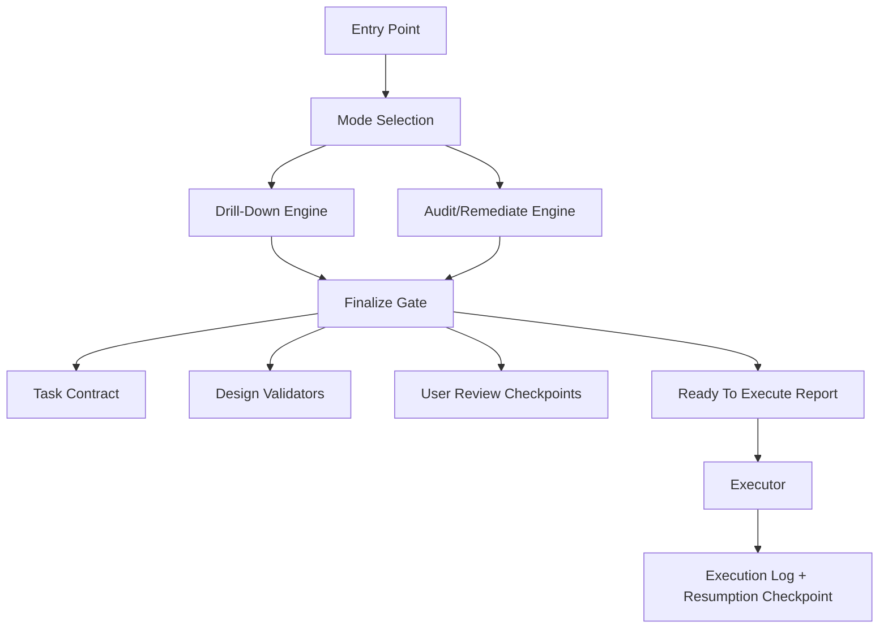

# Hybrid Library Upgrade Plan

## Decision

Keep the phase/orchestrator architecture as the lifecycle spine. Do not
flatten phases into skills. Convert overloaded phase internals into
callable skills, tools, scripts, and validators.

The library should remain a planning/execution contract system:
orchestrators define sequencing and state, while tools enforce
deterministic contracts and specialized skills supply optional
capabilities when a project needs them.

## What Stays As Orchestration

- Entry routing and checkpoint protocol.
- Greenfield drill-down planning.
- Audit/remediation planning.
- Executor loop and execution-log handoff.
- Output artifact schemas.
- Validation gates and final handoff rules.
- Delivery ordering, DAGs, phase rules, and hard stops.

These concerns need global sequencing and state. They are not good
matches for flat skills.

## What Moves Into Skills

- Design research and reference intake.
- Design-system review planning.
- Platform-specific implementation guidance.
- Harness diagnosis patterns.
- Store, privacy, and compliance review.
- UI fidelity review.
- Native iOS/Android design-system application.

These concerns are contextual capabilities. They should be loaded when
relevant, not carried by every phase prompt.

## What Moves Into Tools

- Task contract parsing and reporting.
- Ready-to-execute validation.
- UI reference source-map validation.
- Design-system review artifact generation and validation.
- User-review checkpoint enforcement.
- Phase/order validation.
- Resumption checkpoint validation.
- Baseline task coverage validation.
- Screenshot matrix generation and verification.

Tools are the right home for deterministic or mechanically checkable
requirements.

## Implemented In This Upgrade Slice

- Added a canonical task-contract API under `src/task-contract/`.
- Added `task-contract.json` generation and validation.
- Rewired task graph and delivery order generation to consume the task
  contract.
- Added `validate-ready-to-execute.sh` as the executor preflight gate.
- Added UI source-map validation.
- Added design-system review artifact generation and validation.
- Added `user-review-checkpoints.md` validation so dependent UI work
  cannot bypass design review.
- Exposed public package entrypoints and CLI bins.
- Added build/import smoke coverage for published ESM entrypoints.
- Made published shell bins resolve sibling scripts through npm-style
  symlinks.
- Moved task-contract generation behind the TypeScript CLI so the
  shell tool and public API use one parser/report implementation.
- Added resumption-checkpoint validation for selective context loading.
- Moved task-card schema alignment into the task contract, including
  user-story shape, change type, precise change, acceptance bullets,
  dependency reasons, tests, LOC, and phase.
- Added `baseline-task-coverage.md` generation and
  `validate-baseline-task-coverage.sh` so C5 baseline checks have a
  deterministic gate for scoped-in production concerns.
- Added `phase-order-report.md` generation and
  `validate-phase-order.sh` so C11 phase/order checks are
  task-contract-derived instead of embedded in the broad instantiation
  validator.
- Added UI source-map row citation enforcement for UI-heavy task files.
- Hardened task-contract validation against empty task files.
- Hardened UI source-map parsing for escaped pipes and shifted columns.
- Hardened design-review validation against keyword-only HTML.
- Hardened design-review validation against source-map drift: when a
  UI source map is present, the HTML must represent the actual REF/MAP
  rows, product decisions, non-copy boundaries, and row-derived
  component/token/state values.
- Added `task-schema-repair-report.md` generation and
  `repair-task-schema-fields.sh` so explicit schema aliases and
  mechanical value shorthands can be normalized before validation
  without inventing missing fields.
- Extended baseline coverage traceability: `baseline-task-coverage.md`
  now records whether a baseline topic was scoped by `epics.md`,
  `brief-keywords.md`, or plan keyword detection, and respects explicit
  brief-keyword out-of-scope rows.
- Productized npm onboarding with install instructions, `npx` command
  reference, prerequisites, public API examples, and package dry-run
  coverage for published docs, declarations, prompts, and scripts.
- Tightened package publish hygiene by narrowing the compiled `dist`
  payload to the public task-contract surface, declaring the Node 20+
  runtime, and removing local Xcode `xcuserdata` from the iOS template.
- Added packed-tarball consumer smoke coverage so the actual npm
  artifact installs cleanly, imports both public ESM entrypoints, and
  runs the installed `ai-prompt-ready` bin through npm's symlinked
  `node_modules/.bin` path.
- Extended `ready-to-execute-report.md` with structured
  `blocking_artifacts`, `blocking_issues`, and `recommended_step`
  metadata so executors and CI can act on readiness failures without
  scraping finalize logs.
- Added stale-contract regression coverage: directory validation
  rebuilds `task-contract.json` before checking issues, so changed task
  files cannot pass against an old artifact.
- Hardened UI reference source-map validation for required narrative
  sections, minimum greenfield evidence count, row-ID format, explicit
  non-copy direction, open design risks, and non-specific component/token
  values.
- Added `validate-screenshot-matrix.sh` so app-store screenshot tasks
  can be checked for tooling setup, concrete PNG ownership, matching
  verifier commands, localized-copy acceptance, and full locale × device
  × frame coverage.
- Wired screenshot matrix validation into `finalize.sh` and
  `validate-ready-to-execute.sh`, so app-store screenshot gaps now block
  executor handoff with structured readiness metadata.
- Added `validate-release-readiness.sh` so the pre-tag package checklist
  is a mechanical gate for package metadata, docs examples, executable
  bins, and npm pack dry-run contents.

## Next Upgrade Priorities

1. Cut a release branch/tag after review.
   Run full verification, `npm run validate:release`, and the
   acceptance probe before publishing.

## Architecture Target

The end state is an orchestrator spine that invokes specialized
capabilities, with every production-quality rule either encoded in a
tool or represented as a typed artifact the next phase can verify.
