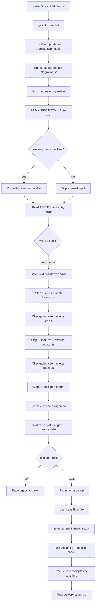
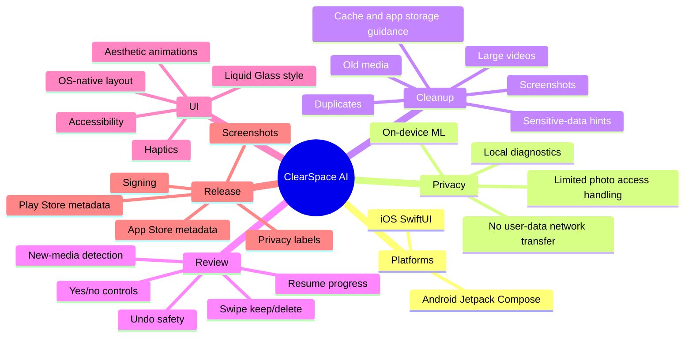
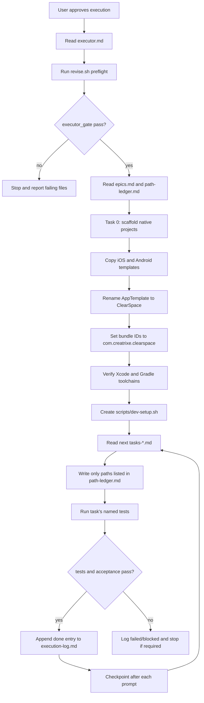

# Storage Cleaner Quick Start Dry Run

Date: 2026-05-17

This is a dry-run trace for the Quick Start prompt using the supplied
storage-cleaner product idea. It does not create `prompts/outputs/current/`
planning artifacts. Instead, it documents the route the library should take,
the artifacts it should produce, and the behavior gaps exposed by the current
orchestrator, module, template, and validator rules.

## Source Inputs

- Starting prompt: `QUICK_START.md`, "The single prompt".
- Primary routing files:
  - `prompts/AGENTS.md`
  - `prompts/orchestrators/ai-agent-entry-point.md`
  - `prompts/orchestrators/drill-down-engine.md`
  - `prompts/orchestrators/module-selection-index.md`
  - `prompts/orchestrators/baseline-task-shapes.md`
  - `prompts/orchestrators/revise-outputs.md`
  - `prompts/orchestrators/executor.md`
- Product idea: native Android and iOS storage cleaner for photo/video and
  general phone cleanup, with swipe review, progress resume, on-device AI/ML,
  local-only privacy, OS-native UI, Liquid Glass-style polish, and App Store /
  Play Store metadata using `com.creatrixe` bundle IDs.

## Product Spec Inferred By Step 4

Quick Start Step 4 tells the agent to ask exactly one question, then infer the
rest of `MY_PROJECT.md` without follow-up questions. For this brief, the
library should infer:

| Section | Dry-run inference |
|---|---|
| App name | `ClearSpace AI: Photo Cleaner` |
| iOS bundle ID | `com.creatrixe.clearspace` |
| Android application ID | `com.creatrixe.clearspace` |
| Platforms | Native iOS and native Android only. No web app. |
| iOS stack | Swift, SwiftUI, Photos framework, Vision, Core ML, Core Data or SwiftData, XCTest/XCUITest. |
| Android stack | Kotlin, Jetpack Compose, MediaStore, Room, DataStore, ML Kit/TFLite with bundled models, JUnit/Espresso/Compose UI tests. |
| Backend | None for user data. The app must function without a backend. |
| Network policy | No network access for user photos/videos or derived media analysis. Android should omit `INTERNET` unless a non-user-data feature explicitly needs it. |
| Users / roles | Single phone owner. No admin, operator, or multi-role model. |
| Storage model | Local-only scan index, review decisions, library snapshots, filter presets, diagnostic logs, and app settings. |
| Key constraints | Privacy-first, on-device ML, resumable progress, safe deletion, OS permission handling, App Store / Play policy compliance. |
| Restrict | Web, backend APIs, cloud database, cloud object storage, admin/RBAC, IaC, payments, social/sharing, account auth, cloud analytics for user data. |
| Non-goals | Cloud backup, cross-device sync, antivirus/security scanning, deleting other apps' private data, replacing the OS photo gallery. |

Store metadata should be produced during planning:

| Field | Dry-run value |
|---|---|
| App Store title | ClearSpace AI: Photo Cleaner |
| App Store subtitle | Swipe clean photos and videos |
| Play Store short description | Free phone space with private, on-device photo and video cleanup. |
| SEO keywords | photo cleaner, video cleaner, storage cleaner, phone cleaner, duplicate photos, screenshots cleaner, swipe delete photos, private AI cleaner |

## Top-Level Route

The Quick Start prompt creates a new consumer project, installs this library as
`.ai-prompts`, bootstraps project integration, asks the product question, and
then routes through the greenfield planning engine before execution.



## Product Mind Map



## Planning Step 1: Expected Epics

The library should produce `epics.md` and `brief-keywords.md`, then stop at
the Epics checkpoint.

### Feature Epics

| Epic | Goal |
|---|---|
| Permissioned Media Library Scanner | Build a local scanner for photos, videos, metadata, file sizes, screenshots, and library deltas. |
| On-Device Media Intelligence | Detect duplicates, similar media, blurry media, screenshots, large files, and sensitive-data candidates without sending content off device. |
| Smart Cleanup Filters | Let users jump into cleanup by age, size, media type, screenshots, sensitivity, and saved shortcuts. |
| Swipe Review Workflow | Provide a Tinder-like keep/delete review flow with OS-native gestures, haptics, previews, and keyboard/VoiceOver alternatives. |
| Progress, Resume, and New Media Detection | Persist review state, scan snapshots, and "new since last run" queues locally. |
| Safe Deletion and Space Recovery | Stage deletion batches, request OS-level deletion authorization, support undo where possible, and report freed space clearly. |
| Premium Native Experience | Deliver a minimalist, chic, OS-native UI with glass effects, tasteful motion, and no visual clutter. |

### Baseline Epics

| Baseline | Include? | Adaptation |
|---|---:|---|
| Identity, auth & onboarding | Yes | Onboarding, photo-library permission education, consent only. No accounts. |
| Admin & RBAC | No | Single-user local app. |
| Observability | Yes | Local logs, OS crash tooling, Android Vitals / Apple crash reports, local diagnostics. |
| Localization & RTL | Yes | Mobile strings and store assets. Default locale set should be inferred, likely `en-US` first unless user adds more. |
| Theming & whitelabel | Yes | Native design tokens, dark/light mode, glass and motion tokens. |
| Accessibility | Yes | VoiceOver/TalkBack, reduced motion, touch targets, contrast, large content viewer where relevant. |
| Testing & QA | Yes | Unit, integration, UI, performance, ML accuracy, deletion safety, property tests. |
| CI/CD & release | Yes | Build, lint, test, sign, and release lanes for iOS and Android. |
| Infrastructure as code | No | No backend or cloud infrastructure. |
| App store release prep | Yes | Metadata, screenshots, privacy labels/data safety, signing, TestFlight, Play internal track. |
| Settings, debug menu & dev UX | Yes | Settings, debug scan fixtures, local diagnostics, one-command setup. |
| Privacy, PII & compliance | Yes | Consent, data export/deletion for local app data, PII classification, retention policy. |

### Brief Keyword Coverage

The current engine requires a companion keyword table so distinctive phrases do
not get summarized away. This product should include at least:

| Keyword / phrase | Expected status | Covered by |
|---|---|---|
| native android and ios | covered | Platform scope; all feature epics apply to Android and iOS. |
| photo/video library cleanup | covered | Permissioned Media Library Scanner, Safe Deletion and Space Recovery. |
| memory cleanup in general | covered with caveat | Smart Cleanup Filters and Safe Deletion, with OS-policy limits documented. |
| tinder-like swipe | covered | Swipe Review Workflow. |
| progress resume anytime | covered | Progress, Resume, and New Media Detection. |
| new media since last run | covered | Progress, Resume, and New Media Detection. |
| older than x / larger than x / screenshots | covered | Smart Cleanup Filters. |
| sensitive data | covered | On-Device Media Intelligence plus Privacy baseline. |
| device AI/ML | covered | On-Device Media Intelligence. |
| no network access for user data | covered | Every feature constraint plus Privacy baseline. |
| OS native layout | covered | Premium Native Experience and technology-stack modules. |
| liquid glass | covered | Premium Native Experience and theming tokens. |
| com.creatrixe | covered | Project initialization and app store release prep. |
| App Store and Play Store submissions | covered | App store release prep baseline. |

## Planning Step 2: Expected Feature Expansion

After user approval, every epic expands to one `features-<epic>.md` file and
`external-accounts.md` is rolled up.

Expected feature families:

| Epic | Likely features |
|---|---|
| Permissioned Media Library Scanner | Photo permission flow; iOS Photos scanner; Android MediaStore scanner; metadata normalization; incremental scan snapshots; large-file indexing. |
| On-Device Media Intelligence | iOS Vision/Core ML duplicate detection; Android ML Kit/TFLite duplicate detection; screenshot classifier; sensitive-data candidate detector; blur/quality detector; ML performance budgets. |
| Smart Cleanup Filters | Filter criteria model; age filters; size filters; screenshots shortcut; sensitive-data shortcut; saved cleanup shortcuts. |
| Swipe Review Workflow | Card stack view; media preview; yes/no controls; swipe thresholds; undo affordance; haptic feedback; accessibility alternatives. |
| Progress, Resume, and New Media Detection | Review decision persistence; checkpointing; "new since last snapshot"; partially reviewed groups; resume queue. |
| Safe Deletion and Space Recovery | Deletion staging; confirmation copy; OS deletion request integration; deletion audit; freed-space estimate; undo/recovery guidance. |
| Premium Native Experience | Design token source; glass surfaces; motion tokens; platform layout adapters; dark/light mode; reduced-motion behavior. |
| Baseline epics | Consent, privacy export/delete, local logging, diagnostics, tests, CI, store metadata, screenshots, signing, localization, accessibility. |

### External Accounts Dry-Run

Runtime external services should be `none` because the product has no backend
and forbids network transfer of user content. Still, release accounts are
needed:

- Apple Developer Program for signing, TestFlight, App Store Connect, privacy
  nutrition labels, and crash report access.
- Google Play Console for signing, internal testing, Android Vitals, and data
  safety.

Current instructions do not clearly say whether release accounts belong in
`external-accounts.md` or only in app-store release prep tasks. That ambiguity
is listed in the gap register below.

## Module Selection Trace

The module-selection index gives deterministic intent-to-module routing. For
this product, the intended selection is:

| Intent | Likely module |
|---|---|
| Swipe card review | `prompts/modules/feature-patterns/gesture-card-ui.md` |
| On-device iOS ML | `prompts/modules/ai-native/on-device-ml-ios.md` |
| On-device Android ML | `prompts/modules/ai-native/on-device-ml-android.md` |
| Native iOS implementation | `prompts/modules/technology-stacks/swift-ios-development.md` |
| iOS UI polish | `prompts/modules/technology-stacks/ios-ui-ux-patterns.md` |
| Native Android implementation | `prompts/modules/technology-stacks/kotlin-android-development.md` |
| Local progress / offline behavior | `prompts/modules/feature-patterns/perf-offline.md`, adapted to local-only storage and no sync |
| Privacy controls | `prompts/modules/security/privacy-controls.md` |
| Local encryption / secure storage | `prompts/modules/feature-patterns/security-encryption.md` |
| Resource optimization | `prompts/modules/performance/resource-optimization.md` |
| App Store release | `prompts/modules/technology-stacks/ios-deployment-distribution.md` |
| Android release | `prompts/modules/technology-stacks/kotlin-android-development.md` |
| Testing strategy | `prompts/modules/testing/test-automation.md`, plus platform test modules |
| Design tokens and motion | `prompts/modules/design-system/token-architecture.md` and `loading-states-and-animations.md` |

Important routing note: `model-serving.md` should not be used for the core
on-device ML feature. It describes model registries, remote downloads, serving,
batching, and rollback. That is useful for cloud inference, but the brief
requires bundled or local models and no user-data network path.

## Planning Step 3: Expected Task Prompt Generation

Every declared feature should produce exactly one `tasks-<feature>.md` file.
Each task prompt should be self-contained enough to pass the copy-paste test:
an AI should be able to implement it in a fresh context without re-reading the
library.

Expected task-prompt characteristics:

- 150-400 lines for substantive features.
- Concrete Swift and Kotlin implementation guidance when a feature spans both
  platforms.
- Real paths and signatures, for example:
  - `ios/ClearSpace/Services/Media/PhotoLibraryScanner.swift`
  - `android/app/src/main/java/com/creatrixe/clearspace/media/MediaStoreScanner.kt`
- Explicit local-only constraints:
  - no remote upload of image/video data;
  - no analytics event containing filenames, thumbnails, EXIF, paths, or
    inferred sensitive categories;
  - bundled or preinstalled ML models only unless the user explicitly approves
    model download.
- Tests named per platform:
  - `xcodebuild test -scheme ClearSpace -destination 'platform=iOS Simulator,name=iPhone 16 Pro'`
  - `cd android && ./gradlew testDebugUnitTest connectedDebugAndroidTest`

Step 3 must run `scripts/step3-progress.sh` after each task file and stop at a
checkpoint after each epic's task files are complete.

## Step 3.7 And Revise Gate

The current library adds a schema-alignment pass after narrative task prompts
are written. For this product, this is critical because the executor needs
dual-platform paths.

Every dual-platform task should receive metadata like:

```markdown
- **Closes user story:** As a privacy-conscious phone owner, I want to review similar media locally, so that I can free space without exposing my photos.
- **Change type:** create-new
- **File:** `ios/ClearSpace/Services/Media/DuplicateDetector.swift` | `android/app/src/main/java/com/creatrixe/clearspace/media/DuplicateDetector.kt`
- **Depends on:** tasks-media-scan-index.md (requires normalized media records before duplicate grouping)
- **Test:** `xcodebuild test -scheme ClearSpace -only-testing:ClearSpaceTests/DuplicateDetectorTests && cd android && ./gradlew testDebugUnitTest --tests '*DuplicateDetectorTest'`
- **Estimated LOC:** +260
```

After Step 3.7, the engine should run:

```bash
bash .ai-prompts/scripts/finalize.sh prompts/outputs/current
```

That command should:

1. Fix user-story formatting.
2. Build `path-ledger.md`.
3. Run the revise gate.
4. Emit canonical `revise-report.md`.
5. Return `executor_gate: pass` only if the plan is mechanically ready.

## Execution Phase Trace

Execution begins only after the planning hard stop and explicit user approval
with `Execute` or `Continue`.



Expected final app tree:

```text
ios/
  ClearSpace.xcodeproj/
  ClearSpace/
  ClearSpaceTests/
  ClearSpaceUITests/
android/
  app/
  gradle/
fastlane/
scripts/
docs/
prompts/outputs/current/
```

Expected local commands in the final report:

```bash
bash scripts/dev-setup.sh
```

```bash
xcodebuild test -scheme ClearSpace -destination 'platform=iOS Simulator,name=iPhone 16 Pro'
cd android && ./gradlew testDebugUnitTest connectedDebugAndroidTest
```

## Intended Behavior Vs Current Behavior Gaps

| Severity | Gap | Why it matters for this product | Suggested fix |
|---|---|---|---|
| High | Checkpoint rules conflict. `QUICK_START.md`, the entry point, and drill-down checkpoints say stop and wait; `prompts/AGENTS.md` also says not to stop between engine steps. | A dry run cannot predict whether the agent should pause after epics/features or continue. This directly affects user review of a large mobile plan. | Update `prompts/AGENTS.md` hard rule 7 to defer to the explicit checkpoint protocol. |
| High | Module-loading rules conflict. `AGENTS.md` and `module-selection-index.md` say one module per expansion context; `drill-down-engine.md` says one or more modules. | Storage cleaner features often need platform + ML + gesture + privacy guidance at once. The wrong rule either lowers quality or violates the engine contract. | `drill-down-engine.md` is the correct rule. number of modules are governed by need of task at hand. |
| High | Native storage cleanup OS limits are not captured in a dedicated module. | iOS and Android restrict arbitrary "memory cleanup" and app-cache deletion. A plan that promises unsupported cleanup will be rejected by stores or fail at runtime. | Add a `native-storage-cleanup.md` module covering Photos, MediaStore, scoped storage, deletion permissions, cache limits, and store policy constraints. |
| High | Android project template is much thinner than iOS. | The iOS template already contains many storage-cleaner-like models/services/views, while Android only has Gradle and resources. Cross-platform tasks may start from unequal baselines. | Expand `project-templates/android` with Kotlin/Compose domain skeletons matching the iOS template |
| High | Identity baseline can over-expand. Step 1 says local-only apps include onboarding + consent only, but baseline task-shapes still requires sign up, sign in, password reset, email verification, session refresh, and sign out. | This app should not create accounts. The revise gate may falsely require auth tasks if the baseline epic name includes "Identity, auth & onboarding". | Split the baseline into "Onboarding & consent" and "Account identity", AND make task-shape rules conditional on account scope. |
| Medium | `perf-offline.md` emphasizes network sync, service workers, React Native AsyncStorage, and conflict resolution. | The product needs local persistence and resumability, not offline sync to a server. A weak expansion may introduce backend sync or network queues against the brief. | Add a local-only persistence/progress module. |
| Medium | Release accounts are ambiguous in `external-accounts.md`. | The app has no runtime external services, but Apple Developer and Google Play Console accounts are required for final delivery. | Clarification: store accounts are listed in both `external-accounts.md` and app-store prep tasks. |
| Medium | Sensitive-data detection needs product-specific guardrails. | False positives and previewing sensitive content can harm trust. The current modules cover privacy generally but not sensitive photo/document UX. | Add acceptance rules for opt-in scanning, explainable labels, local-only thumbnails, confidence thresholds, and "never auto-delete sensitive candidates". |
| Medium | `model-serving.md` can be selected accidentally for "AI model" language. | It includes remote model loading and serving patterns that conflict with on-device processing. | In module selection, prefer on-device modules whenever a brief mentions privacy, local-only, or device AI/ML. |
| Medium | App Store / Play privacy metadata must reflect exact permissions. | Photo library access, limited access mode, deletion permissions, ML inference, crash reports, and no tracking must be consistent with store forms. | Ensure app-store prep tasks consume the PII classification and permission manifest, not generic listing copy. |
| Low | The product name is inferred but not guaranteed stable across artifacts. | Store copy, bundle IDs, schemes, package names, screenshots, and metadata can drift. | Add a canonical `product_identity` block in `MY_PROJECT.md` or `project-context.md`. |
| Low | Locale defaults are not specified by the user. | Baseline localization and screenshot matrices can explode in scope if the agent invents many locales. | Default to user's locale only unless the user or reference material specifies more locales. |

## Expected Pass/Fail Points In This Dry Run

The current changes should help the run pass these points:

- `brief-keywords.md` should prevent dropping "liquid glass", "tinder-like
  swipe", "new media since last run", "sensitive data", and "no network".
- `step3-progress.sh` should prevent partial task generation.
- Step 3.7 should prevent iOS-only metadata for dual-platform tasks.
- `finalize.sh` should produce `path-ledger.md` and block duplicate path
  families before execution.
- The executor should refuse to run until `revise.sh` passes.

The run is still likely to fail or need regeneration if:

- baseline task-shapes demand account auth for a local-only app;
- Android paths are missing because the Android template has no Kotlin source
  skeleton;
- the plan collapses app-store screenshots into one task per platform instead
  of per locale and device class;
- the plan introduces network analytics, model downloads, cloud backups, or
  sync queues despite the local-only constraint;
- "memory cleanup in general" is specified without OS-permitted boundaries.

## Dry-Run Outcome

Expected final state after a successful real run:

- `prompts/outputs/current/epics.md` captures seven feature epics plus adapted
  production-readiness epics.
- `brief-keywords.md` maps all distinctive user phrases to coverage.
- `features-*.md` describes native iOS and Android features, with no backend API
  contracts except "none, local-only" where applicable.
- `external-accounts.md` says no runtime external services are required and
  clearly handles store release accounts.
- `tasks-*.md` provides self-contained implementation prompts with dual-platform
  metadata.
- `path-ledger.md` lists every executable source path before code is written.
- `revise-report.md` has `executor_gate: pass`.
- `execution-log.md` records task-by-task implementation, tests, acceptance, and
  resume state.
- The app can be built and tested through Xcode and Gradle, with no backend
  service required to inspect, sort, or delete user media.

