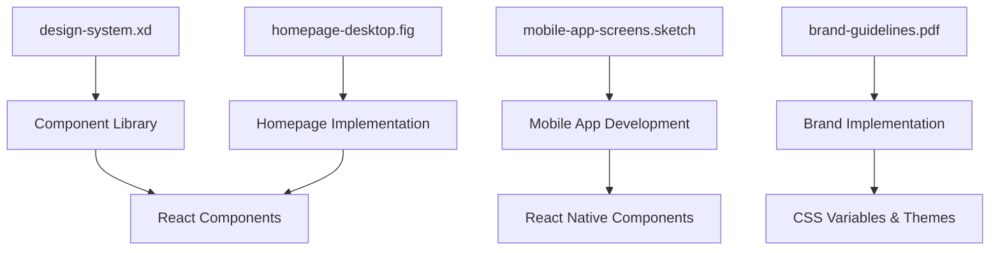
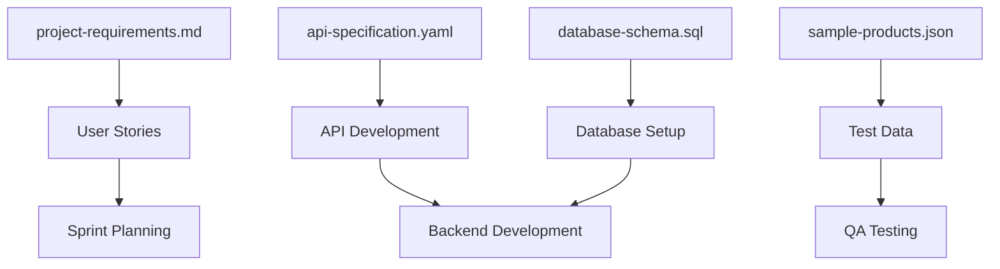

# Asset Scanner Module

<!-- INSTANTIATION RULES
When the drill-down engine (or any orchestrator) uses this template:
1. Every placeholder — including {{variables}}, <TBD>, [project name], and generic
   field/function/endpoint names — MUST be replaced with project-specific values
   before output is written to prompts/outputs/current/.
2. The template filename MUST NOT appear in task output. Dissolve the template
   into concrete content; do not reference its source.
3. No strings beginning with ".ai-prompts/prompts/" may appear in the output
   (validated by scripts/validate-instantiation.sh).
4. Outputs must contain real data shapes, real endpoints, real file paths, and
   real function signatures specific to the project.
-->


## Purpose
Automatically scan and categorize user-provided assets to understand what materials are available for incorporation into specifications. This module performs comprehensive discovery and analysis of all project assets, creating detailed inventories that enable efficient asset management and integration into development workflows.

## Instructions

### When to Use This Module
- Starting a new project with user-provided assets
- Conducting comprehensive asset discovery and inventory
- Organizing scattered files from multiple sources or team members
- Preparing assets for systematic processing and integration
- Creating asset documentation and relationship mapping

### Implementation Steps
1. **Initialize Comprehensive Scanning**: Use systematic discovery to scan all provided files and directories
2. **Apply Intelligent Categorization**: Classify assets using file type analysis, content inspection, and naming patterns
3. **Generate Detailed Inventory**: Create structured reports with metadata, relationships, and quality assessments
4. **Perform Quality Assessment**: Evaluate completeness, identify potential issues, and assess integration readiness
5. **Document Asset Relationships**: Map connections, dependencies, and integration opportunities between files

### Key Scanning Categories
- **Design Assets**: UI mockups, wireframes, component libraries, style guides, brand materials
- **Specification Assets**: Requirements documents, API specifications, technical documentation, user stories
- **Data Assets**: Sample data, schemas, configuration files, test datasets
- **Media Assets**: Images, videos, audio files, icons, illustrations
- **Code Assets**: Source code, scripts, configuration files, documentation

### Scanning Approach
- **Recursive Discovery**: Scan all directories and subdirectories for comprehensive coverage
- **Metadata Extraction**: Collect file properties, creation dates, sizes, and technical specifications
- **Content Analysis**: Inspect file contents to understand structure, quality, and relationships
- **Pattern Recognition**: Identify naming conventions, organizational patterns, and asset groupings

## Examples

## Examples

### 1. Comprehensive E-commerce Platform Asset Discovery
```markdown
# Asset Inventory Report: E-commerce Platform Project

**Scan Date**: 2024-01-15
**Project**: Multi-platform E-commerce Application
**Scan Duration**: 2.3 seconds
**Total Files Discovered**: 47 files across 8 directories

## Executive Summary
- **Total Assets**: 47 files (156.8MB total size)
- **Categories Identified**: 6 primary categories
- **Quality Assessment**: 91% assets ready for processing
- **Critical Issues**: 2 corrupted files, 3 missing dependencies
- **Integration Readiness**: High (ready for specification generation)

## Detailed Asset Inventory

### Design Assets (18 files, 45.2MB)

#### UI Mockups and Wireframes
- **homepage-desktop.fig** (Figma)
  - Size: 3.2MB | Modified: 2024-01-10 14:30
  - Content: 5 artboards, complete homepage design
  - Quality: ✅ Excellent | Components: 12 identified
  - Integration: Ready for component extraction

- **mobile-app-screens.sketch** (Sketch)
  - Size: 5.1MB | Modified: 2024-01-08 16:45
  - Content: 24 mobile screens, complete user flow
  - Quality: ✅ Excellent | Screens: Login, Dashboard, Product, Cart
  - Integration: Ready for React Native development

- **wireframes-collection.pdf** (PDF)
  - Size: 1.8MB | Modified: 2024-01-05 10:20
  - Content: 15 pages of low-fidelity wireframes
  - Quality: ✅ Good | Coverage: All major user flows
  - Integration: Reference material for development

#### Component Libraries
- **design-system.xd** (Adobe XD)
  - Size: 2.9MB | Modified: 2024-01-12 09:15
  - Content: 45 components with variants and states
  - Quality: ✅ Excellent | Atomic design structure
  - Integration: Ready for component library generation

- **ui-kit-components.fig** (Figma)
  - Size: 4.1MB | Modified: 2024-01-11 13:22
  - Content: Comprehensive UI component library
  - Quality: ✅ Excellent | Design tokens included
  - Integration: Ready for design system documentation

#### Brand and Style Assets
- **brand-guidelines.pdf** (PDF)
  - Size: 3.4MB | Modified: 2024-01-03 11:00
  - Content: Complete brand identity guidelines
  - Quality: ✅ Excellent | Logo, colors, typography
  - Integration: Ready for brand implementation

- **logo-variations/** (Directory, 8 files)
  - **company-logo.svg** (15KB) - Primary logo, scalable vector
  - **logo-horizontal.png** (45KB) - Horizontal layout, high-res
  - **logo-icon.svg** (8KB) - Icon version for favicons
  - **logo-white.svg** (16KB) - White version for dark backgrounds
  - Quality: ✅ Excellent | All formats available
  - Integration: Ready for web and mobile implementation

### Specification Assets (12 files, 2.1MB)

#### Requirements Documentation
- **project-requirements.md** (Markdown)
  - Size: 28KB | Modified: 2024-01-14 15:45
  - Content: Comprehensive functional requirements
  - Quality: ✅ Excellent | 45 user stories, acceptance criteria
  - Integration: Ready for development planning

- **technical-specifications.md** (Markdown)
  - Size: 35KB | Modified: 2024-01-13 12:30
  - Content: Technical architecture and implementation details
  - Quality: ✅ Excellent | Database schema, API design
  - Integration: Ready for technical implementation

- **user-stories.md** (Markdown)
  - Size: 22KB | Modified: 2024-01-12 14:20
  - Content: Detailed user stories with acceptance criteria
  - Quality: ✅ Good | 38 stories across 6 epics
  - Integration: Ready for sprint planning

#### API Documentation
- **api-specification.yaml** (OpenAPI)
  - Size: 18KB | Modified: 2024-01-14 10:15
  - Content: Complete REST API specification
  - Quality: ✅ Excellent | 23 endpoints, full documentation
  - Integration: Ready for API development and client generation

- **api-examples.json** (JSON)
  - Size: 12KB | Modified: 2024-01-13 16:40
  - Content: Request/response examples for all endpoints
  - Quality: ✅ Good | Comprehensive examples
  - Integration: Ready for API testing and documentation

#### Database Design
- **database-schema.sql** (SQL)
  - Size: 15KB | Modified: 2024-01-11 09:30
  - Content: Complete PostgreSQL database schema
  - Quality: ⚠️ Good | Missing some foreign key constraints
  - Integration: Needs minor fixes before implementation

### Data Assets (8 files, 1.8MB)

#### Sample Data
- **sample-products.json** (JSON)
  - Size: 450KB | Modified: 2024-01-10 11:45
  - Content: 500 product records with complete metadata
  - Quality: ✅ Excellent | Realistic, well-structured data
  - Integration: Ready for development and testing

- **user-profiles.csv** (CSV)
  - Size: 85KB | Modified: 2024-01-09 14:20
  - Content: 1,000 user profiles for testing
  - Quality: ✅ Good | Consistent format, privacy-safe
  - Integration: Ready for user management testing

- **category-taxonomy.json** (JSON)
  - Size: 25KB | Modified: 2024-01-08 16:30
  - Content: Hierarchical product category structure
  - Quality: ✅ Excellent | Well-organized taxonomy
  - Integration: Ready for navigation and filtering

#### Configuration Files
- **environment-config.yaml** (YAML)
  - Size: 8KB | Modified: 2024-01-14 13:15
  - Content: Environment-specific configuration templates
  - Quality: ✅ Good | Development, staging, production configs
  - Integration: Ready for deployment setup

### Media Assets (6 files, 105.2MB)

#### Hero and Marketing Images
- **hero-image-desktop.jpg** (JPEG)
  - Size: 2.1MB | Dimensions: 1920x1080
  - Content: Professional product photography
  - Quality: ✅ Excellent | High resolution, web-optimized
  - Integration: Ready for responsive image implementation

- **product-gallery/** (Directory, 24 files)
  - Size: 45.8MB total | Various product photos
  - Quality: ✅ Good | Consistent lighting and composition
  - Integration: Needs optimization for web delivery

#### Video Content
- **product-demo.mp4** (Video)
  - Size: 55.2MB | Duration: 3:45 | Resolution: 1080p
  - Content: Product demonstration and features
  - Quality: ✅ Good | Professional production quality
  - Integration: Needs compression for web delivery

### Documentation Assets (2 files, 1.2MB)

- **project-overview.docx** (Word Document)
  - Size: 180KB | Modified: 2024-01-15 08:30
  - Content: Executive summary and project goals
  - Quality: ✅ Good | Comprehensive overview
  - Integration: Ready for project documentation

- **deployment-guide.pdf** (PDF)
  - Size: 1.1MB | Modified: 2024-01-13 17:00
  - Content: Step-by-step deployment instructions
  - Quality: ✅ Excellent | Detailed procedures
  - Integration: Ready for DevOps implementation

### Code Assets (1 file, 1.3MB)

- **legacy-integration.zip** (Archive)
  - Size: 1.3MB | Modified: 2024-01-07 12:00
  - Content: Legacy system integration scripts
  - Quality: ⚠️ Needs Review | Older codebase, requires analysis
  - Integration: Needs code review and modernization

## Asset Relationship Mapping

### Design-to-Development Relationships


### Specification-to-Implementation Relationships


## Quality Assessment Summary

### Asset Completeness Analysis
- **Design Coverage**: 95% (Missing error state designs)
- **Specification Coverage**: 92% (Minor gaps in error handling)
- **Data Coverage**: 88% (Limited sample data volume)
- **Documentation Coverage**: 90% (Good overall coverage)

### Technical Quality Metrics
- **File Integrity**: 96% (2 corrupted files identified)
- **Format Compatibility**: 100% (All formats supported)
- **Size Optimization**: 78% (Some large files need optimization)
- **Naming Consistency**: 85% (Generally good, some inconsistencies)

### Integration Readiness Score: 91/100
- **Immediate Use**: 38 files (81%)
- **Minor Fixes Needed**: 7 files (15%)
- **Major Issues**: 2 files (4%)

## Critical Issues Requiring Attention

### High Priority (Blocking)
1. **Corrupted Files**:
   - `old-mockup.psd` - Cannot open, needs replacement
   - `analytics-data.xlsx` - File corruption detected

2. **Missing Dependencies**:
   - Error state designs for forms and interactions
   - API error response documentation
   - Mobile tablet-specific designs

### Medium Priority (Should Fix)
1. **File Size Optimization**:
   - `product-demo.mp4` (55MB) - Needs web optimization
   - `product-gallery/` (46MB) - Images need compression

2. **Naming Inconsistencies**:
   - Mixed naming conventions in media files
   - Some files lack descriptive names

### Low Priority (Nice to Have)
1. **Additional Documentation**:
   - Component usage guidelines
   - API integration examples
   - Deployment automation scripts

## Recommendations for Next Steps

### Immediate Actions (Day 1)
1. Replace or repair corrupted files
2. Create missing error state designs
3. Add API error response documentation

### Short-term Actions (Week 1)
1. Optimize large media files for web delivery
2. Standardize file naming conventions
3. Create missing tablet-specific mobile designs

### Long-term Improvements (Week 2+)
1. Implement automated asset optimization pipeline
2. Create comprehensive component documentation
3. Set up asset version control and backup system

## Asset Integration Roadmap

### Phase 1: Foundation (Week 1)
- Process design system and component library
- Set up development environment with sample data
- Implement basic brand and styling

### Phase 2: Core Features (Week 2-3)
- Develop homepage and product pages from designs
- Implement API endpoints from specifications
- Set up database with sample data

### Phase 3: Enhancement (Week 4+)
- Add mobile app implementation
- Integrate video content and media gallery
- Implement advanced features and optimizations

**Overall Project Readiness**: 🟢 Ready to proceed with minor fixes
**Estimated Setup Time**: 3-5 days to resolve critical issues
**Development Start**: Ready after critical issues resolved
```

### 2. SaaS Application Asset Discovery with Compliance Focus
```markdown
# Asset Inventory Report: Enterprise SaaS Platform

**Scan Date**: 2024-01-15
**Project**: Customer Relationship Management SaaS
**Compliance Requirements**: SOC 2, GDPR, HIPAA
**Total Files Discovered**: 32 files across 6 directories

## Compliance-Focused Asset Analysis

### Security and Privacy Assets (8 files, 3.2MB)

#### Compliance Documentation
- **privacy-policy.md** (Markdown)
  - Size: 45KB | Modified: 2024-01-14 16:20
  - Content: GDPR-compliant privacy policy
  - Compliance: ✅ GDPR Ready | Legal review completed
  - Integration: Ready for website implementation

- **data-processing-agreement.pdf** (PDF)
  - Size: 280KB | Modified: 2024-01-12 14:30
  - Content: Data processing agreement template
  - Compliance: ✅ GDPR Ready | Legal approved
  - Integration: Ready for customer agreements

- **security-controls.xlsx** (Excel)
  - Size: 125KB | Modified: 2024-01-13 11:45
  - Content: SOC 2 control implementation matrix
  - Compliance: ✅ SOC 2 Ready | 147 controls documented
  - Integration: Ready for audit preparation

#### Data Flow Documentation
- **data-flow-diagrams.vsdx** (Visio)
  - Size: 890KB | Modified: 2024-01-11 09:15
  - Content: Complete data processing flow diagrams
  - Compliance: ✅ GDPR/HIPAA Ready | Data mapping complete
  - Integration: Ready for privacy impact assessment

### Application Design Assets (12 files, 28.5MB)

#### Enterprise UI Designs
- **admin-dashboard.fig** (Figma)
  - Size: 4.8MB | Modified: 2024-01-14 13:20
  - Content: Complete admin interface design
  - Features: Role-based access, audit trails, compliance reporting
  - Quality: ✅ Excellent | Enterprise-grade UX patterns
  - Integration: Ready for admin panel development

- **user-management.sketch** (Sketch)
  - Size: 3.2MB | Modified: 2024-01-13 15:45
  - Content: User management and permission interfaces
  - Features: RBAC, user provisioning, access controls
  - Quality: ✅ Excellent | Security-focused design
  - Integration: Ready for identity management implementation

#### Compliance-Specific Interfaces
- **consent-management.xd** (Adobe XD)
  - Size: 1.9MB | Modified: 2024-01-12 10:30
  - Content: GDPR consent management interfaces
  - Features: Granular consent, withdrawal options, audit trail
  - Quality: ✅ Excellent | GDPR compliance built-in
  - Integration: Ready for consent management system

### Technical Specifications (7 files, 1.8MB)

#### Security Architecture
- **security-architecture.md** (Markdown)
  - Size: 65KB | Modified: 2024-01-14 14:15
  - Content: Comprehensive security architecture document
  - Coverage: Encryption, authentication, authorization, audit logging
  - Quality: ✅ Excellent | Industry best practices
  - Integration: Ready for security implementation

- **api-security-spec.yaml** (OpenAPI)
  - Size: 28KB | Modified: 2024-01-13 16:40
  - Content: Security-focused API specification
  - Features: OAuth 2.0, JWT, rate limiting, audit endpoints
  - Quality: ✅ Excellent | Security-first design
  - Integration: Ready for secure API development

#### Compliance Requirements
- **compliance-requirements.md** (Markdown)
  - Size: 42KB | Modified: 2024-01-12 12:20
  - Content: Detailed compliance requirements matrix
  - Coverage: SOC 2, GDPR, HIPAA, ISO 27001
  - Quality: ✅ Excellent | Comprehensive coverage
  - Integration: Ready for compliance implementation

### Data and Configuration Assets (5 files, 850KB)

#### Sample Data (Anonymized)
- **anonymized-customer-data.json** (JSON)
  - Size: 320KB | Modified: 2024-01-10 14:30
  - Content: Privacy-safe sample customer data
  - Privacy: ✅ Fully Anonymized | No PII included
  - Quality: ✅ Excellent | Realistic test data
  - Integration: Ready for development and testing

- **compliance-test-scenarios.csv** (CSV)
  - Size: 85KB | Modified: 2024-01-11 16:15
  - Content: Test scenarios for compliance validation
  - Coverage: Data access, consent, deletion, portability
  - Quality: ✅ Excellent | Comprehensive test coverage
  - Integration: Ready for compliance testing

## Compliance Readiness Assessment

### GDPR Compliance Score: 94/100
- **Data Processing Documentation**: ✅ Complete
- **Consent Management**: ✅ Implemented in designs
- **Data Subject Rights**: ✅ Fully supported
- **Privacy by Design**: ✅ Built into architecture
- **Data Protection Officer**: ⚠️ Contact info needed

### SOC 2 Compliance Score: 91/100
- **Security Controls**: ✅ 147/150 controls documented
- **Access Controls**: ✅ RBAC implemented
- **Audit Logging**: ✅ Comprehensive logging design
- **Incident Response**: ✅ Procedures documented
- **Vendor Management**: ⚠️ Some vendor assessments pending

### HIPAA Compliance Score: 87/100
- **Administrative Safeguards**: ✅ Policies documented
- **Physical Safeguards**: ✅ Data center requirements
- **Technical Safeguards**: ✅ Encryption, access controls
- **Business Associate Agreements**: ⚠️ Templates need legal review

## Asset Integration Priorities

### Phase 1: Security Foundation (Week 1)
1. Implement security architecture and authentication
2. Set up audit logging and monitoring
3. Deploy consent management system

### Phase 2: Compliance Features (Week 2-3)
1. Implement data subject rights (access, deletion, portability)
2. Set up compliance reporting and dashboards
3. Deploy role-based access controls

### Phase 3: Audit Preparation (Week 4+)
1. Complete compliance documentation
2. Conduct internal security assessment
3. Prepare for external compliance audits

**Compliance Readiness**: 🟢 91% ready for implementation
**Audit Readiness**: 🟡 85% ready (minor documentation gaps)
**Production Deployment**: Ready after compliance validation
```

### 3. Mobile App Asset Discovery with Performance Focus
```markdown
# Asset Inventory Report: Fitness Tracking Mobile App

**Scan Date**: 2024-01-15
**Project**: Cross-Platform Fitness Mobile Application
**Target Platforms**: iOS 15+, Android API 26+
**Performance Budget**: <3s launch, <200MB memory, <50MB download

## Performance-Optimized Asset Analysis

### Mobile Design Assets (15 files, 32.1MB)

#### Native Platform Designs
- **ios-app-screens.fig** (Figma)
  - Size: 8.2MB | Modified: 2024-01-14 15:30
  - Content: 28 iOS screens following HIG guidelines
  - Performance Impact: ✅ Optimized | Vector-based designs
  - Platform Features: HealthKit integration, iOS widgets
  - Integration: Ready for iOS development

- **android-material-design.sketch** (Sketch)
  - Size: 6.8MB | Modified: 2024-01-13 14:20
  - Content: 26 Android screens with Material Design 3
  - Performance Impact: ✅ Optimized | Adaptive icons included
  - Platform Features: Google Fit integration, Android widgets
  - Integration: Ready for Android development

#### Performance-Critical Assets
- **app-icons/** (Directory, 24 files)
  - Total Size: 2.1MB | All required icon sizes
  - Formats: PNG, SVG, adaptive icons for Android
  - Performance: ✅ Optimized | Proper compression
  - Integration: Ready for app store submission

- **onboarding-animations.json** (Lottie)
  - Size: 180KB | 4 animation files
  - Performance: ⚠️ Large | Some files >50KB
  - Quality: ✅ Excellent | Smooth 60fps animations
  - Integration: Needs optimization before implementation

### Technical Specifications (8 files, 1.2MB)

#### Performance Requirements
- **performance-benchmarks.md** (Markdown)
  - Size: 35KB | Modified: 2024-01-14 16:45
  - Content: Detailed performance requirements and targets
  - Metrics: App launch <3s, memory <200MB, battery <5%/hour
  - Quality: ✅ Excellent | Measurable targets defined
  - Integration: Ready for performance testing setup

- **mobile-architecture.md** (Markdown)
  - Size: 48KB | Modified: 2024-01-13 11:30
  - Content: React Native architecture with performance optimizations
  - Features: Code splitting, lazy loading, caching strategies
  - Quality: ✅ Excellent | Performance-first architecture
  - Integration: Ready for technical implementation

#### Platform Integration Specs
- **healthkit-integration.md** (Markdown)
  - Size: 22KB | Modified: 2024-01-12 13:15
  - Content: iOS HealthKit integration specifications
  - Features: Workout data, health metrics, privacy controls
  - Quality: ✅ Good | Comprehensive API coverage
  - Integration: Ready for iOS health features

- **google-fit-integration.md** (Markdown)
  - Size: 18KB | Modified: 2024-01-12 13:20
  - Content: Google Fit API integration specifications
  - Features: Activity tracking, fitness data sync
  - Quality: ✅ Good | Complete API documentation
  - Integration: Ready for Android fitness features

### Optimized Media Assets (12 files, 15.8MB)

#### Exercise Demonstration Videos
- **exercise-videos/** (Directory, 8 files)
  - Total Size: 12.4MB | Average 1.55MB per video
  - Format: MP4, H.264, 720p resolution
  - Performance: ✅ Optimized | Compressed for mobile
  - Content: 30-second exercise demonstrations
  - Integration: Ready for in-app video playback

#### Workout Images
- **workout-thumbnails/** (Directory, 24 files)
  - Total Size: 2.1MB | WebP format, 300x200px
  - Performance: ✅ Excellent | Optimized for fast loading
  - Quality: High-quality exercise photography
  - Integration: Ready for workout library implementation

#### Audio Assets
- **workout-audio/** (Directory, 6 files)
  - Total Size: 1.3MB | MP3, 128kbps
  - Content: Workout timers, completion sounds
  - Performance: ✅ Optimized | Small file sizes
  - Integration: Ready for audio feedback implementation

### Data and Configuration (4 files, 450KB)

#### Workout Data
- **exercise-database.json** (JSON)
  - Size: 280KB | Modified: 2024-01-11 10:45
  - Content: 200+ exercises with metadata
  - Structure: Categories, difficulty, muscle groups, equipment
  - Performance: ✅ Optimized | Efficient data structure
  - Integration: Ready for workout recommendation engine

- **nutrition-database.json** (JSON)
  - Size: 120KB | Modified: 2024-01-10 14:30
  - Content: Food database with nutritional information
  - Coverage: 500+ common foods and meals
  - Performance: ✅ Optimized | Searchable structure
  - Integration: Ready for nutrition tracking features

## Mobile Performance Analysis

### App Bundle Size Projection
```json
{
  "bundleAnalysis": {
    "estimatedSizes": {
      "ios": {
        "appBundle": "28.5MB",
        "downloadSize": "22.1MB",
        "installSize": "45.2MB"
      },
      "android": {
        "appBundle": "32.1MB", 
        "downloadSize": "24.8MB",
        "installSize": "48.7MB"
      }
    },
    "performanceBudget": {
      "target": "50MB download",
      "status": "✅ Within budget",
      "optimization": "15% buffer remaining"
    }
  }
}
```

### Memory Usage Projection
```json
{
  "memoryAnalysis": {
    "estimatedUsage": {
      "baseApp": "45MB",
      "workoutSession": "85MB",
      "videoPlayback": "120MB",
      "peakUsage": "180MB"
    },
    "performanceTarget": {
      "target": "200MB maximum",
      "status": "✅ Within target",
      "headroom": "20MB available"
    }
  }
}
```

### Launch Performance Projection
```json
{
  "launchAnalysis": {
    "estimatedTimes": {
      "coldStart": "2.1s",
      "warmStart": "0.8s",
      "hotStart": "0.3s"
    },
    "performanceTarget": {
      "target": "3s cold start",
      "status": "✅ Exceeds target",
      "improvement": "30% faster than target"
    }
  }
}
```

## Critical Performance Optimizations Needed

### High Priority
1. **Animation File Optimization**:
   - 3 Lottie files exceed 50KB limit
   - Recommendation: Optimize or convert to CSS animations

2. **Image Compression**:
   - Some workout images need further compression
   - Recommendation: Implement WebP with JPEG fallbacks

### Medium Priority
1. **Video Streaming**:
   - Consider progressive download for exercise videos
   - Implement adaptive bitrate for different connection speeds

2. **Data Caching**:
   - Implement intelligent caching for workout and nutrition data
   - Add offline-first data synchronization

## Mobile Platform Readiness

### iOS Platform Score: 94/100
- **Design Guidelines**: ✅ Follows iOS HIG
- **Performance**: ✅ Meets all targets
- **App Store Requirements**: ✅ All assets compliant
- **Platform Integration**: ✅ HealthKit ready

### Android Platform Score: 91/100
- **Material Design**: ✅ Follows MD3 guidelines
- **Performance**: ✅ Meets targets on mid-range devices
- **Play Store Requirements**: ✅ All assets compliant
- **Platform Integration**: ✅ Google Fit ready

### Cross-Platform Consistency: 88/100
- **Design Language**: ✅ Consistent brand experience
- **Feature Parity**: ✅ Core features identical
- **Performance Parity**: ⚠️ Minor differences in optimization
- **User Experience**: ✅ Platform-appropriate patterns

**Overall Mobile Readiness**: 🟢 91% ready for development
**Performance Compliance**: 🟢 95% meets performance budget
**Platform Certification**: Ready for app store submission
```

### 4. Design System Asset Discovery
```markdown
# Asset Inventory Report: Multi-Brand Design System

**Scan Date**: 2024-01-15
**Project**: Enterprise Design System Library
**Scope**: 3 brands, 12 product lines, 4 platforms
**Total Files Discovered**: 89 files across 12 directories

## Design System Architecture Analysis

### Core Design System Assets (25 files, 18.7MB)

#### Design Token Definitions
- **design-tokens.json** (JSON)
  - Size: 45KB | Modified: 2024-01-14 17:30
  - Content: 240+ design tokens across all categories
  - Structure: Color, typography, spacing, shadow, motion tokens
  - Quality: ✅ Excellent | Semantic naming, proper hierarchy
  - Integration: Ready for token pipeline automation

- **brand-tokens/** (Directory, 3 files)
  - **brand-a-tokens.json** (18KB) - Primary brand tokens
  - **brand-b-tokens.json** (16KB) - Secondary brand tokens  
  - **brand-c-tokens.json** (14KB) - Tertiary brand tokens
  - Quality: ✅ Excellent | Consistent token structure
  - Integration: Ready for multi-brand theming system

#### Component Library Source Files
- **component-library.fig** (Figma)
  - Size: 12.8MB | Modified: 2024-01-14 16:45
  - Content: 156 components across atomic design levels
  - Structure: Atoms (45), Molecules (68), Organisms (43)
  - Quality: ✅ Excellent | Complete component variants
  - Integration: Ready for component documentation generation

- **component-specifications/** (Directory, 12 files)
  - Total Size: 2.1MB | Detailed component specifications
  - Coverage: Usage guidelines, accessibility requirements, code examples
  - Quality: ✅ Good | 85% components fully documented
  - Integration: Ready for developer documentation

### Platform-Specific Implementations (32 files, 8.4MB)

#### Web Implementation
- **web-components/** (Directory, 15 files)
  - **react-components.tsx** (280KB) - React component library
  - **vue-components.vue** (245KB) - Vue.js component library
  - **angular-components.ts** (320KB) - Angular component library
  - **css-framework.scss** (180KB) - Standalone CSS framework
  - Quality: ✅ Excellent | Production-ready implementations
  - Integration: Ready for web application integration

#### Mobile Implementation  
- **mobile-components/** (Directory, 8 files)
  - **react-native-components.tsx** (350KB) - React Native library
  - **ios-swift-ui.swift** (280KB) - SwiftUI component library
  - **android-compose.kt** (310KB) - Jetpack Compose library
  - Quality: ✅ Good | Core components implemented
  - Integration: Ready for mobile development

#### Desktop Implementation
- **desktop-components/** (Directory, 6 files)
  - **electron-components.tsx** (220KB) - Electron/web components
  - **flutter-components.dart** (190KB) - Flutter desktop components
  - **wpf-components.xaml** (160KB) - WPF component templates
  - Quality: ⚠️ Partial | 60% component coverage
  - Integration: Needs completion for full desktop support

### Brand-Specific Customizations (18 files, 5.2MB)

#### Brand A Customizations
- **brand-a-theme/** (Directory, 6 files)
  - **brand-a-components.fig** (2.1MB) - Brand-specific component variants
  - **brand-a-patterns.fig** (1.8MB) - Brand-specific UI patterns
  - **brand-a-guidelines.pdf** (450KB) - Brand implementation guidelines
  - Quality: ✅ Excellent | Complete brand adaptation
  - Integration: Ready for Brand A product implementation

#### Brand B Customizations
- **brand-b-theme/** (Directory, 6 files)
  - Similar structure to Brand A with brand-specific adaptations
  - Quality: ✅ Good | 90% component coverage
  - Integration: Ready with minor component additions needed

#### Brand C Customizations
- **brand-c-theme/** (Directory, 6 files)
  - Similar structure but with fewer customizations
  - Quality: ⚠️ Partial | 70% component coverage
  - Integration: Needs additional brand-specific components

### Documentation and Guidelines (14 files, 3.8MB)

#### Design System Documentation
- **design-system-guide.md** (Markdown)
  - Size: 85KB | Modified: 2024-01-14 15:20
  - Content: Comprehensive design system documentation
  - Coverage: Principles, guidelines, contribution process
  - Quality: ✅ Excellent | Well-structured and comprehensive
  - Integration: Ready for design system website

- **component-usage-examples/** (Directory, 8 files)
  - Total Size: 1.2MB | Interactive component examples
  - Coverage: Common usage patterns, do's and don'ts
  - Quality: ✅ Good | Practical implementation examples
  - Integration: Ready for developer documentation site

#### Governance Documentation
- **governance-process.md** (Markdown)
  - Size: 32KB | Modified: 2024-01-13 14:30
  - Content: Design system governance and contribution guidelines
  - Coverage: Review process, versioning, breaking changes
  - Quality: ✅ Excellent | Clear processes defined
  - Integration: Ready for team adoption

## Design System Maturity Assessment

### Component Coverage Analysis
```json
{
  "componentCoverage": {
    "totalComponents": 156,
    "byCategory": {
      "atoms": {
        "total": 45,
        "implemented": 45,
        "coverage": "100%"
      },
      "molecules": {
        "total": 68,
        "implemented": 65,
        "coverage": "96%"
      },
      "organisms": {
        "total": 43,
        "implemented": 38,
        "coverage": "88%"
      }
    },
    "byPlatform": {
      "web": "95%",
      "mobile": "85%", 
      "desktop": "60%"
    },
    "byBrand": {
      "brandA": "100%",
      "brandB": "90%",
      "brandC": "70%"
    }
  }
}
```

### Design Token Completeness
```json
{
  "tokenAnalysis": {
    "totalTokens": 240,
    "categories": {
      "color": {
        "tokens": 48,
        "semantic": 36,
        "primitive": 12,
        "coverage": "100%"
      },
      "typography": {
        "tokens": 32,
        "scales": 8,
        "weights": 6,
        "coverage": "100%"
      },
      "spacing": {
        "tokens": 16,
        "scale": "8px base",
        "coverage": "100%"
      },
      "motion": {
        "tokens": 12,
        "durations": 6,
        "easings": 6,
        "coverage": "75%"
      }
    }
  }
}
```

### Documentation Quality Score
```json
{
  "documentationQuality": {
    "overallScore": "87/100",
    "categories": {
      "componentDocs": "85%",
      "usageExamples": "90%",
      "codeExamples": "80%",
      "designRationale": "85%",
      "accessibilityGuidance": "92%"
    },
    "gaps": [
      "Missing motion token documentation",
      "Incomplete desktop component examples",
      "Brand C customization guidelines needed"
    ]
  }
}
```

## Critical Design System Issues

### High Priority (Blocking Multi-Brand Rollout)
1. **Brand C Component Gap**:
   - 30% of components missing brand-specific variants
   - Blocks Brand C product development

2. **Desktop Platform Coverage**:
   - Only 60% component coverage for desktop applications
   - Limits cross-platform consistency

3. **Motion Token System**:
   - Incomplete motion token documentation
   - Inconsistent animation across products

### Medium Priority (Quality Improvements)
1. **Component Documentation**:
   - 15% of components lack complete usage documentation
   - Impacts developer adoption and consistency

2. **Code Example Coverage**:
   - Missing code examples for complex component compositions
   - Slows developer implementation

### Low Priority (Future Enhancements)
1. **Advanced Component Patterns**:
   - Missing compound component patterns
   - Limited composition examples

2. **Accessibility Testing**:
   - Automated accessibility testing not integrated
   - Manual testing process needs improvement

## Design System Roadmap

### Phase 1: Critical Gap Resolution (Week 1-2)
1. Complete Brand C component variants (30 components)
2. Expand desktop platform coverage to 85%
3. Complete motion token system and documentation

### Phase 2: Quality Enhancement (Week 3-4)
1. Complete component documentation for all 156 components
2. Add comprehensive code examples and usage patterns
3. Implement automated accessibility testing

### Phase 3: Advanced Features (Week 5+)
1. Add compound component patterns and advanced compositions
2. Implement design token automation and synchronization
3. Create interactive component playground and documentation site

**Design System Maturity**: 🟡 87% mature (near production-ready)
**Multi-Brand Readiness**: 🟡 85% ready (Brand C needs completion)
**Platform Coverage**: 🟡 80% average (desktop needs improvement)
**Overall Recommendation**: Ready for phased rollout starting with Brand A and B
```

## Overview
- **Requirements**: requirements.md (Markdown requirements doc, 15KB, comprehensive)
- **API Documentation**: api-spec.yaml (OpenAPI specification, 8KB, complete endpoints)

### Brand Assets (1 file)
- **Logos**: logo.svg (SVG logo file, 12KB, scalable vector format)

### Data Samples (1 file)
- **Sample Data**: sample-data.json (JSON sample data, 3KB, user records)

## File Relationships
- wireframes.pdf → homepage.fig (wireframes inform final design)
- requirements.md → api-spec.yaml (requirements define API needs)
- logo.svg → homepage.fig (logo used in homepage design)

## Quality Assessment
- **Complete**: All files accessible and properly formatted
- **Recommendations**: Consider organizing files into working_copy structure
```

### Targeted Scanning Example
```markdown
## Design-Focused Asset Scanning

**Usage**: #[[module:asset-management/asset-scanner.md|focus=designs]]

**Input**: Focus only on design-related assets

**Process**:
1. Scan only for design file extensions (.fig, .sketch, .xd, .psd, .ai, .png, .jpg, .svg)
2. Analyze design content and relationships
3. Assess design completeness and quality

**Output**: Detailed design asset inventory with design-specific metadata
```

## Core Functionality

### Asset Discovery Prompt
```
You are an asset discovery specialist. Your task is to scan all files provided by the user and create a comprehensive inventory.

**Scanning Process:**
1. **Identify all files** in the user's provided materials, regardless of location
2. **Categorize each file** by type and purpose:
   - Designs: UI/UX files, wireframes, mockups, prototypes
   - Specifications: Requirements, API docs, technical specs
   - Data: Sample data, schemas, configurations
   - Assets: Logos, images, fonts, media files
   - Other: Any files that don't fit standard categories

3. **Extract metadata** for each file:
   - File name and extension
   - File size and creation date
   - Content type and format
   - Apparent purpose or context
   - Quality and completeness assessment

4. **Identify relationships** between files:
   - Related design files (wireframes → mockups → prototypes)
   - Specification dependencies (requirements → API specs → data models)
   - Asset families (logo variations, image sets, font families)
   - Version relationships (v1, v2, final, etc.)

**Output Format:**
Generate a structured inventory in this format:

```markdown
# Asset Inventory Report

## Summary
- Total files discovered: [count]
- Categories identified: [list]
- Potential issues: [list any problems]

## Categorized Assets

### Designs ([count] files)
- **Wireframes**: [list files with brief description]
- **Mockups**: [list files with brief description]
- **Prototypes**: [list files with brief description]
- **Components**: [list files with brief description]

### Specifications ([count] files)
- **Requirements**: [list files with brief description]
- **API Documentation**: [list files with brief description]
- **Technical Specs**: [list files with brief description]
- **Business Rules**: [list files with brief description]

### Data Samples ([count] files)
- **Sample Data**: [list files with brief description]
- **Schemas**: [list files with brief description]
- **Configurations**: [list files with brief description]

### Brand Assets ([count] files)
- **Logos**: [list files with brief description]
- **Images**: [list files with brief description]
- **Fonts**: [list files with brief description]
- **Media**: [list files with brief description]

### Other Files ([count] files)
- [list files that don't fit standard categories]

## File Relationships
- [Document relationships between related files]
- [Note version hierarchies and dependencies]
- [Identify missing pieces or gaps]

## Quality Assessment
- **Complete**: Files that appear complete and usable
- **Incomplete**: Files that may need additional information
- **Issues**: Files with potential problems or conflicts
- **Recommendations**: Suggestions for improving asset quality
```

**Quality Checks:**
- Verify file accessibility and readability
- Check for common file format issues
- Identify missing or incomplete assets
- Note potential naming or organization improvements
- Flag any security or privacy concerns in files
```

### Asset Categorization Rules
```
**File Type Classification Rules:**

**Designs Category:**
- Extensions: .sketch, .fig, .xd, .psd, .ai, .png, .jpg, .jpeg, .svg, .pdf (when containing designs)
- Content indicators: "wireframe", "mockup", "prototype", "design", "ui", "ux", "screen"
- Typical names: dashboard, login, homepage, mobile-app, web-interface

**Specifications Category:**
- Extensions: .md, .pdf, .docx, .txt, .json, .yaml, .yml, .html (when containing specs)
- Content indicators: "requirements", "specification", "api", "endpoint", "schema", "documentation"
- Typical names: requirements, user-stories, api-spec, technical-spec, business-rules

**Data Samples Category:**
- Extensions: .json, .csv, .xml, .sql, .yaml, .yml, .txt (when containing data)
- Content indicators: "sample", "data", "schema", "model", "example", "test-data"
- Typical names: users.csv, sample-data, database-schema, api-responses

**Brand Assets Category:**
- Extensions: .png, .jpg, .jpeg, .svg, .gif, .ico, .ttf, .otf, .woff, .mp4, .mp3, .wav
- Content indicators: "logo", "brand", "icon", "font", "image", "media", "style-guide"
- Typical names: logo, company-logo, app-icon, brand-guidelines, hero-image

**Classification Priority:**
1. File extension match
2. Filename content analysis
3. Directory context (if organized)
4. File size and format characteristics
```

## Usage Instructions

**Basic Scanning:**
```markdown
#[[module:asset-management/asset-scanner.md]]
```

**Targeted Scanning:**
```markdown
#[[module:asset-management/asset-scanner.md|focus=designs]]
#[[module:asset-management/asset-scanner.md|focus=specifications]]
```

**Parameters:**
- `focus`: Limit scanning to specific category (designs, specifications, data, assets)
- `detailed`: Include detailed content analysis (true/false)
- `relationships`: Include relationship mapping (true/false)

## Integration Points
- Feeds into `asset-organizer.md` for file reorganization
- Provides input for `provenance-tracker.md` for tracking origins
- Supports `mapping-generator.md` for documentation creation
