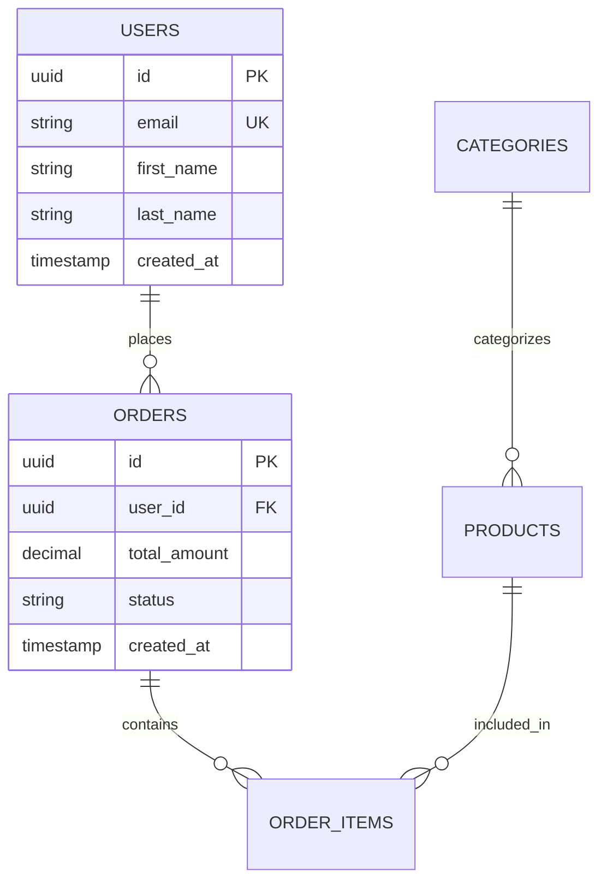

# File Type Processor Module

<!-- INSTANTIATION RULES
When the drill-down engine (or any orchestrator) uses this template:
1. Every placeholder — including {{variables}}, <TBD>, [project name], and generic
   field/function/endpoint names — MUST be replaced with project-specific values
   before output is written to prompts/outputs/current/.
2. The template filename MUST NOT appear in task output. Dissolve the template
   into concrete content; do not reference its source.
3. No strings beginning with ".ai-prompts/prompts/" may appear in the output
   (validated by scripts/validate-instantiation.sh).
4. Outputs must contain real data shapes, real endpoints, real file paths, and
   real function signatures specific to the project.
-->


## Purpose
Process and extract meaningful information from various file types to support comprehensive asset integration into generated specifications. This module handles diverse file formats including design files, documentation, data files, and media assets, converting them into standardized, actionable information that can be seamlessly integrated into project specifications and development workflows.

## Instructions

### When to Use This Module
- Processing diverse file types from user-provided assets
- Extracting structured information from design and specification files
- Converting various formats into standardized project documentation
- Preparing assets for integration into development workflows
- Creating comprehensive asset summaries and integration guides

### Implementation Steps
1. **Identify File Types**: Analyze file extensions, MIME types, and content to determine appropriate processing methods
2. **Extract Information**: Use format-specific processing techniques to extract relevant data and metadata
3. **Standardize Output**: Convert extracted information into consistent, structured formats for easy integration
4. **Document Findings**: Create detailed summaries of processed information with integration recommendations
5. **Map Integration Points**: Identify how processed information relates to other assets and project requirements

### Key Processing Categories
- **Design Files**: Figma, Sketch, Adobe XD, Photoshop - extract components, colors, typography, layouts
- **Documentation Files**: Markdown, Word, PDF - extract requirements, specifications, and structured content
- **Data Files**: JSON, CSV, XML, YAML - parse structure, validate format, extract sample data
- **Media Files**: Images, videos, audio - analyze dimensions, formats, optimization opportunities
- **Code Files**: Various programming languages - extract APIs, functions, documentation

### Processing Approach
- **Format-Specific Extraction**: Use appropriate tools and libraries for each file type
- **Metadata Collection**: Gather comprehensive metadata including file properties and content analysis
- **Content Structuring**: Organize extracted information into standardized formats
- **Integration Mapping**: Identify relationships and dependencies between processed assets

## Examples

## Examples

### 1. Comprehensive Design File Processing
```markdown
## Design File Processing Report: E-commerce Platform

**Processing Date**: 2024-01-15
**Input Files**: 8 design files across 3 formats
**Target Output**: Structured design specifications and component library

### Figma File Processing: homepage-desktop.fig

**File Metadata**:
- File Size: 3.2MB
- Last Modified: 2024-01-10
- Figma Version: 116.2.0
- Artboards: 5 (Homepage, Product List, Product Detail, Cart, Checkout)

**Design System Analysis**:
- **Color Palette Extracted**:
  - Primary: #2563eb (Blue 600)
  - Secondary: #10b981 (Emerald 500)
  - Neutral: #6b7280 (Gray 500)
  - Success: #059669 (Emerald 600)
  - Error: #dc2626 (Red 600)
  - Warning: #d97706 (Amber 600)

- **Typography System**:
  - Font Family: Inter (Variable)
  - Heading 1: 48px/56px, Weight 700
  - Heading 2: 36px/44px, Weight 600
  - Heading 3: 24px/32px, Weight 600
  - Body Large: 18px/28px, Weight 400
  - Body: 16px/24px, Weight 400
  - Caption: 14px/20px, Weight 400

- **Component Library Identified**:
  - Buttons: 6 variants (Primary, Secondary, Outline, Ghost, Link, Icon)
  - Form Elements: 8 components (Input, Select, Checkbox, Radio, Toggle, Textarea)
  - Navigation: 4 components (Header, Sidebar, Breadcrumb, Pagination)
  - Cards: 5 variants (Product, Feature, Testimonial, Blog, CTA)
  - Modals: 3 types (Confirmation, Form, Gallery)

- **Layout System**:
  - Grid: 12-column responsive grid
  - Breakpoints: Mobile (375px), Tablet (768px), Desktop (1200px), Wide (1440px)
  - Spacing Scale: 4px base unit (4, 8, 12, 16, 24, 32, 48, 64, 96px)
  - Container Max-width: 1200px with 24px padding

**Integration Recommendations**:
1. Export color palette as CSS custom properties and design tokens
2. Create component library documentation with usage guidelines
3. Generate responsive grid system CSS framework
4. Extract icon library for development team
5. Document interaction states and micro-animations

### Sketch File Processing: mobile-app-screens.sketch

**File Metadata**:
- File Size: 5.1MB
- Sketch Version: 99.1
- Pages: 3 (Onboarding, Main App, Settings)
- Artboards: 24 screens total

**Mobile Design Analysis**:
- **Screen Inventory**:
  - Onboarding Flow: 6 screens (Welcome, Features, Permissions, Login, Signup, Success)
  - Main Application: 12 screens (Dashboard, Search, Product Detail, Cart, Profile, etc.)
  - Settings & Account: 6 screens (Settings, Profile Edit, Notifications, Help, About)

- **Mobile-Specific Patterns**:
  - Navigation: Bottom tab bar with 4 primary sections
  - Gestures: Swipe-to-delete, pull-to-refresh, pinch-to-zoom documented
  - Touch Targets: All interactive elements minimum 44pt
  - Safe Areas: Proper iPhone notch and home indicator handling

- **Component Adaptations**:
  - Mobile Buttons: Adapted for touch with increased padding
  - Mobile Forms: Optimized input fields with proper keyboard types
  - Mobile Cards: Simplified layouts for smaller screens
  - Mobile Navigation: Collapsible sections and drawer patterns

**Mobile Integration Points**:
1. Create React Native component library based on designs
2. Generate mobile-specific design tokens and spacing system
3. Document gesture interactions and animations
4. Create responsive image specifications for different screen densities

### Adobe XD Processing: component-library.xd

**File Metadata**:
- File Size: 2.8MB
- XD Version: 57.1.12
- Components: 45 master components
- Color Swatches: 24 defined colors

**Component System Analysis**:
- **Atomic Design Structure**:
  - Atoms: 15 components (Button, Input, Icon, Label, Badge, etc.)
  - Molecules: 18 components (Search Bar, Card Header, Form Group, etc.)
  - Organisms: 12 components (Header, Footer, Product Grid, etc.)

- **Component States Documented**:
  - Interactive States: Default, Hover, Active, Disabled, Loading
  - Validation States: Success, Error, Warning
  - Responsive States: Mobile, Tablet, Desktop variants

- **Design Token Extraction**:
  - Spacing Tokens: 8-point grid system (8, 16, 24, 32, 40, 48px)
  - Border Radius: 4px, 8px, 12px, 16px, 24px, 50% (pill)
  - Shadow Tokens: 5 elevation levels with proper blur and opacity
  - Animation Tokens: Duration (150ms, 300ms, 500ms), Easing (ease-out, ease-in-out)

**Component Documentation Generated**:
```markdown
# Button Component Specification

## Variants
- Primary: Blue background, white text, used for main actions
- Secondary: Gray background, dark text, used for secondary actions
- Outline: Transparent background, colored border, used for tertiary actions

## States
- Default: Base appearance
- Hover: Slightly darker background, subtle scale (1.02x)
- Active: Pressed appearance with darker background
- Disabled: 50% opacity, no pointer events
- Loading: Spinner icon, disabled state

## Sizes
- Small: 32px height, 12px padding, 14px font
- Medium: 40px height, 16px padding, 16px font
- Large: 48px height, 20px padding, 18px font

## Usage Guidelines
- Use Primary for main call-to-action buttons
- Limit to one Primary button per screen section
- Use Secondary for supporting actions
- Ensure minimum 8px spacing between buttons
```

### Documentation File Processing: requirements.md

**File Metadata**:
- File Size: 25KB
- Format: Markdown
- Sections: 8 major sections
- Word Count: ~4,200 words

**Content Structure Analysis**:
- **Document Hierarchy**:
  - H1: Project Overview (1 section)
  - H2: Functional Requirements (6 sections)
  - H3: Detailed Requirements (24 subsections)
  - H4: Acceptance Criteria (48 items)

- **Requirement Categories Identified**:
  - User Authentication: 8 requirements
  - Product Management: 12 requirements
  - Shopping Cart: 6 requirements
  - Payment Processing: 10 requirements
  - Order Management: 7 requirements
  - User Profile: 5 requirements

- **Extracted User Stories**:
```markdown
## User Authentication Requirements

### Epic: User Registration and Login
- As a new user, I want to create an account so I can save my preferences
- As a returning user, I want to log in quickly so I can access my account
- As a user, I want to reset my password so I can regain access if forgotten

### Acceptance Criteria Extracted:
- Registration form validates email format and password strength
- Login supports email/password and social authentication (Google, Facebook)
- Password reset sends secure token via email with 1-hour expiration
- Account lockout after 5 failed login attempts for security
```

**Integration Mapping**:
1. Map requirements to design screens and user flows
2. Create traceability matrix linking requirements to test cases
3. Generate API endpoint specifications from functional requirements
4. Create user story cards for development sprint planning

### Data File Processing: sample-products.json

**File Metadata**:
- File Size: 45KB
- Format: JSON
- Records: 100 product entries
- Schema Validation: Valid JSON structure

**Data Structure Analysis**:
```json
{
  "products": [
    {
      "id": "prod_001",
      "name": "Wireless Bluetooth Headphones",
      "category": "Electronics",
      "subcategory": "Audio",
      "price": 129.99,
      "currency": "USD",
      "description": "High-quality wireless headphones with noise cancellation",
      "images": [
        "https://example.com/images/headphones-main.jpg",
        "https://example.com/images/headphones-side.jpg"
      ],
      "specifications": {
        "battery_life": "30 hours",
        "connectivity": "Bluetooth 5.0",
        "weight": "250g"
      },
      "inventory": {
        "stock_quantity": 45,
        "warehouse_location": "US-WEST-01"
      },
      "metadata": {
        "created_at": "2024-01-01T00:00:00Z",
        "updated_at": "2024-01-10T15:30:00Z"
      }
    }
  ]
}
```

**Data Quality Analysis**:
- **Completeness**: 98% (2 products missing descriptions)
- **Consistency**: 95% (Price format consistent, some category variations)
- **Validity**: 100% (All required fields present)
- **Uniqueness**: 100% (No duplicate product IDs)

**Schema Extraction for API Design**:
```yaml
# Generated OpenAPI schema
Product:
  type: object
  required:
    - id
    - name
    - category
    - price
    - currency
  properties:
    id:
      type: string
      pattern: '^prod_[0-9]{3}$'
    name:
      type: string
      maxLength: 100
    category:
      type: string
      enum: [Electronics, Clothing, Home, Sports, Books]
    price:
      type: number
      minimum: 0
    currency:
      type: string
      enum: [USD, EUR, GBP]
```

### Media File Processing: hero-image.jpg

**File Metadata**:
- File Size: 1.2MB
- Dimensions: 1920x1080 pixels
- Format: JPEG
- Color Profile: sRGB
- Compression Quality: 85%

**Image Analysis**:
- **Technical Properties**:
  - Aspect Ratio: 16:9 (suitable for hero sections)
  - Resolution: 72 DPI (web-optimized)
  - Color Depth: 24-bit (16.7 million colors)
  - Compression: Moderate (good balance of quality/size)

- **Content Analysis**:
  - Subject: Modern office workspace with laptop and coffee
  - Composition: Rule of thirds, good negative space
  - Lighting: Natural lighting, well-exposed
  - Style: Professional, clean, minimalist

- **Optimization Recommendations**:
  - WebP Version: Estimated 30% size reduction (840KB)
  - AVIF Version: Estimated 50% size reduction (600KB)
  - Responsive Variants Needed:
    - Mobile: 375x211px (16:9 crop)
    - Tablet: 768x432px (16:9 crop)
    - Desktop: 1200x675px (16:9 crop)
    - Large: 1920x1080px (original)

**Integration Specifications**:
```html
<!-- Generated responsive image markup -->
<picture>
  <source media="(min-width: 1200px)" 
          srcset="hero-1920.avif 1920w, hero-1920.webp 1920w, hero-1920.jpg 1920w"
          sizes="100vw">
  <source media="(min-width: 768px)" 
          srcset="hero-1200.avif 1200w, hero-1200.webp 1200w, hero-1200.jpg 1200w"
          sizes="100vw">
  <source media="(min-width: 375px)" 
          srcset="hero-768.avif 768w, hero-768.webp 768w, hero-768.jpg 768w"
          sizes="100vw">
  
</picture>
```
```

### 2. API Documentation Processing
```markdown
## API Documentation Processing: OpenAPI Specification

**Processing Date**: 2024-01-15
**Input File**: api-specification.yaml (12KB)
**Format**: OpenAPI 3.0
**Endpoints**: 23 documented endpoints

### OpenAPI Structure Analysis

**Specification Metadata**:
- OpenAPI Version: 3.0.3
- API Version: v2.1.0
- Title: Customer Management API
- Base URL: https://api.example.com/v2

**Endpoint Inventory**:
- **Authentication**: 3 endpoints (login, refresh, logout)
- **Users**: 8 endpoints (CRUD operations, profile management)
- **Products**: 6 endpoints (catalog management, search)
- **Orders**: 4 endpoints (create, read, update, cancel)
- **Analytics**: 2 endpoints (reports, metrics)

**Data Model Extraction**:
```yaml
# User Model
User:
  type: object
  required: [id, email, firstName, lastName]
  properties:
    id:
      type: string
      format: uuid
    email:
      type: string
      format: email
    firstName:
      type: string
      maxLength: 50
    lastName:
      type: string
      maxLength: 50
    role:
      type: string
      enum: [admin, user, viewer]
    createdAt:
      type: string
      format: date-time
```

**Security Scheme Analysis**:
- **Authentication Type**: OAuth 2.0 with JWT tokens
- **Scopes Defined**: read:users, write:users, read:orders, write:orders
- **Rate Limiting**: 1000 requests per hour per API key
- **CORS Policy**: Configured for specific domains

**Generated Integration Code**:
```javascript
// Auto-generated API client
class CustomerAPI {
  constructor(baseURL, apiKey) {
    this.baseURL = baseURL;
    this.apiKey = apiKey;
  }
  
  async getUser(userId) {
    const response = await fetch(`${this.baseURL}/users/${userId}`, {
      headers: {
        'Authorization': `Bearer ${this.apiKey}`,
        'Content-Type': 'application/json'
      }
    });
    return response.json();
  }
  
  async createOrder(orderData) {
    const response = await fetch(`${this.baseURL}/orders`, {
      method: 'POST',
      headers: {
        'Authorization': `Bearer ${this.apiKey}`,
        'Content-Type': 'application/json'
      },
      body: JSON.stringify(orderData)
    });
    return response.json();
  }
}
```

### Database Schema Processing: schema.sql

**File Metadata**:
- File Size: 8KB
- Format: PostgreSQL SQL
- Tables: 12 tables defined
- Relationships: 15 foreign key constraints

**Schema Structure Analysis**:
```sql
-- Extracted table relationships
users (id) -> orders (user_id)
orders (id) -> order_items (order_id)
products (id) -> order_items (product_id)
categories (id) -> products (category_id)
```

**Data Model Diagram Generated**:


**Migration Scripts Generated**:
```sql
-- Auto-generated migration for development setup
CREATE TABLE users (
    id UUID PRIMARY KEY DEFAULT gen_random_uuid(),
    email VARCHAR(255) UNIQUE NOT NULL,
    first_name VARCHAR(100) NOT NULL,
    last_name VARCHAR(100) NOT NULL,
    password_hash VARCHAR(255) NOT NULL,
    role VARCHAR(20) DEFAULT 'user',
    created_at TIMESTAMP DEFAULT CURRENT_TIMESTAMP,
    updated_at TIMESTAMP DEFAULT CURRENT_TIMESTAMP
);

CREATE INDEX idx_users_email ON users(email);
CREATE INDEX idx_users_role ON users(role);
```
```

### 3. Configuration File Processing
```markdown
## Configuration File Processing Report

**Processing Date**: 2024-01-15
**Input Files**: 6 configuration files
**Formats**: JSON, YAML, ENV, XML

### Environment Configuration: .env.example

**File Analysis**:
- Variables Defined: 24 environment variables
- Categories: Database, API, Security, Features, Monitoring
- Security Level: Contains sensitive variable templates

**Extracted Configuration Schema**:
```yaml
# Generated configuration documentation
Database:
  DB_HOST:
    description: Database server hostname
    type: string
    required: true
    example: "localhost"
  DB_PORT:
    description: Database server port
    type: integer
    default: 5432
  DB_NAME:
    description: Database name
    type: string
    required: true

API:
  API_BASE_URL:
    description: Base URL for API endpoints
    type: string
    required: true
    format: url
  API_RATE_LIMIT:
    description: Requests per minute limit
    type: integer
    default: 1000
    minimum: 100
    maximum: 10000

Security:
  JWT_SECRET:
    description: Secret key for JWT token signing
    type: string
    required: true
    sensitive: true
    minLength: 32
```

**Environment Setup Guide Generated**:
```bash
#!/bin/bash
# Auto-generated environment setup script

echo "Setting up development environment..."

# Copy environment template
cp .env.example .env

# Generate secure JWT secret
JWT_SECRET=$(openssl rand -base64 32)
sed -i "s/JWT_SECRET=your-secret-here/JWT_SECRET=$JWT_SECRET/" .env

# Set default database configuration
sed -i "s/DB_HOST=localhost/DB_HOST=localhost/" .env
sed -i "s/DB_PORT=5432/DB_PORT=5432/" .env
sed -i "s/DB_NAME=myapp/DB_NAME=myapp_dev/" .env

echo "Environment configuration complete!"
echo "Please review and update .env file with your specific values."
```

### Package Configuration: package.json

**File Analysis**:
- Dependencies: 45 production dependencies
- Dev Dependencies: 23 development dependencies
- Scripts: 12 npm scripts defined
- Node Version: >=16.0.0

**Dependency Analysis**:
```json
{
  "analysis": {
    "totalDependencies": 68,
    "securityVulnerabilities": 0,
    "outdatedPackages": 3,
    "licenseCompliance": "MIT compatible",
    "bundleSize": "estimated 2.3MB gzipped"
  },
  "recommendations": [
    "Update react from 17.0.2 to 18.2.0",
    "Update typescript from 4.5.0 to 5.0.0",
    "Consider replacing moment.js with date-fns for smaller bundle"
  ]
}
```

**Generated Development Scripts**:
```json
{
  "scripts": {
    "dev": "next dev",
    "build": "next build",
    "start": "next start",
    "test": "jest --watch",
    "test:ci": "jest --ci --coverage",
    "lint": "eslint . --ext .js,.jsx,.ts,.tsx",
    "lint:fix": "eslint . --ext .js,.jsx,.ts,.tsx --fix",
    "type-check": "tsc --noEmit",
    "analyze": "ANALYZE=true npm run build"
  }
}
```
```

### 4. Spreadsheet Data Processing
```markdown
## Spreadsheet Processing: user-data.xlsx

**File Metadata**:
- File Size: 156KB
- Format: Excel XLSX
- Worksheets: 3 (Users, Orders, Products)
- Total Rows: 1,247 data rows

### Users Worksheet Analysis

**Data Structure**:
- Columns: 8 (ID, First Name, Last Name, Email, Phone, Registration Date, Status, Role)
- Rows: 500 user records
- Data Quality: 98% complete (10 missing phone numbers)

**Data Validation Results**:
```json
{
  "validation": {
    "emailFormat": {
      "valid": 495,
      "invalid": 5,
      "issues": ["Invalid format: user@domain", "Missing @ symbol"]
    },
    "phoneFormat": {
      "valid": 485,
      "invalid": 5,
      "missing": 10
    },
    "duplicates": {
      "emailDuplicates": 2,
      "phoneDuplicates": 1
    }
  }
}
```

**Generated Data Migration Script**:
```sql
-- Auto-generated user data migration
INSERT INTO users (id, first_name, last_name, email, phone, created_at, status, role)
VALUES 
  ('usr_001', 'John', 'Doe', 'john.doe@example.com', '+1-555-0123', '2023-01-15', 'active', 'user'),
  ('usr_002', 'Jane', 'Smith', 'jane.smith@example.com', '+1-555-0124', '2023-01-16', 'active', 'admin'),
  -- ... (498 more records)
ON CONFLICT (email) DO UPDATE SET
  first_name = EXCLUDED.first_name,
  last_name = EXCLUDED.last_name,
  phone = EXCLUDED.phone,
  updated_at = CURRENT_TIMESTAMP;
```

### Orders Worksheet Analysis

**Data Relationships Identified**:
- User ID references Users worksheet
- Product references Products worksheet
- Order totals calculated from line items

**Data Integrity Check**:
```json
{
  "integrity": {
    "userReferences": {
      "valid": 745,
      "orphaned": 2,
      "issues": ["Order 1001 references non-existent user usr_999"]
    },
    "productReferences": {
      "valid": 1240,
      "orphaned": 7,
      "issues": ["Orders reference discontinued products"]
    },
    "calculations": {
      "correctTotals": 742,
      "incorrectTotals": 5,
      "tolerance": "±$0.01"
    }
  }
}
```

**Generated Analytics Queries**:
```sql
-- Auto-generated business intelligence queries

-- Monthly sales summary
SELECT 
  DATE_TRUNC('month', order_date) as month,
  COUNT(*) as order_count,
  SUM(total_amount) as revenue,
  AVG(total_amount) as avg_order_value
FROM orders 
WHERE status = 'completed'
GROUP BY DATE_TRUNC('month', order_date)
ORDER BY month DESC;

-- Top customers by revenue
SELECT 
  u.first_name || ' ' || u.last_name as customer_name,
  u.email,
  COUNT(o.id) as order_count,
  SUM(o.total_amount) as total_spent
FROM users u
JOIN orders o ON u.id = o.user_id
WHERE o.status = 'completed'
GROUP BY u.id, u.first_name, u.last_name, u.email
ORDER BY total_spent DESC
LIMIT 10;
```
```

### 5. Video and Audio File Processing
```markdown
## Media File Processing: training-video.mp4

**File Metadata**:
- File Size: 125MB
- Duration: 8 minutes 32 seconds
- Resolution: 1920x1080 (Full HD)
- Frame Rate: 30 fps
- Audio: AAC, 128 kbps, Stereo

**Content Analysis**:
- **Video Content**: Product demonstration and tutorial
- **Audio Quality**: Clear narration, no background noise
- **Visual Quality**: Professional lighting, stable footage
- **Accessibility**: No captions or transcripts provided

**Processing Recommendations**:
```json
{
  "optimizations": {
    "webOptimized": {
      "format": "MP4 (H.264)",
      "resolution": "1280x720",
      "bitrate": "2000 kbps",
      "estimatedSize": "45MB"
    },
    "mobileOptimized": {
      "format": "MP4 (H.264)",
      "resolution": "854x480",
      "bitrate": "1000 kbps",
      "estimatedSize": "25MB"
    },
    "thumbnails": {
      "count": 10,
      "format": "WebP",
      "resolution": "320x180"
    }
  },
  "accessibility": {
    "captionsNeeded": true,
    "transcriptNeeded": true,
    "audioDescriptionRecommended": false
  }
}
```

**Generated Video Integration Code**:
```html
<!-- Responsive video player with accessibility features -->
<video 
  controls 
  preload="metadata"
  poster="training-video-poster.webp"
  aria-label="Product demonstration tutorial">
  
  <!-- Multiple source formats for browser compatibility -->
  <source src="training-video-1080p.mp4" type="video/mp4" media="(min-width: 1200px)">
  <source src="training-video-720p.mp4" type="video/mp4" media="(min-width: 768px)">
  <source src="training-video-480p.mp4" type="video/mp4">
  
  <!-- Captions for accessibility -->
  <track kind="captions" src="training-video-captions.vtt" srclang="en" label="English" default>
  <track kind="descriptions" src="training-video-descriptions.vtt" srclang="en" label="Audio Descriptions">
  
  <!-- Fallback for browsers that don't support video -->
  <p>Your browser doesn't support video playback. 
     <a href="training-video-480p.mp4" download>Download the video</a> instead.</p>
</video>
```

**Auto-Generated Transcript** (using speech-to-text):
```markdown
# Training Video Transcript

## Introduction (0:00 - 0:30)
Welcome to our product demonstration. In this video, we'll walk through the key features of our customer management platform and show you how to get started.

## Feature Overview (0:30 - 2:15)
The dashboard provides a comprehensive view of your customer data. You can see recent activity, pending tasks, and key metrics at a glance...

[Transcript continues with timestamps and speaker identification]
```

### Audio File Processing: podcast-episode.mp3

**File Metadata**:
- File Size: 45MB
- Duration: 32 minutes 18 seconds
- Format: MP3, 128 kbps
- Sample Rate: 44.1 kHz
- Channels: Stereo

**Content Analysis**:
- **Content Type**: Interview/discussion format
- **Speakers**: 2 identified (host and guest)
- **Audio Quality**: Good, minimal background noise
- **Topics Discussed**: Product strategy, market trends, user feedback

**Generated Podcast Metadata**:
```json
{
  "episode": {
    "title": "Product Strategy and Market Trends",
    "description": "Discussion with industry expert about current market trends and product development strategies",
    "duration": "32:18",
    "publishDate": "2024-01-15",
    "speakers": [
      {
        "name": "Host",
        "role": "Product Manager",
        "segments": ["0:00-1:30", "15:45-18:20", "28:30-32:18"]
      },
      {
        "name": "Guest",
        "role": "Industry Expert",
        "segments": ["1:30-15:45", "18:20-28:30"]
      }
    ],
    "topics": [
      {"topic": "Market Analysis", "timestamp": "2:15"},
      {"topic": "User Research Insights", "timestamp": "8:30"},
      {"topic": "Product Roadmap", "timestamp": "18:45"},
      {"topic": "Competitive Landscape", "timestamp": "25:10"}
    ]
  }
}
```
```

## Overview

**Extracted Requirements**:
- Mobile-first responsive design
- Touch-friendly interface elements
- Offline capability indicators
- Progressive disclosure patterns
```

### Specification File Processing Example
```markdown
## Processing Task: Technical Specifications

**Input Files**:
- api-specification.yaml (OpenAPI spec)
- requirements.md (Markdown requirements)
- database-schema.sql (SQL schema)

**Processing Results**:

### api-specification.yaml
**File Type**: OpenAPI 3.0 Specification
**Content Analysis**:
- **Endpoints**: 24 REST endpoints across 6 resource types
- **Authentication**: JWT bearer token authentication
- **Data Models**: 12 schema definitions with validation rules
- **Error Handling**: Standardized error response format

**Implementation Requirements**:
- RESTful API with OpenAPI compliance
- JWT authentication middleware
- Input validation for all endpoints
- Comprehensive error handling

### requirements.md
**File Type**: Markdown Requirements Document
**Content Analysis**:
- **User Stories**: 18 user stories across 4 user roles
- **Acceptance Criteria**: 45 specific acceptance criteria
- **Non-functional Requirements**: Performance, security, accessibility
- **Business Rules**: 12 business logic rules

**Extracted Features**:
- User authentication and authorization
- Product catalog management
- Order processing workflow
- Admin dashboard functionality
```

## Core Functionality

### File Type Processing Prompt
```
You are a file type processing specialist. Your task is to extract meaningful information from various file formats and prepare that information for integration into specifications and implementation plans.

**Processing Approach:**
1. **Identify file type and format** based on extension and content analysis
2. **Extract structured information** relevant to specification generation
3. **Convert information to standardized formats** for consistent processing
4. **Identify integration opportunities** with other assets and specifications
5. **Generate processing summaries** for documentation and reference

**File Type Processing Rules:**

### Design Files

#### Image-Based Designs (PNG, JPG, SVG)
**Processing Steps:**
1. **Visual Analysis**:
   - Identify UI components and layout patterns
   - Extract color palette and typography information
   - Recognize design patterns and interaction elements
   - Document layout structure and hierarchy

2. **Content Extraction**:
   - List visible text content and labels
   - Identify form fields, buttons, and interactive elements
   - Document navigation structure and user flow
   - Extract branding elements and visual style

3. **Technical Analysis**:
   - Assess image resolution and quality
   - Identify responsive design considerations
   - Document accessibility considerations visible in design
   - Note platform-specific design elements

**Output Format:**
```markdown
## Design File Analysis: [filename]

### Visual Components Identified
- **Layout Type**: [grid, flexbox, custom layout]
- **Navigation**: [header nav, sidebar, footer, mobile menu]
- **Content Areas**: [hero section, content blocks, sidebar, footer]
- **Interactive Elements**: [buttons, forms, modals, dropdowns]

### Design System Elements
- **Color Palette**: [list primary, secondary, accent colors with hex codes if visible]
- **Typography**: [heading styles, body text, font weights observed]
- **Spacing**: [consistent spacing patterns observed]
- **Component Patterns**: [card layouts, button styles, form patterns]

### Content Structure
- **Page Title**: [main heading or page title]
- **Section Headings**: [list of section headings visible]
- **Call-to-Action Elements**: [buttons, links, forms]
- **Content Types**: [text blocks, images, lists, tables]

### Technical Considerations
- **Responsive Elements**: [mobile-specific elements, breakpoint considerations]
- **Accessibility Features**: [alt text areas, focus indicators, contrast]
- **Platform Adaptations**: [web-specific, mobile-specific elements]

### Integration Opportunities
- **Related Assets**: [other design files this relates to]
- **Specification Impact**: [how this influences UI/UX specifications]
- **Implementation Notes**: [technical considerations for development]
```

#### Vector Design Files (Sketch, Figma, Adobe XD)
**Processing Steps:**
1. **Layer Analysis**: Extract layer structure and component organization
2. **Component Extraction**: Identify reusable components and design systems
3. **Style Guide Extraction**: Extract colors, fonts, and style definitions
4. **Interaction Documentation**: Document any interactive prototypes or flows

### Specification Files

#### Markdown Documents (.md)
**Processing Steps:**
1. **Structure Analysis**:
   - Parse heading hierarchy and document structure
   - Extract sections and subsections
   - Identify lists, tables, and code blocks
   - Document cross-references and links

2. **Content Classification**:
   - Identify requirements vs. design vs. implementation content
   - Extract user stories and acceptance criteria
   - Find business rules and constraints
   - Locate technical specifications and API definitions

**Output Format:**
```markdown
## Specification Analysis: [filename]

### Document Structure
- **Document Type**: [requirements, API spec, technical doc, business rules]
- **Main Sections**: [list of major sections]
- **Subsection Count**: [number of detailed subsections]
- **Cross-References**: [links to other documents or external resources]

### Requirements Content
- **User Stories**: [count and brief summary]
- **Acceptance Criteria**: [count and complexity assessment]
- **Business Rules**: [count and brief summary]
- **Constraints**: [technical, business, or regulatory constraints]

### Technical Content
- **API Endpoints**: [count and brief summary if applicable]
- **Data Models**: [entities and relationships mentioned]
- **Technical Requirements**: [performance, security, integration needs]
- **Implementation Notes**: [specific technical guidance provided]

### Integration Opportunities
- **Related Specifications**: [other spec files this connects to]
- **Design Connections**: [design files this specification relates to]
- **Data Dependencies**: [data files or schemas this references]
```

#### JSON/YAML Files (.json, .yaml, .yml)
**Processing Steps:**
1. **Schema Analysis**: Understand data structure and relationships
2. **Content Validation**: Verify syntax and completeness
3. **Usage Context**: Determine how this data relates to system design
4. **Integration Mapping**: Identify how this connects to other assets

### Data Files

#### CSV Files (.csv)
**Processing Steps:**
1. **Schema Extraction**: Identify columns, data types, and relationships
2. **Data Quality Assessment**: Check for completeness and consistency
3. **Sample Analysis**: Understand data patterns and edge cases
4. **Usage Context**: Determine how this data informs system design

**Output Format:**
```markdown
## Data File Analysis: [filename]

### Schema Information
- **Column Count**: [number of columns]
- **Row Count**: [number of data rows]
- **Primary Columns**: [key identifying columns]
- **Data Types**: [inferred data types for each column]

### Data Quality
- **Completeness**: [percentage of complete records]
- **Consistency**: [data format consistency assessment]
- **Edge Cases**: [unusual or boundary values identified]
- **Relationships**: [foreign key relationships or data connections]

### Business Context
- **Entity Type**: [users, products, orders, etc.]
- **Use Cases**: [how this data would be used in the system]
- **Integration Points**: [how this connects to other data or APIs]
```

#### SQL Files (.sql)
**Processing Steps:**
1. **Schema Extraction**: Parse table definitions and relationships
2. **Constraint Analysis**: Identify foreign keys, indexes, and constraints
3. **Data Model Documentation**: Create entity relationship understanding
4. **Migration Context**: Understand schema evolution and versioning

### Asset Files

#### Font Files (.ttf, .otf, .woff)
**Processing Steps:**
1. **Font Family Analysis**: Identify font family, weights, and styles
2. **Character Set Assessment**: Determine language and symbol support
3. **Usage Guidelines**: Extract or infer appropriate usage contexts
4. **Technical Compatibility**: Assess web and platform compatibility

#### Media Files (.mp4, .mp3, .wav)
**Processing Steps:**
1. **Content Analysis**: Understand media content and purpose
2. **Technical Specifications**: Extract format, quality, and size information
3. **Usage Context**: Determine appropriate integration points
4. **Optimization Needs**: Identify format or quality optimization opportunities

## Processing Output Integration

### Standardized Information Extraction
All processed files generate standardized metadata:

```markdown
## File Processing Summary: [filename]

### Basic Information
- **File Type**: [category and specific format]
- **Processing Date**: [when analysis was performed]
- **File Size**: [size in appropriate units]
- **Quality Assessment**: [high/medium/low quality rating]

### Extracted Content
- **Structured Data**: [any structured information extracted]
- **Text Content**: [relevant text content found]
- **Visual Elements**: [design elements, colors, layouts identified]
- **Technical Specifications**: [technical details and requirements]

### Integration Recommendations
- **Related Assets**: [other files this should be grouped with]
- **Specification Impact**: [how this influences generated specifications]
- **Implementation Considerations**: [technical notes for development]
- **Quality Improvements**: [suggestions for enhancing this asset]

### Processing Notes
- **Extraction Method**: [how information was extracted]
- **Confidence Level**: [confidence in extracted information]
- **Limitations**: [what couldn't be extracted or analyzed]
- **Follow-up Needed**: [additional processing or clarification needed]
```
```

### Error Handling and Fallbacks
```
**File Processing Error Handling:**

**Corrupted or Inaccessible Files:**
- Document the issue and impact on specification generation
- Suggest alternative approaches or replacement assets
- Provide graceful degradation options

**Unsupported File Formats:**
- Identify the file type and explain why it can't be processed
- Suggest format conversion options if available
- Recommend alternative assets that could serve the same purpose

**Incomplete or Low-Quality Files:**
- Document quality issues and their impact
- Suggest improvements or alternatives
- Provide workarounds for specification generation

**Processing Limitations:**
- Clearly document what could and couldn't be extracted
- Explain the impact on specification completeness
- Suggest manual review or additional assets to fill gaps
```

## Usage Instructions

**Process All File Types:**
```markdown
#[[module:asset-management/file-type-processor.md]]
```

**Process Specific File Types:**
```markdown
#[[module:asset-management/file-type-processor.md|type=designs]]
#[[module:asset-management/file-type-processor.md|type=specifications]]
```

**Parameters:**
- `type`: Focus on specific file types (designs, specifications, data, assets, all)
- `detailed`: Include detailed content analysis (true/false)
- `extract_text`: Extract and analyze text content (true/false)
- `technical_analysis`: Include technical format analysis (true/false)

## Integration Points
- Processes files organized by `asset-organizer.md`
- Feeds extracted information into `asset-validator.md` for quality assessment
- Provides structured data for `mapping-generator.md` documentation
- Supports specification generation with detailed asset information
