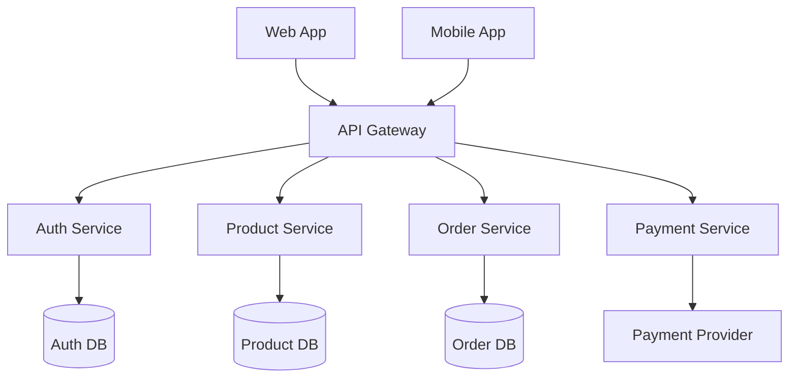

# Stage 03 - Architecture

## Purpose
Design comprehensive system architecture, technology stack, and integration patterns.

## Instructions
Use this stage to create a detailed system architecture that supports all project requirements and platforms. Focus on scalability, maintainability, and performance while making technology decisions that align with team capabilities and project constraints.

1. **Analyze Requirements**: Review charter and requirements for architectural implications
2. **Design System Architecture**: Create high-level system design and component relationships
3. **Select Technology Stack**: Choose appropriate technologies for each platform and component
4. **Plan Integration Patterns**: Define how components will communicate and integrate
5. **Consider Scalability**: Design for current needs and future growth
6. **Document Decisions**: Record architectural decisions with rationale

## Examples

### Microservices Architecture Example
```markdown
## System Architecture: E-commerce Platform

### High-Level Architecture


### Technology Stack Decisions
**Frontend**:
- Web: React + TypeScript + Next.js (SSR for SEO)
- Mobile: React Native (code sharing with web team)

**Backend**:
- API Gateway: Kong (rate limiting, authentication)
- Services: Node.js + Express + TypeScript
- Databases: PostgreSQL (ACID compliance for orders)
- Cache: Redis (session storage, product cache)

**Infrastructure**:
- Hosting: AWS ECS (containerized services)
- CDN: CloudFront (static assets, global distribution)
- Monitoring: DataDog (APM, logging, metrics)

### Integration Patterns
- **API Communication**: RESTful APIs with OpenAPI specs
- **Event Streaming**: Apache Kafka for order processing
- **Authentication**: JWT tokens with refresh mechanism
- **Data Consistency**: Saga pattern for distributed transactions
```

### Monolithic Architecture Example
```markdown
## System Architecture: Task Management SaaS

### Architecture Decision
**Chosen**: Modular Monolith
**Rationale**: 
- Small team (3-5 developers)
- Rapid development and deployment needed
- Clear module boundaries for future extraction

### Technology Stack
**Application**:
- Framework: Ruby on Rails 7 (team expertise)
- Database: PostgreSQL (full-text search, JSON support)
- Cache: Redis (background jobs, session storage)
- Search: PostgreSQL full-text search

**Frontend**:
- Framework: Stimulus + Turbo (Rails-native SPA experience)
- Styling: Tailwind CSS (rapid UI development)
- Build: esbuild (fast compilation)

**Infrastructure**:
- Hosting: Heroku (simple deployment, managed services)
- CDN: Heroku CDN (integrated solution)
- Monitoring: Heroku metrics + Sentry (error tracking)

### Module Structure
```
app/
├── modules/
│   ├── authentication/
│   ├── projects/
│   ├── tasks/
│   ├── teams/
│   └── notifications/
├── shared/
│   ├── ui_components/
│   └── utilities/
└── api/
    └── v1/
```
```

## Templates

## Inputs
- Project charter and scope (Stage 02)
- Technology preferences and constraints
- Scalability and performance requirements

## Outputs
- `platform-agnostic.md` - Core system architecture
- `web.md` - Web architecture specifications
- `mobile.md` - Mobile architecture specifications
- `backend.md` - Backend architecture and APIs
- `prompts/outputs/specifications/data-architecture.md` - Database choice, migrations, backup strategy
- `prompts/outputs/specifications/backend-infrastructure.md` - Runtime/deployment topology and ownership
- Technology stack decisions with rationale
- Integration and deployment architecture

## Prerequisites
- Stage 02 (Charter) completed
- Technology preferences defined

## Next Stage
Stage 04 - Features (Detailed feature specifications)
