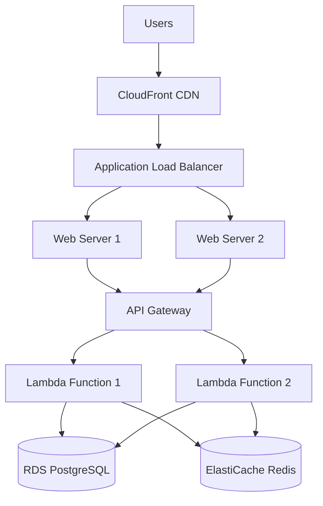

# Stage 07 - Deployment

## Purpose
Configure deployment infrastructure, CI/CD pipelines, and production environment setup for reliable, scalable, and secure application delivery across all target platforms.

## Instructions

### When to Use This Stage
- After implementation planning is complete and development approach is defined
- When setting up production infrastructure and deployment processes
- Before beginning actual development to establish deployment foundations
- When configuring automated testing and deployment pipelines

### Implementation Steps
1. **Analyze Infrastructure Requirements**: Review implementation plan for deployment needs
2. **Design Deployment Architecture**: Create infrastructure design supporting all platforms
3. **Configure CI/CD Pipelines**: Set up automated testing, building, and deployment
4. **Set Up Environments**: Configure development, staging, and production environments
5. **Implement Security Measures**: Configure security, monitoring, and compliance
6. **Create Deployment Documentation**: Document deployment procedures and troubleshooting

### Key Configuration Decisions
- **Hosting Platform**: Choose cloud provider (AWS, Azure, GCP) or on-premises
- **Deployment Strategy**: Select blue-green, rolling, or canary deployment approach
- **CI/CD Platform**: Choose GitHub Actions, GitLab CI, Jenkins, or other automation
- **Monitoring Stack**: Configure logging, metrics, and alerting systems
- **Security Implementation**: Set up authentication, authorization, and data protection

### Quality Assurance Guidelines
- Test deployment processes in staging environments before production
- Implement automated rollback mechanisms for failed deployments
- Configure comprehensive monitoring and alerting for all environments
- Document all deployment procedures and emergency response plans
- Validate security configurations and compliance requirements

## Examples

### 1. Full-Stack Web Application Deployment
```markdown
# Deployment Strategy: E-commerce Platform

## Infrastructure Architecture


## Technology Stack
**Frontend Deployment**:
- Platform: Vercel (optimized for Next.js)
- CDN: Vercel Edge Network with global distribution
- Build: Automatic builds on git push
- Environment Variables: Secure environment configuration

**Backend Deployment**:
- Platform: AWS Lambda (serverless, cost-effective)
- API Gateway: AWS API Gateway with rate limiting
- Database: AWS RDS PostgreSQL with Multi-AZ
- Cache: AWS ElastiCache Redis cluster
- File Storage: AWS S3 with CloudFront distribution

## CI/CD Pipeline Configuration
```yaml
# .github/workflows/deploy.yml
name: Deploy to Production

on:
  push:
    branches: [main]
  pull_request:
    branches: [main]

jobs:
  test:
    runs-on: ubuntu-latest
    steps:
      - uses: actions/checkout@v3
      - uses: actions/setup-node@v3
        with:
          node-version: '18'
      - run: npm ci
      - run: npm run test:unit
      - run: npm run test:integration
      - run: npm run test:e2e

  deploy-frontend:
    needs: test
    if: github.ref == 'refs/heads/main'
    runs-on: ubuntu-latest
    steps:
      - uses: actions/checkout@v3
      - uses: actions/setup-node@v3
      - run: npm ci
      - run: npm run build
      - uses: amondnet/vercel-action@v20
        with:
          vercel-token: ${{ secrets.VERCEL_TOKEN }}
          vercel-org-id: ${{ secrets.ORG_ID }}
          vercel-project-id: ${{ secrets.PROJECT_ID }}
          vercel-args: '--prod'

  deploy-backend:
    needs: test
    if: github.ref == 'refs/heads/main'
    runs-on: ubuntu-latest
    steps:
      - uses: actions/checkout@v3
      - uses: actions/setup-node@v3
      - run: npm ci
      - run: npm run build:lambda
      - uses: serverless/github-action@v3.1
        with:
          args: deploy --stage production
        env:
          AWS_ACCESS_KEY_ID: ${{ secrets.AWS_ACCESS_KEY_ID }}
          AWS_SECRET_ACCESS_KEY: ${{ secrets.AWS_SECRET_ACCESS_KEY }}
```

## Environment Configuration
**Development Environment**:
- Local development with Docker Compose
- Hot reloading for rapid development
- Local PostgreSQL and Redis instances
- Mock external services for testing

**Staging Environment**:
- Production-like infrastructure at smaller scale
- Automated deployment from develop branch
- Integration testing with real external services
- Performance testing and load simulation

**Production Environment**:
- High availability with multi-AZ deployment
- Auto-scaling based on traffic patterns
- Comprehensive monitoring and alerting
- Automated backups and disaster recovery
```

### 2. Mobile Application Deployment
```markdown
# Mobile App Deployment: Task Management App

## App Store Distribution Strategy
**iOS Deployment**:
- Platform: Apple App Store Connect
- Build System: Xcode Cloud or GitHub Actions with Fastlane
- Code Signing: Automatic signing with App Store Connect API
- TestFlight: Beta testing with internal and external testers

**Android Deployment**:
- Platform: Google Play Console
- Build System: GitHub Actions with Gradle
- Signing: Upload key stored in GitHub Secrets
- Internal Testing: Play Console internal testing track

## CI/CD Pipeline for Mobile
```yaml
# .github/workflows/mobile-deploy.yml
name: Mobile App Deployment

on:
  push:
    branches: [main, develop]
    paths: ['mobile/**']

jobs:
  test:
    runs-on: ubuntu-latest
    steps:
      - uses: actions/checkout@v3
      - uses: actions/setup-node@v3
      - run: cd mobile && npm ci
      - run: cd mobile && npm run test:unit
      - run: cd mobile && npm run lint

  build-ios:
    needs: test
    runs-on: macos-latest
    steps:
      - uses: actions/checkout@v3
      - uses: actions/setup-node@v3
      - run: cd mobile && npm ci
      - uses: ruby/setup-ruby@v1
        with:
          ruby-version: 3.0
      - run: cd mobile/ios && bundle install
      - run: cd mobile/ios && bundle exec fastlane beta
        env:
          MATCH_PASSWORD: ${{ secrets.MATCH_PASSWORD }}
          FASTLANE_APPLE_APPLICATION_SPECIFIC_PASSWORD: ${{ secrets.FASTLANE_PASSWORD }}

  build-android:
    needs: test
    runs-on: ubuntu-latest
    steps:
      - uses: actions/checkout@v3
      - uses: actions/setup-node@v3
      - run: cd mobile && npm ci
      - uses: actions/setup-java@v3
        with:
          java-version: '11'
          distribution: 'temurin'
      - run: cd mobile/android && ./gradlew assembleRelease
      - uses: r0adkll/upload-google-play@v1
        with:
          serviceAccountJsonPlainText: ${{ secrets.SERVICE_ACCOUNT_JSON }}
          packageName: com.company.taskmanager
          releaseFiles: mobile/android/app/build/outputs/bundle/release/app-release.aab
          track: internal
```

## Backend API Deployment
**Serverless Architecture**:
- AWS Lambda functions for API endpoints
- API Gateway for request routing and rate limiting
- DynamoDB for user data with auto-scaling
- S3 for file uploads with presigned URLs

**Container Architecture Alternative**:
- AWS ECS Fargate for containerized API
- Application Load Balancer for high availability
- RDS PostgreSQL for relational data
- ElastiCache Redis for session storage
```

### 3. Microservices Deployment with Kubernetes
```markdown
# Microservices Deployment: SaaS Platform

## Kubernetes Cluster Architecture
```yaml
# k8s/namespace.yaml
apiVersion: v1
kind: Namespace
metadata:
  name: saas-platform
---
# k8s/deployment.yaml
apiVersion: apps/v1
kind: Deployment
metadata:
  name: user-service
  namespace: saas-platform
spec:
  replicas: 3
  selector:
    matchLabels:
      app: user-service
  template:
    metadata:
      labels:
        app: user-service
    spec:
      containers:
      - name: user-service
        image: myregistry/user-service:latest
        ports:
        - containerPort: 3000
        env:
        - name: DATABASE_URL
          valueFrom:
            secretKeyRef:
              name: db-secret
              key: url
        resources:
          requests:
            memory: "256Mi"
            cpu: "250m"
          limits:
            memory: "512Mi"
            cpu: "500m"
---
# k8s/service.yaml
apiVersion: v1
kind: Service
metadata:
  name: user-service
  namespace: saas-platform
spec:
  selector:
    app: user-service
  ports:
  - port: 80
    targetPort: 3000
  type: ClusterIP
```

## Helm Chart Configuration
```yaml
# helm/values.yaml
global:
  registry: myregistry.com
  tag: latest

services:
  userService:
    enabled: true
    replicas: 3
    resources:
      requests:
        memory: 256Mi
        cpu: 250m
      limits:
        memory: 512Mi
        cpu: 500m

  orderService:
    enabled: true
    replicas: 2
    resources:
      requests:
        memory: 512Mi
        cpu: 500m

database:
  postgresql:
    enabled: true
    auth:
      database: saas_platform
      username: app_user

redis:
  enabled: true
  auth:
    enabled: true

ingress:
  enabled: true
  className: nginx
  hosts:
    - host: api.saasplatform.com
      paths:
        - path: /
          pathType: Prefix
  tls:
    - secretName: api-tls
      hosts:
        - api.saasplatform.com
```

## GitOps Deployment Pipeline
```yaml
# .github/workflows/gitops-deploy.yml
name: GitOps Deployment

on:
  push:
    branches: [main]

jobs:
  build-and-push:
    runs-on: ubuntu-latest
    steps:
      - uses: actions/checkout@v3
      - uses: docker/setup-buildx-action@v2
      - uses: docker/login-action@v2
        with:
          registry: myregistry.com
          username: ${{ secrets.REGISTRY_USERNAME }}
          password: ${{ secrets.REGISTRY_PASSWORD }}
      
      - name: Build and push images
        run: |
          docker buildx build --platform linux/amd64,linux/arm64 \
            -t myregistry.com/user-service:${{ github.sha }} \
            -t myregistry.com/user-service:latest \
            --push ./services/user-service

  deploy:
    needs: build-and-push
    runs-on: ubuntu-latest
    steps:
      - uses: actions/checkout@v3
      - uses: azure/k8s-set-context@v1
        with:
          method: kubeconfig
          kubeconfig: ${{ secrets.KUBE_CONFIG }}
      
      - name: Deploy with Helm
        run: |
          helm upgrade --install saas-platform ./helm \
            --namespace saas-platform \
            --create-namespace \
            --set global.tag=${{ github.sha }} \
            --wait --timeout=10m
```
```

### 4. Serverless-First Deployment Strategy
```markdown
# Serverless Deployment: Content Management System

## Architecture Overview
**Frontend**: Static site generation with incremental builds
**API**: Serverless functions with edge computing
**Database**: Serverless database with auto-scaling
**CDN**: Global edge network with intelligent caching

## Deployment Configuration
```yaml
# serverless.yml
service: cms-platform

provider:
  name: aws
  runtime: nodejs18.x
  region: us-east-1
  stage: ${opt:stage, 'dev'}
  environment:
    STAGE: ${self:provider.stage}
    DATABASE_URL: ${env:DATABASE_URL}
    JWT_SECRET: ${env:JWT_SECRET}

functions:
  api:
    handler: src/lambda.handler
    events:
      - http:
          path: /{proxy+}
          method: ANY
          cors: true
    environment:
      NODE_ENV: production

  imageProcessor:
    handler: src/imageProcessor.handler
    events:
      - s3:
          bucket: cms-uploads-${self:provider.stage}
          event: s3:ObjectCreated:*
    timeout: 30
    memorySize: 1024

resources:
  Resources:
    UploadsS3Bucket:
      Type: AWS::S3::Bucket
      Properties:
        BucketName: cms-uploads-${self:provider.stage}
        CorsConfiguration:
          CorsRules:
            - AllowedHeaders: ['*']
              AllowedMethods: [GET, PUT, POST, DELETE]
              AllowedOrigins: ['*']

    CloudFrontDistribution:
      Type: AWS::CloudFront::Distribution
      Properties:
        DistributionConfig:
          Origins:
            - DomainName: !GetAtt UploadsS3Bucket.DomainName
              Id: S3Origin
              S3OriginConfig:
                OriginAccessIdentity: !Ref OriginAccessIdentity
          DefaultCacheBehavior:
            TargetOriginId: S3Origin
            ViewerProtocolPolicy: redirect-to-https
            CachePolicyId: 4135ea2d-6df8-44a3-9df3-4b5a84be39ad
```

## Edge Deployment with Vercel
```json
// vercel.json
{
  "builds": [
    {
      "src": "package.json",
      "use": "@vercel/static-build",
      "config": {
        "distDir": "dist"
      }
    }
  ],
  "routes": [
    {
      "src": "/api/(.*)",
      "dest": "/api/$1"
    },
    {
      "src": "/(.*)",
      "dest": "/index.html"
    }
  ],
  "functions": {
    "api/**.js": {
      "runtime": "nodejs18.x",
      "regions": ["iad1", "sfo1", "lhr1"]
    }
  },
  "headers": [
    {
      "source": "/api/(.*)",
      "headers": [
        {
          "key": "Cache-Control",
          "value": "s-maxage=60, stale-while-revalidate"
        }
      ]
    }
  ]
}
```

## Monitoring and Observability
```yaml
# monitoring/prometheus.yml
global:
  scrape_interval: 15s

scrape_configs:
  - job_name: 'cms-api'
    static_configs:
      - targets: ['api.cms.com:443']
    scheme: https
    metrics_path: /metrics

  - job_name: 'lambda-functions'
    ec2_sd_configs:
      - region: us-east-1
        port: 9100
    relabel_configs:
      - source_labels: [__meta_ec2_tag_Function]
        target_label: function_name
```
```

### 5. Multi-Environment Deployment Pipeline
```markdown
# Multi-Environment Strategy: Enterprise Application

## Environment Progression
**Development** → **Staging** → **Production**
- Automated deployment to dev on feature branch merge
- Manual promotion to staging after dev validation
- Automated production deployment after staging approval

## Infrastructure as Code
```terraform
# terraform/main.tf
provider "aws" {
  region = var.aws_region
}

module "vpc" {
  source = "./modules/vpc"
  
  environment = var.environment
  cidr_block  = var.vpc_cidr
}

module "ecs_cluster" {
  source = "./modules/ecs"
  
  environment     = var.environment
  vpc_id         = module.vpc.vpc_id
  subnet_ids     = module.vpc.private_subnet_ids
  desired_count  = var.app_desired_count
}

module "rds" {
  source = "./modules/rds"
  
  environment    = var.environment
  vpc_id        = module.vpc.vpc_id
  subnet_ids    = module.vpc.database_subnet_ids
  instance_class = var.db_instance_class
}

# terraform/environments/production/terraform.tfvars
environment = "production"
aws_region = "us-east-1"
vpc_cidr = "10.0.0.0/16"
app_desired_count = 6
db_instance_class = "db.r5.xlarge"

# terraform/environments/staging/terraform.tfvars
environment = "staging"
aws_region = "us-east-1"
vpc_cidr = "10.1.0.0/16"
app_desired_count = 2
db_instance_class = "db.t3.medium"
```

## Deployment Automation
```yaml
# .github/workflows/multi-env-deploy.yml
name: Multi-Environment Deployment

on:
  push:
    branches: [develop, main]
  pull_request:
    branches: [main]

jobs:
  test:
    runs-on: ubuntu-latest
    steps:
      - uses: actions/checkout@v3
      - uses: actions/setup-node@v3
      - run: npm ci
      - run: npm run test:unit
      - run: npm run test:integration
      - run: npm run lint
      - run: npm run type-check

  deploy-dev:
    needs: test
    if: github.ref == 'refs/heads/develop'
    runs-on: ubuntu-latest
    environment: development
    steps:
      - uses: actions/checkout@v3
      - uses: hashicorp/setup-terraform@v2
      - name: Deploy to Development
        run: |
          cd terraform/environments/development
          terraform init
          terraform plan
          terraform apply -auto-approve
        env:
          AWS_ACCESS_KEY_ID: ${{ secrets.AWS_ACCESS_KEY_ID }}
          AWS_SECRET_ACCESS_KEY: ${{ secrets.AWS_SECRET_ACCESS_KEY }}

  deploy-staging:
    needs: test
    if: github.ref == 'refs/heads/main'
    runs-on: ubuntu-latest
    environment: staging
    steps:
      - uses: actions/checkout@v3
      - uses: hashicorp/setup-terraform@v2
      - name: Deploy to Staging
        run: |
          cd terraform/environments/staging
          terraform init
          terraform plan
          terraform apply -auto-approve

  deploy-production:
    needs: deploy-staging
    if: github.ref == 'refs/heads/main'
    runs-on: ubuntu-latest
    environment: production
    steps:
      - uses: actions/checkout@v3
      - uses: hashicorp/setup-terraform@v2
      - name: Deploy to Production
        run: |
          cd terraform/environments/production
          terraform init
          terraform plan
          terraform apply -auto-approve
        env:
          AWS_ACCESS_KEY_ID: ${{ secrets.PROD_AWS_ACCESS_KEY_ID }}
          AWS_SECRET_ACCESS_KEY: ${{ secrets.PROD_AWS_SECRET_ACCESS_KEY }}
```

## Rollback and Recovery Procedures
```bash
#!/bin/bash
# scripts/rollback.sh

set -e

ENVIRONMENT=$1
PREVIOUS_VERSION=$2

if [ -z "$ENVIRONMENT" ] || [ -z "$PREVIOUS_VERSION" ]; then
    echo "Usage: $0 <environment> <previous_version>"
    exit 1
fi

echo "Rolling back $ENVIRONMENT to version $PREVIOUS_VERSION"

# Update ECS service to previous task definition
aws ecs update-service \
    --cluster "app-cluster-$ENVIRONMENT" \
    --service "app-service-$ENVIRONMENT" \
    --task-definition "app-task-$ENVIRONMENT:$PREVIOUS_VERSION"

# Wait for deployment to complete
aws ecs wait services-stable \
    --cluster "app-cluster-$ENVIRONMENT" \
    --services "app-service-$ENVIRONMENT"

echo "Rollback completed successfully"
```
```

## Inputs
- Implementation plan (Stage 06)
- Infrastructure requirements and constraints
- Security and compliance requirements

## Outputs
- `platform-agnostic.md` - Core deployment strategy
- `web.md` - Web application deployment configuration
- `mobile.md` - Mobile app deployment and distribution
- CI/CD pipeline configurations and automation scripts
- Infrastructure as code and environment setup

## Prerequisites
- Stage 06 (Implementation) completed
- Infrastructure decisions finalized

## Next Stage
Stage 08 - Documentation (Documentation generation and maintenance)

## Templates

This module includes the following templates:
