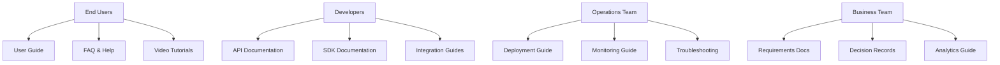

# Stage 08 - Documentation

## Purpose
Generate comprehensive project documentation, user guides, and maintenance procedures that ensure long-term project success, user adoption, and maintainability across all platforms and stakeholders.

## Instructions

### When to Use This Stage
- After deployment infrastructure is configured and tested
- When creating comprehensive documentation for project handoff
- Before quality assurance to ensure all documentation is complete
- When establishing long-term maintenance and support procedures

### Implementation Steps
1. **Analyze Documentation Requirements**: Review all previous stages for documentation needs
2. **Create Documentation Architecture**: Design comprehensive documentation structure
3. **Generate User Documentation**: Create user guides, tutorials, and help systems
4. **Develop Technical Documentation**: Create API docs, architecture guides, and maintenance procedures
5. **Implement Documentation Systems**: Set up documentation platforms and automation
6. **Validate Documentation Quality**: Ensure accuracy, completeness, and usability

### Key Documentation Categories
- **User Documentation**: End-user guides, tutorials, and help systems
- **Developer Documentation**: API references, SDK guides, and integration documentation
- **Operations Documentation**: Deployment guides, monitoring procedures, and troubleshooting
- **Business Documentation**: Requirements, decisions, and project specifications
- **Maintenance Documentation**: Update procedures, backup processes, and disaster recovery

### Quality Standards
- All documentation must be accurate, up-to-date, and tested
- User documentation should be accessible and follow plain language principles
- Technical documentation must include working code examples
- All documentation should be searchable and well-organized
- Regular review and update processes must be established

## Examples

### 1. Comprehensive Documentation Strategy
```markdown
# Documentation Strategy: E-commerce Platform

## Documentation Architecture


## Documentation Platform Strategy
**Primary Platform**: GitBook (centralized, searchable, collaborative)
**API Documentation**: OpenAPI with Swagger UI (interactive, always current)
**Code Documentation**: JSDoc/TypeDoc (embedded in codebase)
**Video Content**: Loom/YouTube (visual tutorials and demos)

## Content Strategy
**User-Focused Content**:
- Getting started guide with 5-minute quick start
- Step-by-step tutorials for common workflows
- FAQ addressing top 20 user questions
- Video walkthroughs for complex features

**Developer-Focused Content**:
- Complete API reference with examples
- SDK documentation with code samples
- Integration guides for popular platforms
- Webhook documentation with testing tools

**Operations-Focused Content**:
- Deployment runbooks with checklists
- Monitoring and alerting setup guides
- Incident response procedures
- Performance optimization guides
```

### 2. User Documentation Example
```markdown
# User Guide: Task Management App

## Getting Started

### Quick Start (5 minutes)
1. **Create Your Account**
   - Visit [app.taskmanager.com](https://app.taskmanager.com)
   - Click "Sign Up" and enter your email
   - Verify your email and set your password

2. **Create Your First Task**
   - Click the "+" button in the top right
   - Enter task title: "Review quarterly reports"
   - Set due date: Next Friday
   - Click "Save Task"

3. **Organize Your Tasks**
   - Drag tasks to reorder by priority
   - Use tags to categorize: #work #urgent #review
   - Create projects to group related tasks

### Core Features

#### Task Management
**Creating Tasks**:
- **Quick Add**: Use the "+" button for simple tasks
- **Detailed Add**: Click "New Task" for full options including:
  - Title and description
  - Due date and time
  - Priority level (High, Medium, Low)
  - Tags and project assignment
  - File attachments

**Editing Tasks**:
- Click any task to open the editor
- All fields can be modified after creation
- Changes are saved automatically
- Edit history is preserved for 30 days

**Task States**:
- **Active**: Tasks you're currently working on
- **Completed**: Finished tasks (archived after 90 days)
- **Deferred**: Tasks postponed to a future date

#### Collaboration Features
**Sharing Tasks**:
1. Open the task you want to share
2. Click the "Share" button
3. Enter collaborator email addresses
4. Set permissions: View Only or Edit Access
5. Click "Send Invitations"

**Team Projects**:
- Create shared projects for team collaboration
- Assign tasks to specific team members
- Track project progress with visual dashboards
- Set project deadlines and milestones

### Mobile App Features

#### Offline Functionality
- All tasks are available offline
- Create and edit tasks without internet
- Changes sync automatically when connected
- Conflict resolution for simultaneous edits

#### Mobile-Specific Features
- **Quick Capture**: Voice-to-text task creation
- **Location Reminders**: Get notified when near specific locations
- **Photo Attachments**: Attach photos directly from camera
- **Push Notifications**: Customizable reminder notifications

### Troubleshooting

#### Common Issues
**Tasks Not Syncing**:
1. Check internet connection
2. Force refresh by pulling down on task list
3. Log out and log back in
4. Contact support if issue persists

**Forgot Password**:
1. Go to login page
2. Click "Forgot Password"
3. Enter your email address
4. Check email for reset link
5. Follow instructions to create new password

#### Getting Help
- **Help Center**: [help.taskmanager.com](https://help.taskmanager.com)
- **Email Support**: support@taskmanager.com
- **Live Chat**: Available 9 AM - 5 PM EST
- **Community Forum**: [community.taskmanager.com](https://community.taskmanager.com)
```

### 3. API Documentation Example
```markdown
# API Documentation: Task Management API

## Authentication
All API requests require authentication using JWT tokens.

```bash
# Get authentication token
curl -X POST https://api.taskmanager.com/auth/login \
  -H "Content-Type: application/json" \
  -d '{
    "email": "user@example.com",
    "password": "your-password"
  }'
```

**Response**:
```json
{
  "token": "eyJhbGciOiJIUzI1NiIsInR5cCI6IkpXVCJ9...",
  "expires_in": 3600,
  "user": {
    "id": "user_123",
    "email": "user@example.com",
    "name": "John Doe"
  }
}
```

## Tasks API

### Create Task
Create a new task for the authenticated user.

**Endpoint**: `POST /api/tasks`
**Authentication**: Required

**Request Body**:
```json
{
  "title": "Review quarterly reports",
  "description": "Review Q4 financial reports and prepare summary",
  "due_date": "2024-03-15T17:00:00Z",
  "priority": "high",
  "tags": ["work", "finance", "quarterly"],
  "project_id": "proj_456"
}
```

**Response** (201 Created):
```json
{
  "id": "task_789",
  "title": "Review quarterly reports",
  "description": "Review Q4 financial reports and prepare summary",
  "due_date": "2024-03-15T17:00:00Z",
  "priority": "high",
  "status": "active",
  "tags": ["work", "finance", "quarterly"],
  "project_id": "proj_456",
  "created_at": "2024-02-08T10:30:00Z",
  "updated_at": "2024-02-08T10:30:00Z",
  "user_id": "user_123"
}
```

### List Tasks
Retrieve tasks for the authenticated user with optional filtering.

**Endpoint**: `GET /api/tasks`
**Authentication**: Required

**Query Parameters**:
- `status` (optional): Filter by status (active, completed, deferred)
- `project_id` (optional): Filter by project
- `tag` (optional): Filter by tag
- `limit` (optional): Number of results (default: 50, max: 100)
- `offset` (optional): Pagination offset (default: 0)

**Example Request**:
```bash
curl -X GET "https://api.taskmanager.com/api/tasks?status=active&limit=10" \
  -H "Authorization: Bearer YOUR_JWT_TOKEN"
```

**Response** (200 OK):
```json
{
  "tasks": [
    {
      "id": "task_789",
      "title": "Review quarterly reports",
      "description": "Review Q4 financial reports and prepare summary",
      "due_date": "2024-03-15T17:00:00Z",
      "priority": "high",
      "status": "active",
      "tags": ["work", "finance", "quarterly"],
      "project_id": "proj_456",
      "created_at": "2024-02-08T10:30:00Z",
      "updated_at": "2024-02-08T10:30:00Z"
    }
  ],
  "pagination": {
    "total": 25,
    "limit": 10,
    "offset": 0,
    "has_more": true
  }
}
```

### Error Handling
All API errors follow a consistent format:

```json
{
  "error": {
    "code": "VALIDATION_ERROR",
    "message": "The request data is invalid",
    "details": {
      "title": ["Title is required"],
      "due_date": ["Due date must be in the future"]
    }
  }
}
```

**Common Error Codes**:
- `AUTHENTICATION_REQUIRED` (401): Missing or invalid authentication
- `FORBIDDEN` (403): Insufficient permissions
- `NOT_FOUND` (404): Resource not found
- `VALIDATION_ERROR` (422): Invalid request data
- `RATE_LIMIT_EXCEEDED` (429): Too many requests

## SDK Documentation

### JavaScript SDK
```javascript
// Installation
npm install @taskmanager/sdk

// Basic usage
import TaskManager from '@taskmanager/sdk';

const client = new TaskManager({
  apiKey: 'your-api-key',
  baseUrl: 'https://api.taskmanager.com'
});

// Create a task
const task = await client.tasks.create({
  title: 'Review quarterly reports',
  description: 'Review Q4 financial reports',
  dueDate: new Date('2024-03-15'),
  priority: 'high',
  tags: ['work', 'finance']
});

// List tasks
const tasks = await client.tasks.list({
  status: 'active',
  limit: 10
});

// Update a task
const updatedTask = await client.tasks.update(task.id, {
  status: 'completed'
});
```

### Python SDK
```python
# Installation
pip install taskmanager-sdk

# Basic usage
from taskmanager import TaskManager
from datetime import datetime

client = TaskManager(
    api_key='your-api-key',
    base_url='https://api.taskmanager.com'
)

# Create a task
task = client.tasks.create(
    title='Review quarterly reports',
    description='Review Q4 financial reports',
    due_date=datetime(2024, 3, 15),
    priority='high',
    tags=['work', 'finance']
)

# List tasks
tasks = client.tasks.list(
    status='active',
    limit=10
)

# Update a task
updated_task = client.tasks.update(
    task.id,
    status='completed'
)
```
```

### 4. Operations Documentation Example
```markdown
# Operations Guide: Task Management Platform

## Deployment Procedures

### Production Deployment Checklist
**Pre-Deployment**:
- [ ] All tests passing in staging environment
- [ ] Database migrations tested and ready
- [ ] Feature flags configured for gradual rollout
- [ ] Monitoring and alerting systems updated
- [ ] Rollback plan prepared and tested

**Deployment Steps**:
1. **Database Migration** (if required):
   ```bash
   # Connect to production database
   kubectl exec -it postgres-pod -- psql -U app_user -d taskmanager_prod
   
   # Run migration
   npm run migrate:prod
   
   # Verify migration success
   npm run migrate:status
   ```

2. **Application Deployment**:
   ```bash
   # Deploy new version with zero downtime
   kubectl set image deployment/taskmanager-api \
     api=taskmanager/api:v2.1.0
   
   # Wait for rollout to complete
   kubectl rollout status deployment/taskmanager-api
   
   # Verify deployment health
   kubectl get pods -l app=taskmanager-api
   ```

3. **Post-Deployment Verification**:
   ```bash
   # Health check
   curl -f https://api.taskmanager.com/health
   
   # Smoke tests
   npm run test:smoke:prod
   
   # Monitor error rates
   kubectl logs -f deployment/taskmanager-api
   ```

### Monitoring and Alerting

#### Key Metrics to Monitor
**Application Metrics**:
- Response time (95th percentile < 500ms)
- Error rate (< 0.1% of requests)
- Throughput (requests per second)
- Database connection pool usage

**Infrastructure Metrics**:
- CPU usage (< 70% average)
- Memory usage (< 80% average)
- Disk usage (< 85% capacity)
- Network latency and packet loss

#### Alert Configuration
```yaml
# prometheus/alerts.yml
groups:
  - name: taskmanager-alerts
    rules:
      - alert: HighErrorRate
        expr: rate(http_requests_total{status=~"5.."}[5m]) > 0.01
        for: 2m
        labels:
          severity: critical
        annotations:
          summary: "High error rate detected"
          description: "Error rate is {{ $value }} errors per second"

      - alert: HighResponseTime
        expr: histogram_quantile(0.95, rate(http_request_duration_seconds_bucket[5m])) > 0.5
        for: 5m
        labels:
          severity: warning
        annotations:
          summary: "High response time detected"
          description: "95th percentile response time is {{ $value }}s"

      - alert: DatabaseConnectionsHigh
        expr: pg_stat_activity_count > 80
        for: 3m
        labels:
          severity: warning
        annotations:
          summary: "High database connection count"
          description: "Database has {{ $value }} active connections"
```

### Troubleshooting Guide

#### Common Issues and Solutions

**Issue**: High Response Times
**Symptoms**: API responses taking > 1 second
**Investigation Steps**:
1. Check database query performance:
   ```sql
   SELECT query, mean_time, calls 
   FROM pg_stat_statements 
   ORDER BY mean_time DESC 
   LIMIT 10;
   ```
2. Review application logs for slow operations
3. Check Redis cache hit rates
4. Monitor database connection pool usage

**Resolution**:
- Add database indexes for slow queries
- Implement query result caching
- Scale database read replicas if needed
- Optimize expensive operations

**Issue**: Memory Leaks
**Symptoms**: Gradual increase in memory usage, eventual pod restarts
**Investigation Steps**:
1. Generate heap dump:
   ```bash
   kubectl exec -it api-pod -- node --inspect --heap-prof app.js
   ```
2. Analyze memory usage patterns
3. Review recent code changes for potential leaks

**Resolution**:
- Fix identified memory leaks in code
- Implement proper cleanup in event handlers
- Add memory usage monitoring and alerts
- Consider implementing memory limits and automatic restarts

### Backup and Recovery

#### Database Backup Procedures
**Automated Daily Backups**:
```bash
#!/bin/bash
# backup-database.sh

DATE=$(date +%Y%m%d_%H%M%S)
BACKUP_FILE="taskmanager_backup_$DATE.sql"

# Create backup
pg_dump -h $DB_HOST -U $DB_USER -d taskmanager_prod > $BACKUP_FILE

# Compress backup
gzip $BACKUP_FILE

# Upload to S3
aws s3 cp $BACKUP_FILE.gz s3://taskmanager-backups/daily/

# Clean up local file
rm $BACKUP_FILE.gz

# Verify backup integrity
aws s3 ls s3://taskmanager-backups/daily/$BACKUP_FILE.gz
```

**Recovery Procedures**:
1. **Point-in-Time Recovery**:
   ```bash
   # Stop application
   kubectl scale deployment taskmanager-api --replicas=0
   
   # Restore database from backup
   aws s3 cp s3://taskmanager-backups/daily/backup.sql.gz .
   gunzip backup.sql.gz
   psql -h $DB_HOST -U $DB_USER -d taskmanager_prod < backup.sql
   
   # Restart application
   kubectl scale deployment taskmanager-api --replicas=3
   ```

2. **Disaster Recovery**:
   - RTO (Recovery Time Objective): 4 hours
   - RPO (Recovery Point Objective): 1 hour
   - Automated failover to secondary region
   - Database replication with 15-minute lag

### Performance Optimization

#### Database Optimization
```sql
-- Add indexes for common queries
CREATE INDEX CONCURRENTLY idx_tasks_user_status 
ON tasks(user_id, status) 
WHERE status IN ('active', 'deferred');

CREATE INDEX CONCURRENTLY idx_tasks_due_date 
ON tasks(due_date) 
WHERE due_date IS NOT NULL;

-- Analyze query performance
EXPLAIN (ANALYZE, BUFFERS) 
SELECT * FROM tasks 
WHERE user_id = $1 AND status = 'active' 
ORDER BY due_date ASC;
```

#### Application Optimization
```javascript
// Implement connection pooling
const pool = new Pool({
  host: process.env.DB_HOST,
  database: process.env.DB_NAME,
  user: process.env.DB_USER,
  password: process.env.DB_PASSWORD,
  max: 20, // Maximum connections
  idleTimeoutMillis: 30000,
  connectionTimeoutMillis: 2000,
});

// Implement Redis caching
const redis = new Redis({
  host: process.env.REDIS_HOST,
  port: process.env.REDIS_PORT,
  retryDelayOnFailover: 100,
  maxRetriesPerRequest: 3,
});

// Cache frequently accessed data
async function getUserTasks(userId) {
  const cacheKey = `user:${userId}:tasks`;
  
  // Try cache first
  const cached = await redis.get(cacheKey);
  if (cached) {
    return JSON.parse(cached);
  }
  
  // Fetch from database
  const tasks = await db.query(
    'SELECT * FROM tasks WHERE user_id = $1 AND status = $2',
    [userId, 'active']
  );
  
  // Cache for 5 minutes
  await redis.setex(cacheKey, 300, JSON.stringify(tasks));
  
  return tasks;
}
```
```

### 5. Maintenance Documentation Example
```markdown
# Maintenance Guide: Task Management Platform

## Regular Maintenance Tasks

### Daily Tasks (Automated)
- **Database Backups**: Automated at 2 AM UTC
- **Log Rotation**: Automated cleanup of logs older than 7 days
- **Health Checks**: Continuous monitoring with alerts
- **Security Scans**: Automated vulnerability scanning

### Weekly Tasks
**Performance Review** (Every Monday):
1. Review performance metrics from previous week
2. Identify slow queries and optimization opportunities
3. Check database growth and plan capacity
4. Review error logs and resolve recurring issues

**Security Review** (Every Wednesday):
1. Review security alerts and incidents
2. Update dependencies with security patches
3. Review access logs for suspicious activity
4. Validate backup integrity and recovery procedures

### Monthly Tasks
**Capacity Planning** (First Monday of month):
1. Analyze usage trends and growth patterns
2. Review infrastructure costs and optimization opportunities
3. Plan for upcoming capacity needs
4. Update disaster recovery procedures

**Dependency Updates** (Second Wednesday of month):
1. Update all non-security dependencies
2. Test updates in staging environment
3. Deploy updates during maintenance window
4. Monitor for any issues post-deployment

### Quarterly Tasks
**Security Audit** (End of each quarter):
1. Comprehensive security assessment
2. Penetration testing by third party
3. Review and update security policies
4. Update incident response procedures

**Disaster Recovery Testing** (Mid-quarter):
1. Test complete disaster recovery procedures
2. Validate backup and restore processes
3. Update recovery documentation
4. Train team on emergency procedures

## Update Procedures

### Application Updates
```bash
#!/bin/bash
# update-application.sh

# 1. Prepare for update
echo "Starting application update process..."

# 2. Run tests in staging
kubectl config use-context staging
helm upgrade taskmanager ./helm-chart --values staging-values.yaml
kubectl wait --for=condition=ready pod -l app=taskmanager --timeout=300s

# 3. Run integration tests
npm run test:integration:staging

# 4. Deploy to production if tests pass
if [ $? -eq 0 ]; then
    echo "Staging tests passed, deploying to production..."
    kubectl config use-context production
    helm upgrade taskmanager ./helm-chart --values production-values.yaml
    kubectl wait --for=condition=ready pod -l app=taskmanager --timeout=300s
    
    # 5. Verify production deployment
    npm run test:smoke:production
    
    if [ $? -eq 0 ]; then
        echo "Production deployment successful!"
    else
        echo "Production deployment failed, initiating rollback..."
        helm rollback taskmanager
    fi
else
    echo "Staging tests failed, aborting deployment"
    exit 1
fi
```

### Database Schema Updates
```sql
-- Migration script template
-- File: migrations/2024_02_08_add_task_categories.sql

BEGIN;

-- Add new column
ALTER TABLE tasks ADD COLUMN category_id INTEGER;

-- Create categories table
CREATE TABLE task_categories (
    id SERIAL PRIMARY KEY,
    name VARCHAR(100) NOT NULL UNIQUE,
    color VARCHAR(7) NOT NULL,
    user_id INTEGER NOT NULL REFERENCES users(id),
    created_at TIMESTAMP DEFAULT NOW(),
    updated_at TIMESTAMP DEFAULT NOW()
);

-- Add foreign key constraint
ALTER TABLE tasks 
ADD CONSTRAINT fk_tasks_category 
FOREIGN KEY (category_id) REFERENCES task_categories(id);

-- Create indexes
CREATE INDEX idx_task_categories_user_id ON task_categories(user_id);
CREATE INDEX idx_tasks_category_id ON tasks(category_id);

-- Insert default categories
INSERT INTO task_categories (name, color, user_id)
SELECT 'General', '#6B7280', id FROM users;

-- Update existing tasks to use default category
UPDATE tasks 
SET category_id = (
    SELECT tc.id 
    FROM task_categories tc 
    WHERE tc.user_id = tasks.user_id 
    AND tc.name = 'General'
);

COMMIT;
```

## Emergency Procedures

### Incident Response
**Severity Levels**:
- **P0 (Critical)**: Complete service outage, data loss
- **P1 (High)**: Major feature unavailable, significant performance degradation
- **P2 (Medium)**: Minor feature issues, moderate performance impact
- **P3 (Low)**: Cosmetic issues, minimal user impact

**Response Times**:
- P0: Immediate response (< 15 minutes)
- P1: 1 hour response
- P2: 4 hour response
- P3: Next business day

### Emergency Contacts
- **On-Call Engineer**: +1-555-0123 (24/7)
- **DevOps Lead**: +1-555-0124 (business hours)
- **Database Admin**: +1-555-0125 (on-call rotation)
- **Security Team**: security@company.com (24/7)

### Rollback Procedures
```bash
#!/bin/bash
# emergency-rollback.sh

echo "EMERGENCY ROLLBACK INITIATED"
echo "Current time: $(date)"

# 1. Get current deployment info
CURRENT_REVISION=$(helm list -o json | jq -r '.[] | select(.name=="taskmanager") | .revision')
echo "Current revision: $CURRENT_REVISION"

# 2. Rollback to previous version
echo "Rolling back to previous revision..."
helm rollback taskmanager $(($CURRENT_REVISION - 1))

# 3. Wait for rollback to complete
kubectl wait --for=condition=ready pod -l app=taskmanager --timeout=300s

# 4. Verify rollback success
echo "Verifying rollback..."
curl -f https://api.taskmanager.com/health

if [ $? -eq 0 ]; then
    echo "ROLLBACK SUCCESSFUL"
    echo "Service is responding normally"
else
    echo "ROLLBACK FAILED - ESCALATING TO ON-CALL"
    # Send alert to on-call engineer
    curl -X POST https://hooks.slack.com/services/... \
        -d '{"text":"CRITICAL: Rollback failed for taskmanager service"}'
fi
```
```

## Inputs
- Deployment configuration (Stage 07)
- All previous stage outputs and decisions
- Documentation requirements and standards

## Outputs
- `platform-agnostic.md` - Core documentation strategy
- `web.md` - Web application documentation
- `mobile.md` - Mobile application documentation
- User guides, API documentation, and technical manuals
- Maintenance and support documentation

## Prerequisites
- Stage 07 (Deployment) completed
- Documentation standards defined

## Next Stage
Stage 09 - Quality (Quality assurance and validation procedures)

## Templates

This module includes the following templates:
