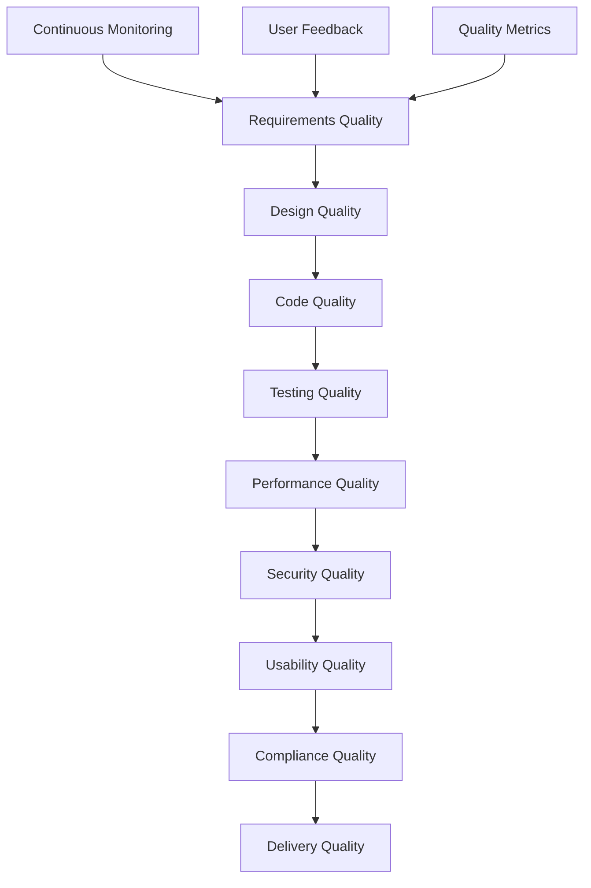

# Stage 09 - Quality

## Purpose
Implement quality assurance procedures, validation checklists, and continuous improvement processes that ensure the delivered software meets all requirements, standards, and user expectations across all platforms and use cases.

## Instructions

### When to Use This Stage
- After comprehensive documentation is complete and validated
- Before final project handoff to ensure quality standards are met
- When establishing ongoing quality assurance and improvement processes
- For implementing compliance validation and audit procedures

### Implementation Steps
1. **Define Quality Standards**: Establish measurable quality criteria and acceptance thresholds
2. **Create Validation Procedures**: Develop comprehensive testing and validation checklists
3. **Implement Quality Gates**: Set up automated and manual quality checkpoints
4. **Establish Compliance Processes**: Create procedures for regulatory and standard compliance
5. **Design Improvement Processes**: Implement continuous quality improvement workflows
6. **Validate Quality Achievement**: Perform comprehensive quality assessment and validation

### Key Quality Dimensions
- **Functional Quality**: Feature completeness, correctness, and reliability
- **Performance Quality**: Speed, scalability, and resource efficiency
- **Security Quality**: Data protection, access control, and vulnerability management
- **Usability Quality**: User experience, accessibility, and ease of use
- **Maintainability Quality**: Code quality, documentation, and extensibility
- **Compliance Quality**: Regulatory requirements, standards adherence, and audit readiness

### Quality Assurance Framework
- Establish clear quality metrics and measurement procedures
- Implement automated quality checks in CI/CD pipelines
- Create manual validation checklists for comprehensive review
- Set up continuous monitoring and quality tracking
- Define quality improvement processes and feedback loops

## Examples

### 1. Comprehensive Quality Assurance Strategy
```markdown
# Quality Assurance Strategy: E-commerce Platform

## Quality Framework Overview


## Quality Standards and Metrics
**Functional Quality Standards**:
- Feature completeness: 100% of acceptance criteria met
- Bug density: < 1 critical bug per 1000 lines of code
- Test coverage: > 90% code coverage, > 95% critical path coverage
- Regression rate: < 2% of previously working features affected by changes

**Performance Quality Standards**:
- Page load time: < 3 seconds for 95th percentile
- API response time: < 200ms for 95th percentile
- Concurrent users: Support 10,000+ simultaneous users
- Uptime: 99.9% availability (< 8.77 hours downtime per year)

**Security Quality Standards**:
- Vulnerability scan: Zero high/critical vulnerabilities
- Penetration testing: Pass annual third-party security assessment
- Data encryption: All sensitive data encrypted at rest and in transit
- Access control: Role-based access with principle of least privilege

**Usability Quality Standards**:
- Accessibility: WCAG 2.1 AA compliance verified
- User satisfaction: > 4.0/5.0 average user rating
- Task completion rate: > 95% for primary user workflows
- Support tickets: < 5% of users require support for basic tasks
```

### 2. Quality Validation Checklist
```markdown
# Quality Validation Checklist: Task Management App

## Pre-Release Quality Gate

### Functional Quality Validation
- [ ] **Feature Completeness**
  - [ ] All user stories implemented and tested
  - [ ] All acceptance criteria verified
  - [ ] Edge cases and error scenarios handled
  - [ ] Cross-platform feature parity validated

- [ ] **Integration Quality**
  - [ ] All API endpoints tested and documented
  - [ ] Third-party integrations verified
  - [ ] Database operations tested under load
  - [ ] Authentication and authorization working correctly

- [ ] **Data Quality**
  - [ ] Data validation rules implemented and tested
  - [ ] Data migration scripts tested and verified
  - [ ] Backup and recovery procedures validated
  - [ ] Data integrity constraints enforced

### Performance Quality Validation
- [ ] **Load Testing**
  - [ ] Application handles expected user load
  - [ ] Database performance under concurrent access
  - [ ] API response times within acceptable limits
  - [ ] Memory usage stable under extended operation

- [ ] **Scalability Testing**
  - [ ] Auto-scaling triggers tested and tuned
  - [ ] Database connection pooling optimized
  - [ ] CDN configuration verified for global performance
  - [ ] Caching strategies validated for effectiveness

- [ ] **Mobile Performance**
  - [ ] App startup time < 3 seconds
  - [ ] Smooth scrolling and animations (60 FPS)
  - [ ] Battery usage optimized
  - [ ] Network usage minimized for mobile data

### Security Quality Validation
- [ ] **Authentication Security**
  - [ ] Password policies enforced
  - [ ] Multi-factor authentication implemented
  - [ ] Session management secure
  - [ ] Account lockout policies configured

- [ ] **Data Protection**
  - [ ] Sensitive data encrypted at rest
  - [ ] Data transmission encrypted (HTTPS/TLS)
  - [ ] PII handling compliant with regulations
  - [ ] Data retention policies implemented

- [ ] **Vulnerability Assessment**
  - [ ] Automated security scanning passed
  - [ ] Dependency vulnerabilities resolved
  - [ ] Input validation prevents injection attacks
  - [ ] Error handling doesn't leak sensitive information

### Usability Quality Validation
- [ ] **User Experience**
  - [ ] User interface intuitive and consistent
  - [ ] Navigation clear and logical
  - [ ] Error messages helpful and actionable
  - [ ] Loading states and feedback provided

- [ ] **Accessibility**
  - [ ] Screen reader compatibility verified
  - [ ] Keyboard navigation fully functional
  - [ ] Color contrast meets WCAG standards
  - [ ] Text scaling supported up to 200%

- [ ] **Cross-Platform Consistency**
  - [ ] Core features work identically across platforms
  - [ ] UI adapts appropriately to platform conventions
  - [ ] Data synchronization works seamlessly
  - [ ] Performance consistent across platforms

### Compliance Quality Validation
- [ ] **Regulatory Compliance**
  - [ ] GDPR compliance for EU users
  - [ ] CCPA compliance for California users
  - [ ] SOC 2 Type II controls implemented
  - [ ] Industry-specific regulations addressed

- [ ] **Standards Compliance**
  - [ ] Web Content Accessibility Guidelines (WCAG) 2.1 AA
  - [ ] ISO 27001 security management practices
  - [ ] OWASP Top 10 security risks mitigated
  - [ ] Platform-specific guidelines followed (App Store, Play Store)
```

### 3. Automated Quality Gates
```yaml
# .github/workflows/quality-gates.yml
name: Quality Gates

on:
  pull_request:
    branches: [main, develop]
  push:
    branches: [main]

jobs:
  code-quality:
    runs-on: ubuntu-latest
    steps:
      - uses: actions/checkout@v3
      - uses: actions/setup-node@v3
        with:
          node-version: '18'
      
      - name: Install dependencies
        run: npm ci
      
      - name: Lint code
        run: npm run lint
      
      - name: Type check
        run: npm run type-check
      
      - name: Code complexity analysis
        run: npm run complexity-check
      
      - name: Dependency vulnerability scan
        run: npm audit --audit-level=high

  test-quality:
    runs-on: ubuntu-latest
    steps:
      - uses: actions/checkout@v3
      - uses: actions/setup-node@v3
      
      - name: Unit tests
        run: npm run test:unit -- --coverage
      
      - name: Integration tests
        run: npm run test:integration
      
      - name: Property-based tests
        run: npm run test:property
      
      - name: Coverage check
        run: |
          COVERAGE=$(npm run test:coverage:json | jq '.total.lines.pct')
          if (( $(echo "$COVERAGE < 90" | bc -l) )); then
            echo "Coverage $COVERAGE% is below 90% threshold"
            exit 1
          fi

  security-quality:
    runs-on: ubuntu-latest
    steps:
      - uses: actions/checkout@v3
      
      - name: Security scan
        uses: securecodewarrior/github-action-add-sarif@v1
        with:
          sarif-file: security-scan-results.sarif
      
      - name: Container security scan
        run: |
          docker build -t app:test .
          docker run --rm -v /var/run/docker.sock:/var/run/docker.sock \
            aquasec/trivy image app:test

  performance-quality:
    runs-on: ubuntu-latest
    steps:
      - uses: actions/checkout@v3
      
      - name: Build application
        run: npm run build
      
      - name: Lighthouse CI
        uses: treosh/lighthouse-ci-action@v9
        with:
          configPath: './lighthouse-ci.json'
          uploadArtifacts: true
          temporaryPublicStorage: true
      
      - name: Bundle size check
        run: |
          BUNDLE_SIZE=$(stat -c%s "dist/main.js")
          MAX_SIZE=500000  # 500KB
          if [ $BUNDLE_SIZE -gt $MAX_SIZE ]; then
            echo "Bundle size $BUNDLE_SIZE exceeds maximum $MAX_SIZE"
            exit 1
          fi

  accessibility-quality:
    runs-on: ubuntu-latest
    steps:
      - uses: actions/checkout@v3
      
      - name: Build and start app
        run: |
          npm run build
          npm run start &
          sleep 10
      
      - name: Accessibility audit
        run: |
          npx @axe-core/cli http://localhost:3000 \
            --exit --tags wcag2a,wcag2aa
      
      - name: Color contrast check
        run: |
          npx @axe-core/cli http://localhost:3000 \
            --exit --tags color-contrast

  quality-gate-summary:
    needs: [code-quality, test-quality, security-quality, performance-quality, accessibility-quality]
    runs-on: ubuntu-latest
    if: always()
    steps:
      - name: Quality gate summary
        run: |
          echo "Quality Gate Results:"
          echo "Code Quality: ${{ needs.code-quality.result }}"
          echo "Test Quality: ${{ needs.test-quality.result }}"
          echo "Security Quality: ${{ needs.security-quality.result }}"
          echo "Performance Quality: ${{ needs.performance-quality.result }}"
          echo "Accessibility Quality: ${{ needs.accessibility-quality.result }}"
          
          if [[ "${{ needs.code-quality.result }}" != "success" ]] || \
             [[ "${{ needs.test-quality.result }}" != "success" ]] || \
             [[ "${{ needs.security-quality.result }}" != "success" ]] || \
             [[ "${{ needs.performance-quality.result }}" != "success" ]] || \
             [[ "${{ needs.accessibility-quality.result }}" != "success" ]]; then
            echo "Quality gates failed - blocking deployment"
            exit 1
          else
            echo "All quality gates passed - ready for deployment"
          fi
```

### 4. Quality Metrics Dashboard
```markdown
# Quality Metrics Dashboard: SaaS Platform

## Real-Time Quality Metrics

### Code Quality Metrics
```json
{
  "codeQuality": {
    "technicalDebt": {
      "current": "2.5 days",
      "target": "< 5 days",
      "trend": "improving"
    },
    "codeComplexity": {
      "average": 3.2,
      "target": "< 5.0",
      "trend": "stable"
    },
    "duplicateCode": {
      "percentage": 2.1,
      "target": "< 3%",
      "trend": "improving"
    },
    "testCoverage": {
      "lines": 92.5,
      "branches": 89.3,
      "target": "> 90%",
      "trend": "stable"
    }
  }
}
```

### Performance Quality Metrics
```json
{
  "performance": {
    "webVitals": {
      "LCP": "1.8s",  // Largest Contentful Paint
      "FID": "45ms",  // First Input Delay
      "CLS": "0.08",  // Cumulative Layout Shift
      "target": "LCP < 2.5s, FID < 100ms, CLS < 0.1"
    },
    "apiPerformance": {
      "p95ResponseTime": "185ms",
      "p99ResponseTime": "420ms",
      "errorRate": "0.05%",
      "target": "p95 < 200ms, p99 < 500ms, errors < 0.1%"
    },
    "mobilePerformance": {
      "appStartTime": "2.1s",
      "frameRate": "58 FPS",
      "crashRate": "0.02%",
      "target": "start < 3s, FPS > 55, crashes < 0.1%"
    }
  }
}
```

### Security Quality Metrics
```json
{
  "security": {
    "vulnerabilities": {
      "critical": 0,
      "high": 0,
      "medium": 2,
      "low": 5,
      "target": "0 critical/high, < 5 medium"
    },
    "compliance": {
      "gdprCompliance": "100%",
      "soc2Controls": "98%",
      "owaspTop10": "100%",
      "target": "100% for all"
    },
    "securityIncidents": {
      "thisMonth": 0,
      "lastMonth": 1,
      "target": "< 1 per month"
    }
  }
}
```

### User Experience Quality Metrics
```json
{
  "userExperience": {
    "satisfaction": {
      "averageRating": 4.3,
      "npsScore": 42,
      "target": "> 4.0 rating, > 30 NPS"
    },
    "usability": {
      "taskCompletionRate": 96.2,
      "averageTaskTime": "2.3 minutes",
      "supportTicketRate": "3.1%",
      "target": "> 95% completion, < 5% support tickets"
    },
    "accessibility": {
      "wcagCompliance": "AA",
      "screenReaderCompatibility": "100%",
      "keyboardNavigation": "100%",
      "target": "AA compliance, 100% compatibility"
    }
  }
}
```

## Quality Monitoring Dashboard
```html
<!-- Quality Dashboard HTML -->
<div class="quality-dashboard">
  <div class="metric-card">
    <h3>Overall Quality Score</h3>
    <div class="score-circle" data-score="94">94%</div>
    <div class="trend up">↑ 2% from last week</div>
  </div>
  
  <div class="metric-grid">
    <div class="metric-item">
      <span class="metric-label">Code Quality</span>
      <span class="metric-value green">A+</span>
    </div>
    <div class="metric-item">
      <span class="metric-label">Test Coverage</span>
      <span class="metric-value green">92.5%</span>
    </div>
    <div class="metric-item">
      <span class="metric-label">Performance</span>
      <span class="metric-value green">A</span>
    </div>
    <div class="metric-item">
      <span class="metric-label">Security</span>
      <span class="metric-value yellow">B+</span>
    </div>
  </div>
</div>
```
```

### 5. Continuous Quality Improvement Process
```markdown
# Continuous Quality Improvement: Task Management Platform

## Quality Improvement Cycle

### Weekly Quality Review
**Every Monday 10:00 AM - Quality Team Meeting**

**Agenda**:
1. Review quality metrics from previous week
2. Analyze quality gate failures and root causes
3. Identify quality improvement opportunities
4. Plan quality initiatives for upcoming week

**Quality Metrics Review**:
```bash
# Generate weekly quality report
npm run quality:report:weekly

# Key metrics to review:
# - Test coverage trends
# - Bug discovery and resolution rates
# - Performance regression analysis
# - Security vulnerability trends
# - User satisfaction scores
```

### Monthly Quality Assessment
**First Friday of Each Month - Comprehensive Quality Review**

**Assessment Areas**:
1. **Code Quality Assessment**
   - Technical debt analysis and reduction plan
   - Code complexity trends and refactoring needs
   - Architecture quality and maintainability review

2. **Process Quality Assessment**
   - Development workflow effectiveness
   - Quality gate effectiveness and tuning
   - Testing strategy effectiveness and gaps

3. **Product Quality Assessment**
   - User feedback analysis and action items
   - Performance trends and optimization opportunities
   - Security posture review and improvements

### Quality Improvement Initiatives

#### Initiative 1: Automated Quality Feedback
**Objective**: Provide real-time quality feedback to developers
**Implementation**:
```yaml
# .github/workflows/quality-feedback.yml
name: Quality Feedback

on:
  pull_request:
    types: [opened, synchronize]

jobs:
  quality-feedback:
    runs-on: ubuntu-latest
    steps:
      - uses: actions/checkout@v3
      
      - name: Code quality analysis
        run: |
          npm run lint:report
          npm run complexity:report
          npm run coverage:report
      
      - name: Generate quality comment
        uses: actions/github-script@v6
        with:
          script: |
            const fs = require('fs');
            const lintResults = JSON.parse(fs.readFileSync('lint-results.json'));
            const coverageResults = JSON.parse(fs.readFileSync('coverage-results.json'));
            
            const comment = `
            ## Quality Analysis Results
            
            ### Code Quality
            - Lint issues: ${lintResults.errorCount} errors, ${lintResults.warningCount} warnings
            - Test coverage: ${coverageResults.total.lines.pct}%
            
            ### Recommendations
            ${lintResults.errorCount > 0 ? '- Fix linting errors before merging' : ''}
            ${coverageResults.total.lines.pct < 90 ? '- Increase test coverage to meet 90% threshold' : ''}
            `;
            
            github.rest.issues.createComment({
              issue_number: context.issue.number,
              owner: context.repo.owner,
              repo: context.repo.repo,
              body: comment
            });
```

#### Initiative 2: Quality Training Program
**Objective**: Improve team quality awareness and skills
**Components**:
- Monthly quality workshops on specific topics
- Code review best practices training
- Security awareness training
- Performance optimization workshops

**Training Schedule**:
- **Month 1**: Test-Driven Development and Property-Based Testing
- **Month 2**: Security Best Practices and Vulnerability Prevention
- **Month 3**: Performance Optimization and Monitoring
- **Month 4**: Accessibility and Inclusive Design

#### Initiative 3: Quality Metrics Gamification
**Objective**: Encourage quality-focused development through positive reinforcement
**Implementation**:
```javascript
// quality-leaderboard.js
const qualityMetrics = {
  codeQuality: {
    weight: 0.3,
    metrics: ['lintScore', 'complexityScore', 'duplicateCodeScore']
  },
  testQuality: {
    weight: 0.3,
    metrics: ['coverageScore', 'testQualityScore']
  },
  reviewQuality: {
    weight: 0.2,
    metrics: ['reviewThoroughness', 'reviewTimeliness']
  },
  bugPrevention: {
    weight: 0.2,
    metrics: ['bugDiscoveryRate', 'bugFixQuality']
  }
};

function calculateQualityScore(developer, timeframe) {
  let totalScore = 0;
  
  for (const [category, config] of Object.entries(qualityMetrics)) {
    const categoryScore = config.metrics.reduce((sum, metric) => {
      return sum + getMetricScore(developer, metric, timeframe);
    }, 0) / config.metrics.length;
    
    totalScore += categoryScore * config.weight;
  }
  
  return Math.round(totalScore);
}

// Generate monthly quality leaderboard
function generateQualityLeaderboard() {
  const developers = getDevelopers();
  const scores = developers.map(dev => ({
    name: dev.name,
    score: calculateQualityScore(dev, 'last_month'),
    improvements: getQualityImprovements(dev)
  }));
  
  return scores.sort((a, b) => b.score - a.score);
}
```

### Quality Improvement Tracking
```markdown
## Quality Improvement Tracking

### Current Initiatives Status
| Initiative | Status | Progress | Target Date | Owner |
|------------|--------|----------|-------------|-------|
| Automated Quality Feedback | In Progress | 75% | 2024-03-01 | Dev Team |
| Quality Training Program | Planning | 25% | 2024-04-01 | QA Team |
| Quality Metrics Gamification | In Progress | 60% | 2024-03-15 | Tech Lead |

### Quality Trend Analysis
**Positive Trends**:
- Test coverage increased from 85% to 92.5% over last quarter
- Bug discovery rate improved by 30% with better testing
- Code review quality scores increased by 15%

**Areas for Improvement**:
- Security vulnerability discovery needs automation
- Performance testing coverage needs expansion
- Accessibility testing needs integration into CI/CD

### Success Metrics
**Quality Improvement KPIs**:
- Overall quality score: Target 95% (Current: 94%)
- Bug escape rate: Target < 2% (Current: 3.1%)
- Customer satisfaction: Target > 4.5/5 (Current: 4.3/5)
- Time to resolution: Target < 24 hours (Current: 18 hours)
```
```

## Inputs
- Documentation (Stage 08)
- Quality requirements and compliance standards
- Testing results and validation criteria

## Outputs
- `platform-agnostic.md` - Core quality assurance strategy
- `web.md` - Web application quality procedures
- `mobile.md` - Mobile application quality validation
- Quality checklists, validation procedures, and improvement processes
- Compliance verification and audit procedures

## Prerequisites
- Stage 08 (Documentation) completed
- Quality standards defined

## Next Stage
Stage 10 - Handoff (Project handoff and transition procedures)

## Templates

This module includes the following templates:
