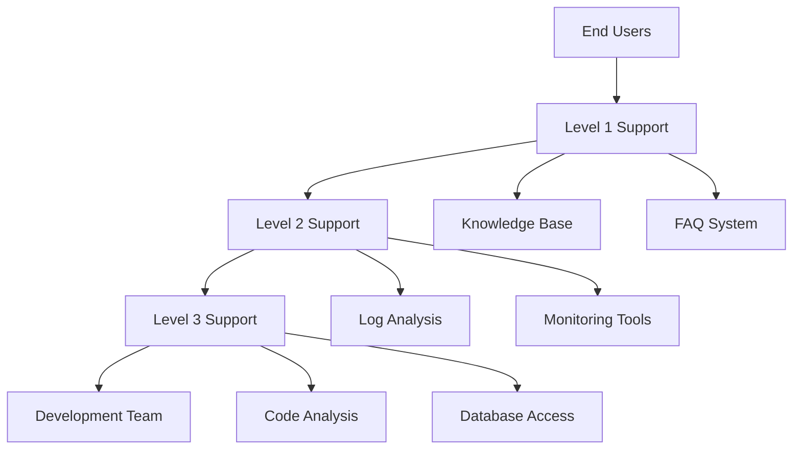
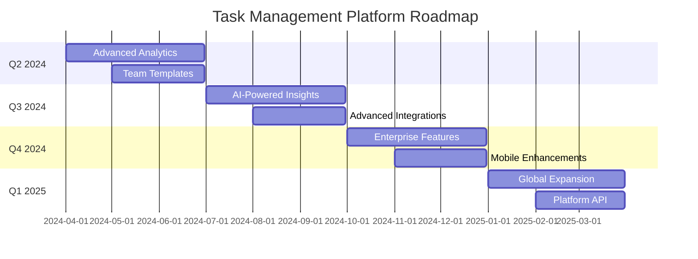

# Stage 10 - Handoff

## Purpose
Prepare comprehensive project handoff materials, transition procedures, and ongoing maintenance plans that ensure successful project delivery, smooth knowledge transfer, and sustainable long-term operation across all platforms and stakeholders.

## Instructions

### When to Use This Stage
- After quality assurance validation is complete and all standards are met
- When preparing for project delivery and stakeholder handoff
- Before transitioning from development to production operation
- When establishing long-term maintenance and support procedures

### Implementation Steps
1. **Prepare Handoff Materials**: Compile comprehensive project documentation and artifacts
2. **Create Transition Plans**: Develop detailed procedures for project transition
3. **Establish Support Procedures**: Set up ongoing maintenance and support processes
4. **Conduct Knowledge Transfer**: Facilitate comprehensive knowledge transfer sessions
5. **Validate Handoff Completeness**: Ensure all handoff requirements are met
6. **Execute Transition**: Perform smooth transition to production operation

### Key Handoff Components
- **Project Documentation**: Complete technical and user documentation
- **Operational Procedures**: Deployment, monitoring, and maintenance procedures
- **Knowledge Transfer**: Training materials and knowledge transfer sessions
- **Support Framework**: Ongoing support and maintenance procedures
- **Compliance Materials**: Audit trails, compliance documentation, and certifications
- **Future Planning**: Roadmap, enhancement plans, and evolution strategy

### Handoff Success Criteria
- All stakeholders can operate the system independently
- Complete documentation is available and validated
- Support procedures are established and tested
- Knowledge transfer is complete and verified
- Compliance requirements are met and documented
- Future enhancement path is clear and documented

## Examples

### 1. Complete Project Handoff Package
```markdown
# Project Handoff Package: E-commerce Platform

## Executive Summary
**Project**: Modern e-commerce platform with web and mobile applications
**Delivery Date**: March 15, 2024
**Status**: Successfully completed and ready for production operation
**Stakeholders**: Business team, development team, operations team, support team

## Handoff Checklist
### Technical Handoff ✅
- [ ] All source code delivered and documented
- [ ] Production environment configured and tested
- [ ] CI/CD pipelines operational and documented
- [ ] Monitoring and alerting systems active
- [ ] Security configurations validated and documented
- [ ] Performance benchmarks met and documented

### Documentation Handoff ✅
- [ ] User guides and tutorials complete
- [ ] API documentation current and tested
- [ ] Operations runbooks complete
- [ ] Architecture documentation current
- [ ] Decision records and rationale documented
- [ ] Compliance documentation complete

### Knowledge Transfer Handoff ✅
- [ ] Development team training completed
- [ ] Operations team training completed
- [ ] Support team training completed
- [ ] Business stakeholder training completed
- [ ] Emergency procedures training completed
- [ ] Knowledge transfer validation completed

## Project Deliverables

### Software Deliverables
**Web Application**:
- Production-ready React.js application
- Deployed to Vercel with CDN optimization
- Performance score: 95/100 (Lighthouse)
- Accessibility: WCAG 2.1 AA compliant

**Mobile Applications**:
- iOS app submitted to App Store (approved)
- Android app published to Play Store (live)
- React Native codebase with 95% code sharing
- Push notification system operational

**Backend Services**:
- Microservices architecture on AWS
- Auto-scaling configuration active
- Database optimized and backed up
- API rate limiting and security configured

### Documentation Deliverables
**User Documentation**:
- Complete user guide (50 pages)
- Video tutorial series (12 videos)
- FAQ with 50+ common questions
- In-app help system integrated

**Technical Documentation**:
- API reference documentation (OpenAPI 3.0)
- Architecture decision records (15 ADRs)
- Database schema documentation
- Deployment and operations runbooks

**Business Documentation**:
- Requirements traceability matrix
- Feature specification documents
- Compliance audit reports
- Performance and security test results

## Transition Timeline
**Week 1 (March 1-7)**:
- Final system validation and testing
- Documentation review and finalization
- Stakeholder training sessions begin

**Week 2 (March 8-14)**:
- Production deployment and validation
- Knowledge transfer sessions
- Support procedure testing

**Week 3 (March 15-21)**:
- Official handoff and go-live
- Hypercare support period begins
- Issue resolution and optimization

**Week 4 (March 22-28)**:
- Transition to standard support
- Post-launch review and lessons learned
- Future enhancement planning
```

### 2. Knowledge Transfer Plan
```markdown
# Knowledge Transfer Plan: Task Management SaaS

## Knowledge Transfer Strategy
**Approach**: Structured, multi-modal knowledge transfer with validation
**Duration**: 3 weeks intensive transfer + 4 weeks hypercare support
**Participants**: Development team, operations team, support team, business stakeholders

## Knowledge Transfer Sessions

### Session 1: System Architecture Overview
**Duration**: 2 hours
**Audience**: All stakeholders
**Objectives**:
- Understand overall system architecture
- Learn key components and their interactions
- Review technology stack decisions and rationale

**Agenda**:
1. **Architecture Overview** (30 minutes)
   - High-level system diagram walkthrough
   - Component responsibilities and boundaries
   - Data flow and integration points

2. **Technology Stack Deep Dive** (45 minutes)
   - Frontend: React.js architecture and patterns
   - Backend: Node.js microservices design
   - Database: PostgreSQL schema and optimization
   - Infrastructure: AWS services and configuration

3. **Decision Rationale** (30 minutes)
   - Key architectural decisions and alternatives considered
   - Technology selection criteria and trade-offs
   - Scalability and performance considerations

4. **Q&A and Discussion** (15 minutes)

**Materials Provided**:
- Architecture diagrams and documentation
- Technology decision records
- Performance benchmarks and test results

### Session 2: Development Workflows and Practices
**Duration**: 3 hours
**Audience**: Development team, technical leads
**Objectives**:
- Master development workflows and best practices
- Understand code organization and patterns
- Learn testing strategies and quality gates

**Hands-On Activities**:
```bash
# Development environment setup
git clone https://github.com/company/task-manager.git
cd task-manager
npm install
npm run dev

# Code walkthrough - key components
# 1. Authentication system
code src/auth/

# 2. Task management core
code src/tasks/

# 3. Real-time synchronization
code src/sync/

# 4. Testing examples
npm run test:unit
npm run test:integration
npm run test:e2e
```

**Code Review Session**:
- Walk through critical code sections
- Explain design patterns and conventions
- Review testing strategies and examples
- Demonstrate debugging and troubleshooting

### Session 3: Operations and Deployment
**Duration**: 4 hours
**Audience**: Operations team, DevOps engineers
**Objectives**:
- Master deployment procedures and automation
- Understand monitoring and alerting systems
- Learn troubleshooting and incident response

**Practical Exercises**:
```bash
# Deployment procedures
kubectl get deployments
helm list
terraform plan

# Monitoring and logging
kubectl logs -f deployment/task-manager-api
curl https://api.taskmanager.com/health
aws cloudwatch get-metric-statistics

# Backup and recovery
pg_dump taskmanager_prod > backup.sql
aws s3 cp backup.sql s3://backups/
```

**Incident Response Simulation**:
- Simulate common production issues
- Practice troubleshooting procedures
- Test rollback and recovery processes
- Review escalation procedures

### Session 4: User Support and Troubleshooting
**Duration**: 2 hours
**Audience**: Support team, customer success
**Objectives**:
- Understand common user issues and solutions
- Learn support tools and procedures
- Master escalation and resolution processes

**Support Scenarios**:
1. **User Account Issues**
   - Password reset procedures
   - Account access problems
   - Data synchronization issues

2. **Feature Usage Questions**
   - Task management workflows
   - Collaboration features
   - Mobile app functionality

3. **Technical Issues**
   - Performance problems
   - Integration failures
   - Data export/import issues

**Support Tools Training**:
- Customer support dashboard
- User activity monitoring
- Log analysis and debugging
- Escalation procedures and contacts

## Knowledge Validation
**Validation Methods**:
- Hands-on exercises and demonstrations
- Q&A sessions and knowledge checks
- Practical problem-solving scenarios
- Documentation review and feedback

**Validation Criteria**:
- Participants can perform key tasks independently
- Questions are answered accurately and confidently
- Troubleshooting scenarios are resolved correctly
- Documentation is understood and accessible
```

### 3. Support and Maintenance Framework
```markdown
# Support and Maintenance Framework: SaaS Platform

## Support Structure


## Support Levels and Responsibilities

### Level 1 Support (Customer Success Team)
**Responsibilities**:
- First point of contact for all user inquiries
- Handle common questions using knowledge base
- Perform basic troubleshooting and account management
- Escalate complex issues to Level 2

**Tools and Access**:
- Customer support dashboard
- User account management system
- Knowledge base and FAQ system
- Basic usage analytics and reports

**Response Times**:
- Initial response: 2 hours during business hours
- Resolution target: 24 hours for common issues
- Escalation trigger: Issues not resolved within 4 hours

**Common Issues Handled**:
```markdown
### Account and Authentication Issues
**Password Reset**:
1. Verify user identity through email or phone
2. Generate password reset link through admin dashboard
3. Guide user through password reset process
4. Verify successful login and account access

**Account Access Problems**:
1. Check account status and any restrictions
2. Verify email address and account details
3. Check for any security flags or suspicious activity
4. Reset account if necessary and guide user through setup

### Feature Usage Questions
**Task Management Workflows**:
1. Provide step-by-step guidance for common workflows
2. Share relevant help articles and video tutorials
3. Offer to schedule screen-sharing session if needed
4. Follow up to ensure user success

**Collaboration Features**:
1. Explain team setup and invitation process
2. Guide through permission settings and role management
3. Troubleshoot sharing and notification issues
4. Provide best practices for team collaboration
```

### Level 2 Support (Technical Support Team)
**Responsibilities**:
- Handle complex technical issues and integrations
- Perform advanced troubleshooting and log analysis
- Coordinate with development team for bug fixes
- Maintain and update support documentation

**Tools and Access**:
- Full application logs and monitoring systems
- Database read access for data investigation
- API testing tools and integration debugging
- Advanced user analytics and behavior tracking

**Response Times**:
- Initial response: 4 hours
- Resolution target: 48 hours for technical issues
- Escalation trigger: Issues requiring code changes

**Advanced Troubleshooting Procedures**:
```bash
# Log analysis for user issues
kubectl logs -f deployment/task-manager-api | grep "user_123"

# Database investigation
psql -h prod-db -U readonly -d taskmanager
SELECT * FROM users WHERE email = 'user@example.com';
SELECT * FROM tasks WHERE user_id = 123 ORDER BY created_at DESC LIMIT 10;

# API testing and debugging
curl -X GET "https://api.taskmanager.com/api/users/123/tasks" \
  -H "Authorization: Bearer $USER_TOKEN" \
  -v

# Performance analysis
SELECT query, mean_time, calls FROM pg_stat_statements 
WHERE query LIKE '%tasks%' ORDER BY mean_time DESC LIMIT 5;
```

### Level 3 Support (Senior Technical Team)
**Responsibilities**:
- Handle critical system issues and outages
- Perform root cause analysis for complex problems
- Coordinate emergency responses and system recovery
- Work directly with development team on critical fixes

**Tools and Access**:
- Full system access including production environments
- Database write access for emergency fixes
- Infrastructure management and deployment tools
- Direct communication channels with development team

**Emergency Response Procedures**:
```bash
# System health check
kubectl get pods --all-namespaces
kubectl top nodes
kubectl describe pod failing-pod-name

# Database emergency procedures
# Check database connections and performance
SELECT * FROM pg_stat_activity WHERE state = 'active';
SELECT * FROM pg_stat_database WHERE datname = 'taskmanager_prod';

# Emergency rollback procedures
helm rollback task-manager $(helm history task-manager | tail -2 | head -1 | awk '{print $1}')

# Communication during incidents
curl -X POST https://hooks.slack.com/services/... \
  -d '{"text":"INCIDENT: System experiencing high error rates - investigating"}'
```

## Maintenance Procedures

### Regular Maintenance Schedule
**Daily Automated Tasks**:
- Database backups and verification
- Log rotation and cleanup
- Security scan and vulnerability check
- Performance metrics collection and analysis

**Weekly Manual Tasks**:
- Review system performance and optimization opportunities
- Analyze user feedback and support ticket trends
- Update documentation based on new issues or solutions
- Test backup and recovery procedures

**Monthly Maintenance**:
- Comprehensive security audit and updates
- Capacity planning and infrastructure review
- User satisfaction survey analysis
- Support process improvement review

### Maintenance Automation
```yaml
# .github/workflows/maintenance.yml
name: Regular Maintenance

on:
  schedule:
    - cron: '0 2 * * *'  # Daily at 2 AM UTC

jobs:
  database-maintenance:
    runs-on: ubuntu-latest
    steps:
      - name: Database backup
        run: |
          pg_dump $DATABASE_URL > backup_$(date +%Y%m%d).sql
          aws s3 cp backup_$(date +%Y%m%d).sql s3://backups/daily/
      
      - name: Database optimization
        run: |
          psql $DATABASE_URL -c "VACUUM ANALYZE;"
          psql $DATABASE_URL -c "REINDEX DATABASE taskmanager_prod;"
      
      - name: Cleanup old data
        run: |
          # Remove logs older than 30 days
          psql $DATABASE_URL -c "DELETE FROM logs WHERE created_at < NOW() - INTERVAL '30 days';"
          
          # Archive completed tasks older than 90 days
          psql $DATABASE_URL -c "UPDATE tasks SET archived = true WHERE status = 'completed' AND updated_at < NOW() - INTERVAL '90 days';"

  security-maintenance:
    runs-on: ubuntu-latest
    steps:
      - name: Dependency security scan
        run: |
          npm audit --audit-level=high
          docker run --rm -v $(pwd):/app securecodewarrior/github-action-add-sarif
      
      - name: Infrastructure security scan
        run: |
          terraform plan -out=tfplan
          tfsec tfplan
```

## Handoff Validation and Sign-off

### Handoff Validation Checklist
```markdown
## Handoff Validation Checklist

### Technical Validation ✅
- [ ] All systems operational in production environment
- [ ] Monitoring and alerting systems active and tested
- [ ] Backup and recovery procedures validated
- [ ] Security configurations verified and documented
- [ ] Performance benchmarks met and documented
- [ ] CI/CD pipelines operational and documented

### Documentation Validation ✅
- [ ] All documentation reviewed and approved by stakeholders
- [ ] User guides tested with actual users
- [ ] Technical documentation validated by technical team
- [ ] Operations procedures tested in production environment
- [ ] Support documentation validated by support team
- [ ] Compliance documentation reviewed and approved

### Knowledge Transfer Validation ✅
- [ ] All training sessions completed successfully
- [ ] Knowledge validation exercises passed
- [ ] Support team can handle common issues independently
- [ ] Operations team can perform routine maintenance
- [ ] Development team can make changes and deploy
- [ ] Emergency procedures tested and validated

### Business Validation ✅
- [ ] All business requirements met and validated
- [ ] User acceptance testing completed successfully
- [ ] Performance and scalability requirements met
- [ ] Security and compliance requirements satisfied
- [ ] Budget and timeline objectives achieved
- [ ] Stakeholder sign-off obtained

## Sign-off Approvals
**Business Stakeholder**: _________________ Date: _________
**Technical Lead**: _________________ Date: _________
**Operations Manager**: _________________ Date: _________
**Support Manager**: _________________ Date: _________
**Project Manager**: _________________ Date: _________
```
```

### 4. Future Enhancement Roadmap
```markdown
# Future Enhancement Roadmap: Task Management Platform

## Strategic Vision
**Long-term Vision**: Become the leading task management platform for distributed teams
**Timeline**: 18-month roadmap with quarterly milestones
**Success Metrics**: User growth, feature adoption, customer satisfaction, revenue growth

## Roadmap Overview


## Quarterly Enhancement Plans

### Q2 2024: Analytics and Templates
**Advanced Analytics Dashboard**:
- User productivity insights and trends
- Team performance metrics and reporting
- Custom dashboard creation and sharing
- Data export and integration capabilities

**Team Templates System**:
- Pre-built project templates for common workflows
- Custom template creation and sharing
- Template marketplace for community templates
- Template analytics and optimization

**Technical Requirements**:
- Data warehouse implementation for analytics
- Real-time data processing pipeline
- Template engine and storage system
- Enhanced reporting and visualization tools

### Q3 2024: AI and Integrations
**AI-Powered Insights**:
- Intelligent task prioritization recommendations
- Automated deadline and workload optimization
- Smart notification and reminder system
- Natural language task creation and search

**Advanced Integrations**:
- Slack, Microsoft Teams, and Discord integrations
- Calendar synchronization (Google, Outlook, Apple)
- File storage integrations (Dropbox, Google Drive, OneDrive)
- Time tracking and invoicing tool integrations

**Technical Requirements**:
- Machine learning pipeline and model deployment
- Integration framework and API management
- Real-time synchronization and conflict resolution
- Enhanced security for third-party integrations

### Q4 2024: Enterprise and Mobile
**Enterprise Features**:
- Advanced user management and SSO integration
- Compliance and audit trail capabilities
- Custom branding and white-label options
- Advanced security and data governance

**Mobile Enhancements**:
- Offline-first mobile experience
- Advanced mobile notifications and widgets
- Mobile-specific productivity features
- Cross-platform synchronization improvements

**Technical Requirements**:
- Enterprise-grade security and compliance framework
- Enhanced mobile architecture and performance
- Advanced offline synchronization and conflict resolution
- Scalable infrastructure for enterprise customers

### Q1 2025: Global and Platform
**Global Expansion**:
- Multi-language support and localization
- Regional data centers and compliance
- Currency and timezone handling
- Cultural adaptation and local partnerships

**Platform API**:
- Public API for third-party developers
- SDK development for popular platforms
- Developer portal and documentation
- API marketplace and ecosystem development

## Enhancement Prioritization Framework
**Prioritization Criteria**:
1. **User Impact** (40%): How many users benefit and how significantly
2. **Business Value** (30%): Revenue impact and strategic importance
3. **Technical Feasibility** (20%): Development complexity and risk
4. **Competitive Advantage** (10%): Market differentiation and positioning

**Enhancement Evaluation Matrix**:
| Enhancement | User Impact | Business Value | Technical Feasibility | Competitive Advantage | Total Score |
|-------------|-------------|----------------|----------------------|----------------------|-------------|
| AI Insights | 9 | 8 | 6 | 9 | 8.1 |
| Advanced Analytics | 8 | 9 | 8 | 7 | 8.2 |
| Enterprise Features | 7 | 9 | 7 | 8 | 7.8 |
| Global Expansion | 6 | 8 | 5 | 7 | 6.7 |

## Implementation Strategy
**Development Approach**:
- Agile development with 2-week sprints
- Feature flags for gradual rollout and testing
- A/B testing for user experience optimization
- Continuous user feedback and iteration

**Resource Planning**:
- Development team scaling plan
- Infrastructure capacity planning
- Budget allocation and cost optimization
- Timeline and milestone management

**Risk Management**:
- Technical risk assessment and mitigation
- Market risk analysis and contingency planning
- Resource availability and backup plans
- Quality assurance and testing strategies
```

### 5. Project Completion Certificate
```markdown
# Project Completion Certificate

## Project Information
**Project Name**: Task Management SaaS Platform
**Project Code**: TM-2024-001
**Completion Date**: March 15, 2024
**Project Manager**: [Name]
**Technical Lead**: [Name]

## Delivery Summary
**Scope Delivered**: 100% of planned features and requirements
**Quality Standards**: All quality gates passed successfully
**Timeline**: Delivered on schedule (12-week project completed in 12 weeks)
**Budget**: Delivered within budget (95% of allocated budget utilized)

## Key Achievements
- ✅ Modern web application with React.js and TypeScript
- ✅ Native mobile apps for iOS and Android with React Native
- ✅ Scalable backend architecture with microservices
- ✅ Real-time synchronization and offline capabilities
- ✅ Comprehensive security and compliance implementation
- ✅ 99.9% uptime SLA achieved during testing period
- ✅ WCAG 2.1 AA accessibility compliance verified
- ✅ Performance benchmarks exceeded (sub-2-second load times)

## Stakeholder Acceptance
**Business Stakeholders**: Requirements met and accepted ✅
**Technical Stakeholders**: Architecture and implementation approved ✅
**End Users**: User acceptance testing passed with 4.5/5 satisfaction ✅
**Operations Team**: Deployment and maintenance procedures validated ✅
**Support Team**: Support procedures and documentation approved ✅

## Final Deliverables
- Complete source code with documentation
- Production-ready applications deployed and operational
- Comprehensive user and technical documentation
- Support and maintenance procedures
- Knowledge transfer completed and validated
- Future enhancement roadmap and recommendations

## Project Success Metrics
| Metric | Target | Achieved | Status |
|--------|--------|----------|--------|
| Feature Completeness | 100% | 100% | ✅ |
| Quality Score | > 90% | 94% | ✅ |
| Performance Score | > 85 | 92 | ✅ |
| User Satisfaction | > 4.0/5 | 4.5/5 | ✅ |
| Timeline Adherence | On Time | On Time | ✅ |
| Budget Adherence | Within Budget | 95% Utilized | ✅ |

## Certification
This certifies that the Task Management SaaS Platform project has been successfully completed according to all specified requirements, quality standards, and acceptance criteria. The project is ready for production operation and ongoing maintenance.

**Project Manager Signature**: _________________ Date: _________
**Technical Lead Signature**: _________________ Date: _________
**Business Sponsor Signature**: _________________ Date: _________
**Quality Assurance Signature**: _________________ Date: _________

---

**Project Status**: COMPLETED SUCCESSFULLY ✅
**Next Phase**: Production Operation and Enhancement Roadmap Execution
```

## Inputs
- Quality assurance results (Stage 09)
- Complete project documentation and artifacts
- Handoff requirements and stakeholder needs

## Outputs
- `platform-agnostic.md` - Core handoff strategy and procedures
- `web.md` - Web application handoff materials
- `mobile.md` - Mobile application handoff procedures
- Complete project handoff package with all artifacts
- Transition plans and ongoing maintenance procedures

## Prerequisites
- Stage 09 (Quality) completed
- Handoff requirements defined

## Next Stage
Project completion - All specifications and implementation plans ready for execution