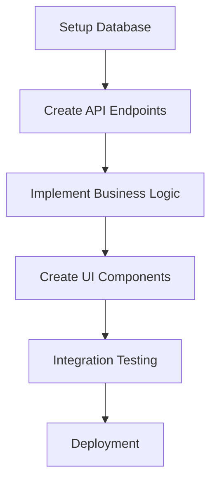

# Feature Breakdown Template

## Purpose
Break down user requirements into discrete features and modules, applying production-quality defaults and creating bite-sized, trackable development components.

## Instructions
Use this template to systematically analyze user requirements and break them down into manageable features. Apply production-quality defaults for essential features like security, accessibility, and monitoring. Organize features by priority and create detailed implementation plans.

## Examples
```markdown
## Example Feature Breakdown

### Project Brief: "An e-commerce platform for handmade crafts"

### Essential Features (Must-Have)
1. **Product Catalog**
   - Description: Browse and search handmade craft products
   - User Value: Customers can discover and view products
   - Complexity: Medium
   - Dependencies: None (foundational feature)

2. **Shopping Cart & Checkout**
   - Description: Add products to cart and complete purchases
   - User Value: Customers can buy products securely
   - Complexity: Complex
   - Dependencies: Product Catalog, Payment Processing

3. **User Authentication**
   - Description: User registration, login, and account management
   - User Value: Personalized experience and order history
   - Complexity: Medium
   - Dependencies: None (production default)

### Production-Quality Defaults (Automatically Included)
- **Admin Portal**: Seller dashboard for product management
- **Payment Processing**: Stripe integration for secure payments
- **Order Management**: Order tracking and fulfillment system
- **Analytics**: Sales reporting and customer insights
- **Security**: SSL, PCI compliance, fraud protection
```

## Feature Analysis Framework

### Primary Feature Extraction
```markdown
## Core Feature Identification

Based on the project brief: "[USER_BRIEF]"

### Essential Features (Must-Have)
1. **[Feature Name]**
   - **Description**: [What this feature does]
   - **User Value**: [Why users need this]
   - **Complexity**: [Simple/Medium/Complex]
   - **Dependencies**: [Other features this depends on]

2. **[Feature Name]**
   - **Description**: [What this feature does]
   - **User Value**: [Why users need this]
   - **Complexity**: [Simple/Medium/Complex]
   - **Dependencies**: [Other features this depends on]

### Enhanced Features (Should-Have)
1. **[Feature Name]**
   - **Description**: [What this feature does]
   - **User Value**: [Why users would want this]
   - **Complexity**: [Simple/Medium/Complex]
   - **Dependencies**: [Other features this depends on]

### Future Features (Could-Have)
1. **[Feature Name]**
   - **Description**: [What this feature does]
   - **User Value**: [Future value proposition]
   - **Complexity**: [Simple/Medium/Complex]
   - **Dependencies**: [Other features this depends on]
```

### Production-Ready Feature Defaults

#### Mandatory Production Features
```markdown
## Production-Quality Defaults (Automatically Included)

### Security & Authentication
- **User Authentication**
  - Multi-factor authentication (MFA)
  - Social login integration (Google, Facebook, Apple)
  - Password reset and account recovery
  - Session management and security

- **Authorization & Access Control**
  - Role-based access control (RBAC)
  - Permission management system
  - Admin user management
  - Audit logging for security events

### Administrative Features
- **Admin Portal**
  - User management interface
  - Content management system
  - Analytics and reporting dashboard
  - System configuration and settings

- **Monitoring & Observability**
  - Application performance monitoring
  - Error tracking and alerting
  - User behavior analytics
  - System health monitoring

### Quality & Compliance
- **Accessibility Features**
  - WCAG 2.1 AA compliance
  - Keyboard navigation support
  - Screen reader compatibility
  - High contrast and large text options

- **Internationalization**
  - Multi-language support
  - Right-to-left (RTL) language support
  - Locale-specific formatting (dates, numbers, currency)
  - Content localization framework

### Performance & Reliability
- **Offline Capabilities**
  - Offline data caching
  - Sync when connection restored
  - Conflict resolution for offline changes
  - Progressive web app (PWA) features

- **Performance Optimization**
  - Content delivery network (CDN) integration
  - Image optimization and lazy loading
  - Code splitting and bundle optimization
  - Database query optimization
```

### Feature Module Breakdown

#### Module Structure Template
```markdown
## Feature Module: [Feature Name]

### Module Overview
- **Purpose**: [What this module accomplishes]
- **Scope**: [What is included/excluded]
- **Integration Points**: [How it connects to other modules]

### Sub-Features
1. **[Sub-Feature Name]**
   - **Function**: [Specific functionality]
   - **User Story**: As a [user type], I want [functionality] so that [benefit]
   - **Acceptance Criteria**: [Specific, testable criteria]
   - **Implementation Size**: [Small/Medium/Large]

2. **[Sub-Feature Name]**
   - **Function**: [Specific functionality]
   - **User Story**: As a [user type], I want [functionality] so that [benefit]
   - **Acceptance Criteria**: [Specific, testable criteria]
   - **Implementation Size**: [Small/Medium/Large]

### Technical Components
- **Frontend Components**: [UI components needed]
- **Backend Services**: [API endpoints and services]
- **Database Models**: [Data structures and relationships]
- **External Integrations**: [Third-party services or APIs]

### Quality Requirements
- **Testing Strategy**: [Unit tests, integration tests, E2E tests]
- **Performance Criteria**: [Response times, throughput, scalability]
- **Security Considerations**: [Authentication, authorization, data protection]
- **Accessibility Requirements**: [WCAG compliance, keyboard navigation]

### Implementation Priority
- **Phase**: [1-Launch, 2-Enhancement, 3-Future]
- **Dependencies**: [Must be implemented after these features]
- **Blockers**: [Features that depend on this being completed]
- **Effort Estimate**: [Development time estimate]
```

### Cross-Platform Feature Mapping

#### Platform-Specific Considerations
```markdown
## Cross-Platform Feature Analysis

### Feature: [Feature Name]

#### Web Implementation
- **Approach**: [How this feature works on web]
- **Technologies**: [Specific web technologies needed]
- **Limitations**: [Any web-specific constraints]
- **Advantages**: [Web-specific benefits]

#### Mobile Implementation
- **Approach**: [How this feature works on mobile]
- **Technologies**: [Specific mobile technologies needed]
- **Limitations**: [Any mobile-specific constraints]
- **Advantages**: [Mobile-specific benefits]

#### Backend Requirements
- **API Endpoints**: [Required backend services]
- **Data Models**: [Database structures needed]
- **Business Logic**: [Server-side processing requirements]
- **Integrations**: [External service requirements]

#### Parity Considerations
- **Consistent Functionality**: [Features that must work identically]
- **Platform Adaptations**: [Features that should adapt to platform conventions]
- **Exclusive Features**: [Features only available on specific platforms]
- **Graceful Degradation**: [How features degrade on less capable platforms]
```

### Feature Prioritization Matrix

#### Priority Assessment
```markdown
## Feature Prioritization

### High Priority (Launch Blockers)
| Feature | User Impact | Technical Complexity | Business Value | Dependencies |
|---------|-------------|---------------------|----------------|--------------|
| [Feature] | High/Med/Low | Simple/Med/Complex | High/Med/Low | [List] |

### Medium Priority (Post-Launch)
| Feature | User Impact | Technical Complexity | Business Value | Dependencies |
|---------|-------------|---------------------|----------------|--------------|
| [Feature] | High/Med/Low | Simple/Med/Complex | High/Med/Low | [List] |

### Low Priority (Future Enhancements)
| Feature | User Impact | Technical Complexity | Business Value | Dependencies |
|---------|-------------|---------------------|----------------|--------------|
| [Feature] | High/Med/Low | Simple/Med/Complex | High/Med/Low | [List] |

### Prioritization Rationale
- **High Priority**: [Explanation of why these features are essential for launch]
- **Medium Priority**: [Explanation of why these features are important but not launch-critical]
- **Low Priority**: [Explanation of why these features can be deferred]
```

### Bite-Sized Development Tasks

#### Task Breakdown Template
```markdown
## Development Task Breakdown: [Feature Name]

### Task Categories

#### Setup and Infrastructure
- [ ] Set up development environment for [feature]
- [ ] Create database models and migrations
- [ ] Set up API endpoints and routing
- [ ] Configure authentication and authorization

#### Core Implementation
- [ ] Implement [specific functionality 1]
- [ ] Implement [specific functionality 2]
- [ ] Add input validation and error handling
- [ ] Integrate with external services (if needed)

#### User Interface
- [ ] Create UI components for [feature]
- [ ] Implement responsive design
- [ ] Add accessibility features
- [ ] Integrate with design system

#### Testing and Quality
- [ ] Write unit tests for core functionality
- [ ] Write integration tests for API endpoints
- [ ] Write end-to-end tests for user workflows
- [ ] Perform accessibility testing

#### Documentation and Deployment
- [ ] Document API endpoints and usage
- [ ] Create user documentation
- [ ] Set up monitoring and logging
- [ ] Deploy to staging environment

### Task Sizing Guidelines
- **Small Task**: 1-4 hours of development time
- **Medium Task**: 4-16 hours of development time
- **Large Task**: 16+ hours (should be broken down further)

### Task Dependencies

```

### Feature Integration Strategy

#### Integration Points
```markdown
## Feature Integration Planning

### Integration with Core System
- **Authentication Integration**: How this feature uses the auth system
- **Data Integration**: How this feature shares data with other features
- **UI Integration**: How this feature fits into the overall user interface
- **API Integration**: How this feature exposes or consumes APIs

### Cross-Feature Dependencies
- **Depends On**: [Features that must be implemented first]
- **Enables**: [Features that become possible after this is implemented]
- **Conflicts With**: [Features that might conflict and need coordination]
- **Enhances**: [Features that are improved by this feature]

### Integration Testing Strategy
- **Unit Integration**: Testing individual components work together
- **Feature Integration**: Testing complete feature works with system
- **Cross-Platform Integration**: Testing feature works across all platforms
- **Performance Integration**: Testing feature doesn't degrade system performance
```

This feature breakdown framework ensures that all user requirements are systematically analyzed, enhanced with production-quality defaults, and broken down into manageable, trackable development tasks that can be implemented incrementally across multiple platforms.