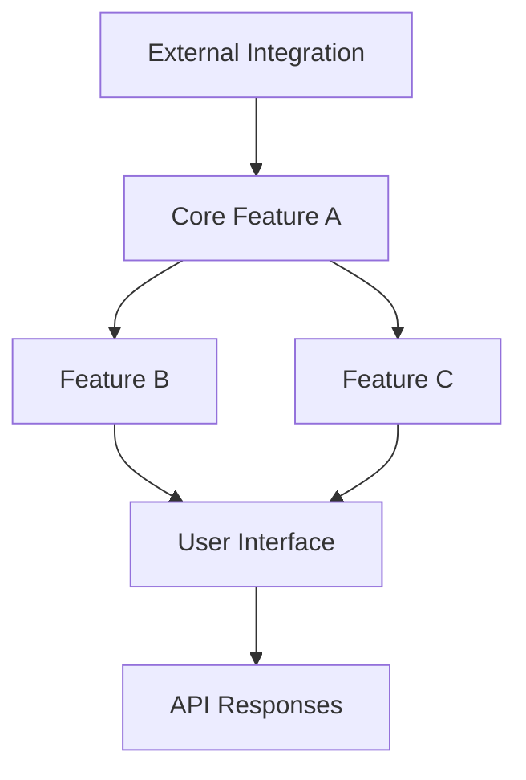

# Functionality Preservation Template

## Purpose
Maintain functionality integrity during bug fixes and improvements, ensuring that fixes never reduce or remove existing capabilities and that all changes are incremental and additive.

## Instructions
Use this template to ensure all bug fixes and improvements preserve existing functionality. Before making any changes, conduct a pre-fix assessment to inventory all current functionality and identify dependencies. Implement fixes using additive-only approaches - add new functions alongside existing ones, add new configuration options with defaults, and add new features behind feature flags. Never remove existing functions, change signatures, or modify API response formats. Test continuously during development and perform comprehensive validation after fixes. Document all changes clearly, emphasizing what functionality was preserved and what was added.

## Examples

### Pre-Fix Assessment Example
```markdown
# Pre-Fix Functionality Assessment

## Current Functionality Inventory
**Date**: 2024-02-08
**Issue Being Fixed**: Authentication token expiration causing unexpected logouts
**Affected Components**: Auth service, token storage, user session management

### Existing Functionality Checklist
#### Core Features
- [x] User login with email/password: Returns JWT token, sets session cookie
- [x] User logout: Clears token and session, redirects to login page
- [x] Token refresh: Automatically refreshes tokens before expiration
- [x] Session persistence: Maintains login state across browser sessions

#### API Endpoints
- [x] POST /auth/login: Returns {token, user, expires_in}
- [x] POST /auth/logout: Returns {success: true}
- [x] POST /auth/refresh: Returns {token, expires_in}
- [x] GET /auth/me: Returns current user info

### Risk Assessment
| Component | Risk Level | Potential Impact | Mitigation Strategy |
|-----------|------------|------------------|-------------------|
| Token Storage | High | Could break existing sessions | Add new storage alongside existing |
| Auth API | Medium | Could break client integrations | Maintain existing API contracts |
| Session Management | Low | Minor UX changes | Preserve existing session behavior |
```

### Additive Fix Implementation
```javascript
// ❌ WRONG: Modifying existing function
function authenticateUser(credentials) {
  // Changing existing behavior breaks functionality
  return newAuthMethod(credentials);
}

// ✅ CORRECT: Adding new function alongside existing
function authenticateUser(credentials) {
  // Preserve existing behavior exactly
  return existingAuthMethod(credentials);
}

function authenticateUserV2(credentials, options = {}) {
  // New enhanced authentication with bug fixes
  if (options.useEnhancedAuth) {
    return enhancedAuthMethod(credentials);
  }
  // Fallback to existing method
  return authenticateUser(credentials);
}

// ✅ CORRECT: Adding new configuration option
const authConfig = {
  // Existing options preserved
  tokenExpiry: 3600,
  refreshThreshold: 300,
  
  // New option with safe default
  enhancedTokenHandling: false, // Default preserves existing behavior
  tokenExpiryBuffer: 60 // New feature, doesn't affect existing logic
};
```

### Functionality Preservation Testing
```javascript
// Regression test suite to ensure functionality preservation
describe('Functionality Preservation - Auth Fix', () => {
  test('Existing login flow works exactly as before', async () => {
    const credentials = { email: 'test@example.com', password: 'password' };
    const result = await authenticateUser(credentials);
    
    // Verify exact same response structure
    expect(result).toHaveProperty('token');
    expect(result).toHaveProperty('user');
    expect(result).toHaveProperty('expires_in');
    expect(result.token).toMatch(/^[A-Za-z0-9-_]+\.[A-Za-z0-9-_]+\.[A-Za-z0-9-_]+$/);
  });

  test('Existing API endpoints maintain exact response format', async () => {
    const response = await request(app).post('/auth/login').send(validCredentials);
    
    // Verify response structure hasn't changed
    expect(response.status).toBe(200);
    expect(response.body).toMatchSnapshot('auth-login-response');
    expect(response.headers['set-cookie']).toBeDefined();
  });

  test('All existing user workflows remain functional', async () => {
    // Test complete existing workflow
    const loginResponse = await login(validCredentials);
    const protectedResponse = await accessProtectedResource(loginResponse.token);
    const logoutResponse = await logout(loginResponse.token);
    
    expect(loginResponse.success).toBe(true);
    expect(protectedResponse.status).toBe(200);
    expect(logoutResponse.success).toBe(true);
  });
});
```

### Change Documentation Example
```markdown
# Change Documentation: Authentication Token Expiration Fix

## Summary
**Type**: Bug Fix
**Impact Level**: Low
**Functionality Preserved**: ✅ All existing functionality maintained

## What Changed
### Added Functionality
- Enhanced token expiration handling with configurable buffer time
- New optional token refresh strategy for improved reliability
- Additional logging for token lifecycle debugging

### Fixed Issues
- Token expiration edge case causing unexpected logouts
- Race condition in token refresh mechanism
- Improved error handling for network interruptions during auth

## What Didn't Change
### Preserved Functionality
- All existing API endpoints work exactly as before
- All existing authentication flows work exactly as before
- All existing token formats and structures unchanged
- All existing session management behavior preserved
- All existing error codes and messages maintained

### Backward Compatibility
- ✅ All existing client code continues to work without changes
- ✅ All existing token storage mechanisms remain valid
- ✅ All existing configuration options work exactly as before
- ✅ All existing user sessions remain active and functional

## Migration Required
**None** - This change is fully backward compatible

## Rollback Plan
If issues are discovered:
1. Set `enhancedTokenHandling: false` in configuration
2. Restart application services
3. Monitor for 15 minutes to confirm stability
**Rollback Time**: < 5 minutes
**Data Impact**: None - no data changes required for rollback
```

## Core Principles
- **Functionality Integrity**: All existing functionality must be preserved during fixes
- **Additive Changes**: Fixes should add capabilities, never remove them
- **Regression Prevention**: Systematic prevention of functionality loss
- **Incremental Improvement**: All changes should build upon existing capabilities

## Functionality Preservation Framework

### Pre-Fix Assessment Template
```markdown
# Pre-Fix Functionality Assessment

## Current Functionality Inventory
**Date**: [Assessment date]
**Issue Being Fixed**: [Description of the issue]
**Affected Components**: [List of components that might be affected]

### Existing Functionality Checklist
#### Core Features
- [ ] [Feature 1]: [Current behavior description]
- [ ] [Feature 2]: [Current behavior description]
- [ ] [Feature 3]: [Current behavior description]
- [ ] [Feature 4]: [Current behavior description]

#### User Interactions
- [ ] [Interaction 1]: [Current behavior description]
- [ ] [Interaction 2]: [Current behavior description]
- [ ] [Interaction 3]: [Current behavior description]

#### API Endpoints (if applicable)
- [ ] [Endpoint 1]: [Current behavior and response format]
- [ ] [Endpoint 2]: [Current behavior and response format]
- [ ] [Endpoint 3]: [Current behavior and response format]

#### Data Processing
- [ ] [Process 1]: [Current input/output behavior]
- [ ] [Process 2]: [Current input/output behavior]
- [ ] [Process 3]: [Current input/output behavior]

#### Integration Points
- [ ] [Integration 1]: [Current behavior with external systems]
- [ ] [Integration 2]: [Current behavior with external systems]

### Functionality Dependencies


### Risk Assessment
| Component | Risk Level | Potential Impact | Mitigation Strategy |
|-----------|------------|------------------|-------------------|
| [Component 1] | [High/Med/Low] | [Impact description] | [Mitigation approach] |
| [Component 2] | [High/Med/Low] | [Impact description] | [Mitigation approach] |
| [Component 3] | [High/Med/Low] | [Impact description] | [Mitigation approach] |

### Success Criteria for Fix
**Fix Objectives**:
- [Objective 1: What the fix should accomplish]
- [Objective 2: What the fix should accomplish]
- [Objective 3: What the fix should accomplish]

**Functionality Preservation Requirements**:
- All existing features must continue to work exactly as before
- All existing API contracts must be maintained
- All existing user workflows must remain functional
- No existing configuration or data should become invalid
- Performance should not degrade for existing functionality
```

### Fix Implementation Guidelines
```markdown
# Fix Implementation Guidelines

## Implementation Approach
**Strategy**: [Describe the approach that preserves functionality]
**Rationale**: [Why this approach maintains existing capabilities]

### Code Changes Strategy
#### Additive Changes Only
- ✅ Add new functions/methods alongside existing ones
- ✅ Add new configuration options with sensible defaults
- ✅ Add new API endpoints while preserving existing ones
- ✅ Add new error handling without changing existing error flows
- ✅ Add new features behind feature flags

#### Prohibited Changes
- ❌ Remove existing functions/methods
- ❌ Change existing function signatures
- ❌ Modify existing API response formats
- ❌ Remove existing configuration options
- ❌ Change existing default behaviors
- ❌ Remove existing error codes or messages

### Backward Compatibility Checklist
- [ ] All existing function calls continue to work
- [ ] All existing configuration files remain valid
- [ ] All existing API clients continue to function
- [ ] All existing data formats are still supported
- [ ] All existing user workflows remain unchanged
- [ ] All existing integrations continue to work

### Migration Strategy (if changes are unavoidable)
If functionality changes are absolutely necessary:

1. **Deprecation Phase**
   - Mark old functionality as deprecated with clear timeline
   - Provide migration guide and tools
   - Maintain both old and new functionality simultaneously
   - Log usage of deprecated functionality

2. **Transition Phase**
   - Provide automatic migration tools where possible
   - Offer side-by-side comparison of old vs new behavior
   - Maintain comprehensive documentation
   - Provide rollback mechanisms

3. **Removal Phase** (only after extended deprecation period)
   - Remove deprecated functionality only after no usage detected
   - Provide clear error messages pointing to alternatives
   - Maintain migration tools for legacy data/configurations
```

### Testing Strategy for Functionality Preservation
```markdown
# Functionality Preservation Testing

## Pre-Fix Testing
### Baseline Functionality Tests
```bash
# Capture current functionality baseline
npm run test:baseline -- --run
npm run test:integration -- --run
npm run test:e2e -- --run

# Document current behavior
npm run test:behavior-capture -- --run
```

### Functionality Documentation
- Document all current behaviors with examples
- Capture current API responses and formats
- Record current user interaction flows
- Document current performance characteristics

## During-Fix Testing
### Continuous Validation
```bash
# Run after each code change
npm run test:functionality-preservation -- --run

# Validate no regressions
npm run test:regression -- --run

# Check performance hasn't degraded
npm run test:performance -- --run
```

### Change Impact Assessment
- Test all identified dependencies after each change
- Validate all integration points remain functional
- Confirm all user workflows still work
- Verify all API contracts are maintained

## Post-Fix Testing
### Comprehensive Validation
```bash
# Full functionality test suite
npm run test:all -- --run

# Regression test suite
npm run test:regression:full -- --run

# Performance comparison
npm run test:performance:compare -- --run

# Integration test suite
npm run test:integration:full -- --run
```

### Functionality Comparison
| Functionality | Before Fix | After Fix | Status | Notes |
|---------------|------------|-----------|--------|-------|
| [Feature 1] | [Behavior] | [Behavior] | ✅ Preserved | [Notes] |
| [Feature 2] | [Behavior] | [Behavior] | ✅ Enhanced | [Notes] |
| [Feature 3] | [Behavior] | [Behavior] | ✅ Preserved | [Notes] |

### User Acceptance Testing
- [ ] All existing user workflows tested and confirmed working
- [ ] All existing integrations tested and confirmed working
- [ ] All existing configurations tested and confirmed working
- [ ] Performance meets or exceeds previous benchmarks
- [ ] No new errors or warnings introduced
```

## Regression Prevention Framework

### Automated Regression Detection
```javascript
// Example regression test framework
describe('Functionality Preservation', () => {
  beforeAll(async () => {
    // Load baseline functionality snapshot
    baselineBehavior = await loadBaselineBehavior();
  });

  test('Core Feature A maintains exact behavior', async () => {
    const currentBehavior = await testCoreFeatureA();
    expect(currentBehavior).toEqual(baselineBehavior.coreFeatureA);
  });

  test('API responses maintain exact format', async () => {
    const response = await callAPI('/api/endpoint');
    expect(response.structure).toMatchSnapshot();
    expect(response.fields).toContainAllFields(baselineBehavior.apiFields);
  });

  test('User workflows remain functional', async () => {
    for (const workflow of baselineBehavior.userWorkflows) {
      const result = await executeWorkflow(workflow);
      expect(result.success).toBe(true);
      expect(result.output).toMatchExpectedFormat();
    }
  });
});
```

### Functionality Regression Checklist
```markdown
# Regression Prevention Checklist

## Code Review Checklist
- [ ] No existing functions/methods removed
- [ ] No existing function signatures changed
- [ ] No existing API endpoints removed or modified
- [ ] No existing configuration options removed
- [ ] No existing default behaviors changed
- [ ] All new code is additive, not replacing existing code

## Testing Checklist
- [ ] All existing tests still pass
- [ ] New tests added for new functionality
- [ ] Regression tests added for the specific issue being fixed
- [ ] Integration tests confirm no breaking changes
- [ ] Performance tests show no degradation

## Documentation Checklist
- [ ] All existing documentation remains accurate
- [ ] New functionality is documented
- [ ] Migration guides provided if any changes affect users
- [ ] API documentation updated without removing existing endpoints
- [ ] Changelog clearly indicates additive nature of changes

## Deployment Checklist
- [ ] Rollback plan prepared and tested
- [ ] Monitoring in place to detect functionality issues
- [ ] Gradual rollout strategy if changes are significant
- [ ] User communication plan for any visible changes
- [ ] Support team briefed on changes and potential issues
```

### Fix Rejection Criteria
```markdown
# Fix Rejection Framework

## Automatic Rejection Criteria
A fix MUST be rejected if it:

### Functionality Reduction
- Removes any existing feature or capability
- Reduces the scope of any existing functionality
- Makes any existing use case impossible or significantly harder
- Breaks any existing user workflow

### API Breaking Changes
- Removes any existing API endpoint
- Changes any existing API response format
- Removes any existing API parameters
- Changes any existing API behavior in a non-backward-compatible way

### Configuration Breaking Changes
- Removes any existing configuration option
- Changes the meaning of any existing configuration value
- Makes any existing configuration file invalid
- Changes any existing default behavior

### Data Breaking Changes
- Makes any existing data format unreadable
- Requires manual data migration without automated tools
- Loses any existing data or metadata
- Changes data semantics in incompatible ways

## Manual Review Required
A fix requires additional review if it:

### Behavior Changes
- Changes any existing behavior, even if arguably an improvement
- Modifies any existing error messages or codes
- Changes any existing performance characteristics
- Alters any existing user interface elements

### Dependency Changes
- Updates any major dependencies
- Changes any external integration behavior
- Modifies any third-party service interactions
- Updates any security or authentication mechanisms

## Approval Process for Necessary Changes
If functionality changes are unavoidable:

1. **Justification Required**
   - Document why the change is absolutely necessary
   - Explain why additive approaches won't work
   - Provide cost-benefit analysis of the change

2. **Migration Plan Required**
   - Detailed migration guide for affected users
   - Automated migration tools where possible
   - Timeline for deprecation and removal
   - Support plan for users during transition

3. **Stakeholder Approval**
   - Product owner approval for user-facing changes
   - Technical lead approval for API changes
   - Security team approval for security-related changes
   - Documentation team approval for documentation impact

4. **Extended Testing**
   - Comprehensive regression testing
   - User acceptance testing with real users
   - Performance testing under realistic conditions
   - Security testing if applicable
```

## Incremental Improvement Framework

### Improvement Strategy
```markdown
# Incremental Improvement Guidelines

## Additive Enhancement Approach
### New Feature Addition
- Add new features alongside existing ones
- Use feature flags to control rollout
- Provide configuration options for new behaviors
- Maintain existing defaults while offering new options

### Performance Improvements
- Optimize existing code paths without changing interfaces
- Add new optimized code paths as alternatives
- Provide configuration to choose between old and new implementations
- Measure and document performance improvements

### User Experience Enhancements
- Add new UI elements without removing existing ones
- Provide new interaction patterns as alternatives
- Maintain existing keyboard shortcuts and workflows
- Add new accessibility features without changing existing ones

### API Enhancements
- Add new endpoints for enhanced functionality
- Add optional parameters to existing endpoints
- Provide new response formats as alternatives (via headers/parameters)
- Maintain existing response formats as defaults

## Enhancement Validation
### Functionality Preservation Tests
```bash
# Test that enhancements don't break existing functionality
npm run test:enhancement-validation -- --run

# Test that new features work alongside existing ones
npm run test:feature-coexistence -- --run

# Test that performance improvements don't break functionality
npm run test:performance-functionality -- --run
```

### User Impact Assessment
- [ ] Existing users can continue using the system exactly as before
- [ ] New features are discoverable but not intrusive
- [ ] Performance improvements are transparent to users
- [ ] No existing workflows are disrupted
- [ ] All existing integrations continue to work

### Rollback Capability
- [ ] All enhancements can be disabled via configuration
- [ ] System can be rolled back to previous functionality level
- [ ] No irreversible changes to data or configuration
- [ ] Monitoring in place to detect issues with enhancements
```

## Documentation and Communication

### Change Documentation Template
```markdown
# Change Documentation: [Fix/Enhancement Title]

## Summary
**Type**: [Bug Fix/Enhancement/Security Fix]
**Impact Level**: [Low/Medium/High]
**Functionality Preserved**: ✅ All existing functionality maintained

## What Changed
### Added Functionality
- [New capability 1]
- [New capability 2]
- [New capability 3]

### Improved Functionality
- [Improvement 1]: [How it's better while maintaining existing behavior]
- [Improvement 2]: [How it's better while maintaining existing behavior]

### Fixed Issues
- [Issue 1]: [How it was fixed without affecting existing functionality]
- [Issue 2]: [How it was fixed without affecting existing functionality]

## What Didn't Change
### Preserved Functionality
- All existing API endpoints work exactly as before
- All existing configuration options work exactly as before
- All existing user workflows work exactly as before
- All existing integrations work exactly as before
- All existing data formats are still supported

### Backward Compatibility
- ✅ All existing code continues to work without changes
- ✅ All existing configurations remain valid
- ✅ All existing data remains accessible
- ✅ All existing integrations continue to function

## Migration Required
**None** - This change is fully backward compatible

## Testing Performed
- [ ] All existing functionality tested and confirmed working
- [ ] All existing integrations tested and confirmed working
- [ ] All existing user workflows tested and confirmed working
- [ ] Performance testing confirms no degradation
- [ ] Security testing confirms no new vulnerabilities

## Rollback Plan
If issues are discovered:
1. [Rollback step 1]
2. [Rollback step 2]
3. [Rollback step 3]

**Rollback Time**: [Estimated time to rollback]
**Data Impact**: None - no data changes required for rollback
```

This comprehensive functionality preservation framework ensures that all fixes and improvements maintain existing capabilities while adding new value, preventing regression and maintaining system reliability for all users and integrations.