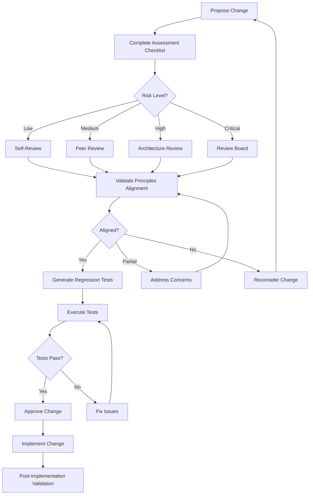

# Library Change Assessment Template

## Purpose
Provide comprehensive impact assessment for proposed changes to the AI Prompt Library. This template ensures that all modifications are evaluated for holistic impacts, maintain consistency with the library's vision, and don't break existing functionality. Every change to core templates or modules must complete this assessment before implementation.

## Instructions
Use this template before making any changes to the prompt library. Complete the impact assessment checklist, validate alignment with core principles, and generate regression test specifications. Do not proceed with changes until all critical items are addressed and the assessment is approved. For high-risk changes, escalate to architecture review before implementation.

## Examples

### Example 1: Template Modification Assessment
```markdown
# Change Assessment: Update feature-implementation-prompt.md

## Change Summary
**Proposed By**: Development Team
**Date**: 2024-01-15
**Change Type**: Enhancement
**Risk Level**: Medium

### Description
Add new section for AI-assisted code review integration to the feature implementation prompt template.

### Affected Components
| Component | Impact Type | Risk Level |
|-----------|-------------|------------|
| feature-implementation-prompt.md | Direct modification | Medium |
| stage-06-implementation/web.md | Indirect (uses template) | Low |
| stage-06-implementation/mobile.md | Indirect (uses template) | Low |
| prompts/modules/feature-patterns/*.md | Indirect (references patterns) | Low |

### Core Principles Alignment
| Principle | Aligned | Evidence |
|-----------|---------|----------|
| Modular | ✅ Yes | New section is self-contained and optional |
| Composable | ✅ Yes | Can be combined with existing sections |
| Production-Ready | ✅ Yes | Includes best practices for code review |
| Bite-sized Context | ✅ Yes | Section is concise and focused |

### Assessment Decision
**Status**: ✅ APPROVED
**Conditions**: Add unit tests for new section validation
**Reviewer**: Architecture Team Lead
```

### Example 2: High-Risk Change Assessment
```markdown
# Change Assessment: Restructure Stage Pipeline

## Change Summary
**Proposed By**: Architecture Team
**Date**: 2024-01-15
**Change Type**: Restructuring
**Risk Level**: Critical

### Description
Reorganize stage pipeline from 10 stages to 8 stages by consolidating testing and quality stages.

### Affected Components
| Component | Impact Type | Risk Level |
|-----------|-------------|------------|
| All stage-* directories | Direct restructuring | Critical |
| stage-pipeline-processor.ts | Major modification | Critical |
| All stage templates | Path changes | High |
| Integration tests | Test updates | High |
| Documentation | Updates required | Medium |

### Core Principles Alignment
| Principle | Aligned | Evidence |
|-----------|---------|----------|
| Modular | ⚠️ Partial | Consolidation may reduce modularity |
| Composable | ✅ Yes | Stages remain composable |
| Production-Ready | ✅ Yes | Maintains production quality |
| Bite-sized Context | ⚠️ Partial | Consolidated stages may be larger |

### Risk Assessment
- **Breaking Changes**: High - All stage references need updating
- **Cross-Platform Impact**: High - Affects all platforms equally
- **Rollback Complexity**: High - Requires coordinated rollback
- **Testing Requirements**: Comprehensive regression testing required

### Assessment Decision
**Status**: ⚠️ CONDITIONAL APPROVAL
**Conditions**: 
1. Complete migration plan required
2. Rollback procedure documented
3. All integration tests updated
4. Cross-platform validation completed
**Escalation**: Architecture Review Board approval required
```

## Core Principles
- **Impact First**: Assess all impacts before implementing changes
- **Principle Alignment**: Ensure changes align with library core principles
- **Regression Prevention**: Generate tests to prevent functionality regression
- **Cross-Platform Consistency**: Validate changes maintain platform parity

### Related Documents
- [Library Vision Document](./library-vision-document.md) - Core principles and vision alignment
- [Library Dependency Map](./library-dependency-map.md) - Component relationships and dependencies

## Impact Assessment Framework

### Change Assessment Checklist
```markdown
# Impact Assessment Checklist

## Change Information
**Change ID**: [Unique identifier]
**Proposed By**: [Name/Team]
**Date**: [Assessment date]
**Target Components**: [List of components to be changed]

## Pre-Assessment Requirements
- [ ] Change description is clear and complete
- [ ] Rationale for change is documented
- [ ] Expected benefits are identified
- [ ] Dependency map has been consulted

## Impact Analysis

### Direct Impact Assessment
- [ ] All directly modified files identified
- [ ] Modification scope documented
- [ ] Breaking changes identified
- [ ] Backward compatibility assessed

### Indirect Impact Assessment
- [ ] All dependent components identified
- [ ] Cascade effects documented
- [ ] Cross-references validated
- [ ] Integration points reviewed

### Cross-Platform Impact Assessment
- [ ] Web platform impact evaluated
- [ ] Mobile (iOS) platform impact evaluated
- [ ] Mobile (Android) platform impact evaluated
- [ ] Platform-agnostic impact evaluated
- [ ] Cross-platform consistency verified

## Risk Evaluation

### Risk Level Determination
| Factor | Score (1-5) | Weight | Weighted Score |
|--------|-------------|--------|----------------|
| Number of affected components | [Score] | 0.25 | [Calculated] |
| Cross-platform impact | [Score] | 0.25 | [Calculated] |
| Breaking change potential | [Score] | 0.30 | [Calculated] |
| Rollback complexity | [Score] | 0.20 | [Calculated] |
| **Total Risk Score** | - | 1.00 | **[Total]** |

### Risk Level Classification
- **1.0-2.0**: Low Risk - Self-review sufficient
- **2.1-3.0**: Medium Risk - Peer review required
- **3.1-4.0**: High Risk - Architecture review required
- **4.1-5.0**: Critical Risk - Full review board approval required

## Approval Requirements

### Low Risk Changes
- [ ] Self-review completed
- [ ] Unit tests updated
- [ ] Documentation updated

### Medium Risk Changes
- [ ] Peer review completed
- [ ] Integration tests updated
- [ ] Cross-platform validation completed
- [ ] Documentation updated

### High Risk Changes
- [ ] Architecture review completed
- [ ] Comprehensive regression tests added
- [ ] Migration plan documented
- [ ] Rollback procedure documented
- [ ] Cross-platform validation completed

### Critical Risk Changes
- [ ] Review board approval obtained
- [ ] Full regression test suite executed
- [ ] Staged rollout plan approved
- [ ] Monitoring and alerting configured
- [ ] Communication plan executed
```

### Core Principles Alignment Validation
```markdown
# Core Principles Alignment Validation

## Library Core Principles

### 1. Modular and Composable
**Definition**: All prompts must be like Lego blocks - basic, unit-level components that can build anything while keeping context manageable.

**Validation Questions**:
- [ ] Does the change maintain or improve modularity?
- [ ] Can the changed component be used independently?
- [ ] Does the change introduce unnecessary coupling?
- [ ] Are new dependencies minimized and justified?

**Alignment Assessment**:
- **Aligned**: Change maintains or improves modularity
- **Partial**: Change has minor modularity concerns
- **Not Aligned**: Change significantly reduces modularity

### 2. Integrated Best Practices
**Definition**: Production-ready features (offline resilience, security, accessibility, etc.) are embedded within feature prompts, not separate stages.

**Validation Questions**:
- [ ] Does the change maintain production-ready defaults?
- [ ] Are best practices still integrated, not separated?
- [ ] Does the change improve or maintain quality standards?
- [ ] Are security and accessibility considerations preserved?

**Alignment Assessment**:
- **Aligned**: Best practices remain integrated
- **Partial**: Some best practices may need adjustment
- **Not Aligned**: Best practices are separated or removed

### 3. Bite-sized Context
**Definition**: Everything must be small enough to avoid context overrun while maintaining trackable state management.

**Validation Questions**:
- [ ] Does the change keep context manageable?
- [ ] Are prompts still concise and focused?
- [ ] Is state management still trackable?
- [ ] Does the change avoid context bloat?

**Alignment Assessment**:
- **Aligned**: Context remains manageable
- **Partial**: Context size increases but remains acceptable
- **Not Aligned**: Context becomes unmanageable

### 4. Feature-Module Breakdown
**Definition**: Break requirements into features and modules, flesh out with relevant modular prompt templates.

**Validation Questions**:
- [ ] Does the change maintain feature-module structure?
- [ ] Are features still properly decomposed?
- [ ] Do modules remain cohesive and focused?
- [ ] Is the breakdown still logical and maintainable?

**Alignment Assessment**:
- **Aligned**: Feature-module structure maintained
- **Partial**: Minor structural adjustments needed
- **Not Aligned**: Structure significantly altered

### 5. Dry-run Capability
**Definition**: Include dry-run options to validate complete stage outputs without generating code or consuming excessive tokens.

**Validation Questions**:
- [ ] Does the change preserve dry-run capabilities?
- [ ] Can outputs still be validated without full execution?
- [ ] Is token consumption still optimizable?
- [ ] Are validation options still available?

**Alignment Assessment**:
- **Aligned**: Dry-run capabilities preserved
- **Partial**: Some dry-run features affected
- **Not Aligned**: Dry-run capabilities removed or broken

## Overall Alignment Score

| Principle | Alignment | Score |
|-----------|-----------|-------|
| Modular and Composable | [Aligned/Partial/Not Aligned] | [3/2/1] |
| Integrated Best Practices | [Aligned/Partial/Not Aligned] | [3/2/1] |
| Bite-sized Context | [Aligned/Partial/Not Aligned] | [3/2/1] |
| Feature-Module Breakdown | [Aligned/Partial/Not Aligned] | [3/2/1] |
| Dry-run Capability | [Aligned/Partial/Not Aligned] | [3/2/1] |
| **Total Score** | - | **[X/15]** |

### Alignment Decision
- **12-15**: Fully Aligned - Proceed with change
- **9-11**: Mostly Aligned - Minor adjustments recommended
- **6-8**: Partially Aligned - Significant review required
- **Below 6**: Not Aligned - Change should be reconsidered
```

### Regression Test Specification Generation
```markdown
# Regression Test Specification

## Test Generation for Change: [Change ID]

### Affected Components Test Coverage

#### Direct Component Tests
```typescript
// Tests for directly modified components
describe('Regression Tests: [Component Name]', () => {
  // Test existing functionality is preserved
  it('should maintain existing [functionality]', () => {
    // Test implementation
  });
  
  // Test new functionality works correctly
  it('should correctly implement [new feature]', () => {
    // Test implementation
  });
  
  // Test backward compatibility
  it('should remain backward compatible with [dependent]', () => {
    // Test implementation
  });
});
```

#### Dependent Component Tests
```typescript
// Tests for components that depend on modified components
describe('Regression Tests: Dependent Components', () => {
  // Test dependents still work correctly
  it('[Dependent] should still function correctly', () => {
    // Test implementation
  });
  
  // Test integration points
  it('integration with [component] should work', () => {
    // Test implementation
  });
});
```

### Cross-Platform Regression Tests
```typescript
// Tests for cross-platform consistency
describe('Cross-Platform Regression Tests', () => {
  const platforms = ['web', 'mobile', 'platform-agnostic'];
  
  platforms.forEach(platform => {
    it(`should maintain consistency for ${platform}`, () => {
      // Platform-specific test implementation
    });
  });
  
  it('should maintain feature parity across platforms', () => {
    // Parity test implementation
  });
});
```

### Test Execution Plan

#### Pre-Change Baseline
```bash
# Capture baseline test results before change
npm run test:baseline -- --run
npm run test:integration -- --run
npm run test:cross-platform -- --run

# Save baseline metrics
npm run test:coverage -- --run > baseline-coverage.txt
```

#### Post-Change Validation
```bash
# Run all regression tests after change
npm run test:regression -- --run
npm run test:integration -- --run
npm run test:cross-platform -- --run

# Compare with baseline
npm run test:coverage -- --run > post-change-coverage.txt
diff baseline-coverage.txt post-change-coverage.txt
```

### Test Success Criteria
- [ ] All existing tests pass
- [ ] New regression tests pass
- [ ] Code coverage maintained or improved
- [ ] No new warnings or errors
- [ ] Cross-platform tests pass
- [ ] Performance benchmarks met
```

## Change Validation Workflow

### Validation Process


### Validation Checkpoints

#### Checkpoint 1: Pre-Assessment
- [ ] Change proposal documented
- [ ] Dependency map consulted
- [ ] Initial impact identified
- [ ] Risk level estimated

#### Checkpoint 2: Impact Analysis
- [ ] All affected components identified
- [ ] Cross-platform impact assessed
- [ ] Breaking changes documented
- [ ] Rollback complexity evaluated

#### Checkpoint 3: Principles Validation
- [ ] All core principles evaluated
- [ ] Alignment score calculated
- [ ] Concerns documented
- [ ] Mitigations identified

#### Checkpoint 4: Test Specification
- [ ] Regression tests specified
- [ ] Cross-platform tests defined
- [ ] Success criteria established
- [ ] Test execution plan created

#### Checkpoint 5: Approval
- [ ] Required reviews completed
- [ ] All concerns addressed
- [ ] Tests executed successfully
- [ ] Change approved for implementation

## Change Documentation

### Change Record Template
```markdown
# Change Record: [Change ID]

## Summary
**Title**: [Brief title]
**Date**: [Implementation date]
**Author**: [Who made the change]
**Reviewers**: [Who reviewed]

## Change Details
**Type**: [Enhancement/Bug Fix/Refactoring/Breaking Change]
**Risk Level**: [Low/Medium/High/Critical]
**Affected Components**: [List]

## Assessment Results
**Impact Score**: [X/5]
**Alignment Score**: [X/15]
**Test Coverage**: [X%]

## Implementation Notes
[Details about how the change was implemented]

## Validation Results
- [ ] All regression tests passed
- [ ] Cross-platform validation completed
- [ ] Documentation updated
- [ ] Rollback procedure verified

## Post-Implementation Monitoring
**Monitoring Period**: [Duration]
**Success Metrics**: [What to watch]
**Rollback Trigger**: [Conditions for rollback]
```

This comprehensive change assessment framework ensures that all modifications to the AI Prompt Library are thoroughly evaluated, aligned with core principles, and validated through regression testing before implementation.
