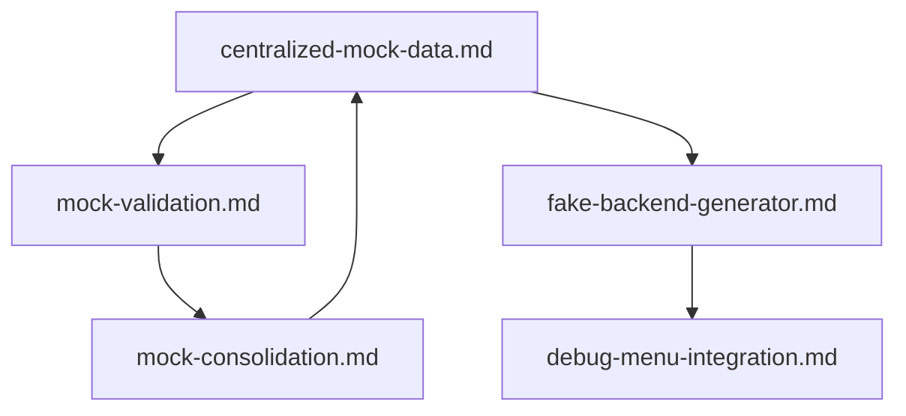
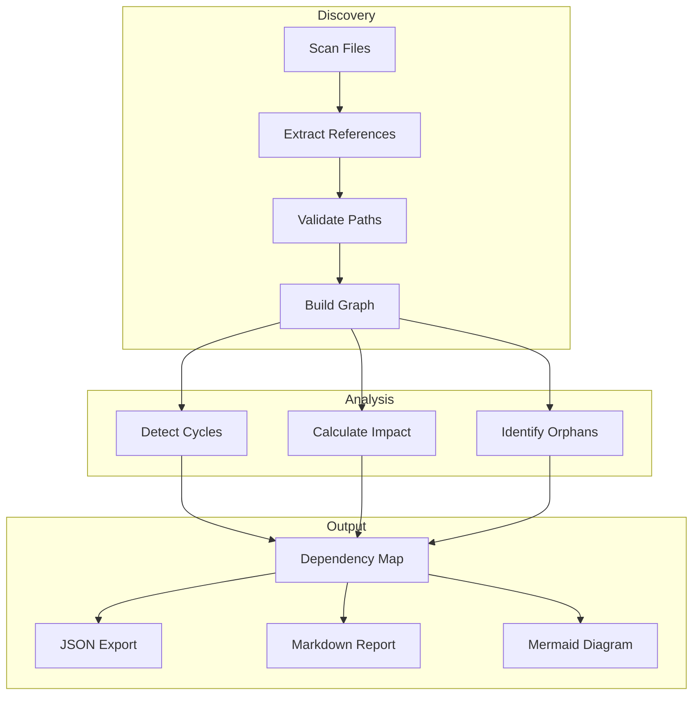
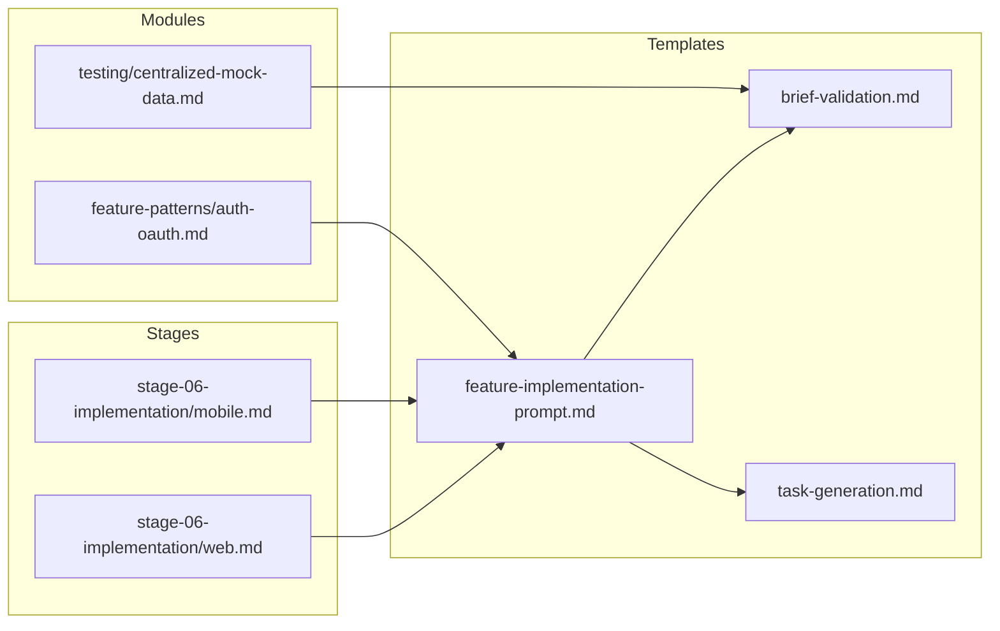

# Library Dependency Map Template

## Purpose
Maintain comprehensive dependency relationships between templates, modules, and stages in the AI Prompt Library. This template enables systematic tracking of how components relate to each other, facilitating impact assessment when changes are proposed and ensuring cross-platform consistency.

## Instructions
Use this template to generate and maintain dependency maps for the prompt library. Before making any changes to templates or modules, consult the dependency map to understand which components will be affected. Update the dependency map whenever new templates are added, existing templates are modified, or relationships between components change. The dependency map should be regenerated periodically to ensure accuracy and completeness.

## Examples

### Example 1: Template Dependency Map
```markdown
# Template Dependency Map

## Last Updated: 2024-01-15
## Generated By: Dependency Mapper v1.0

### Template: feature-implementation-prompt.md
**Path**: prompts/templates/feature-implementation-prompt.md
**Type**: Implementation Template

#### Dependencies (What this template uses)
| Dependency | Type | Relationship | Required |
|------------|------|--------------|----------|
| brief-validation.md | Template | References validation patterns | Yes |
| task-generation.md | Template | Uses task structure format | Yes |
| testing-strategy-generation.md | Template | Includes testing requirements | Yes |
| stage-output-generation.md | Template | Follows stage output format | No |

#### Dependents (What uses this template)
| Dependent | Type | Relationship | Impact Level |
|-----------|------|--------------|--------------|
| stage-06-implementation/web.md | Stage | Primary implementation guide | High |
| stage-06-implementation/mobile.md | Stage | Primary implementation guide | High |
| prompts/modules/feature-patterns/*.md | Module | Feature pattern implementations | Medium |

#### Cross-Platform Impact
- **Web**: Direct dependency for web implementation workflows
- **Mobile**: Direct dependency for mobile implementation workflows
- **Platform-Agnostic**: Provides base patterns used by all platforms

#### Change Risk Assessment
- **Risk Level**: High
- **Reason**: Core template used by multiple stages and platforms
- **Recommended Review**: Architecture review required for any changes
```

### Example 2: Module Relationship Map
```markdown
# Module Relationship Map

## Module: prompts/modules/testing/

### Internal Dependencies


### External Dependencies
| Module | Depends On | Used By |
|--------|------------|---------|
| centralized-mock-data.md | None | fake-backend-generator.md, mock-validation.md |
| fake-backend-generator.md | centralized-mock-data.md | debug-menu-integration.md, stage-05-testing/*.md |
| mock-validation.md | centralized-mock-data.md | mock-consolidation.md |
| debug-menu-integration.md | fake-backend-generator.md | stage-05-testing/mobile.md |

### Cross-Module Dependencies
- **feature-patterns/**: Uses mock data patterns for feature testing
- **cross-platform/**: References mock data for parity validation
- **technology-stacks/**: Integrates with stack-specific mock configurations
```

### Example 3: Automated Dependency Discovery Output
```json
{
  "discoveryDate": "2024-01-15T10:30:00Z",
  "totalTemplates": 45,
  "totalModules": 6,
  "totalStages": 10,
  "dependencies": [
    {
      "source": "prompts/templates/feature-implementation-prompt.md",
      "target": "prompts/templates/brief-validation.md",
      "type": "reference",
      "strength": "strong",
      "evidence": ["Line 45: 'See brief-validation.md for validation patterns'"]
    },
    {
      "source": "prompts/stages/stage-06-implementation/web.md",
      "target": "prompts/templates/feature-implementation-prompt.md",
      "type": "includes",
      "strength": "strong",
      "evidence": ["Line 12: 'Follow feature-implementation-prompt.md guidelines'"]
    }
  ],
  "orphanedTemplates": [],
  "circularDependencies": [],
  "healthScore": 98
}
```

## Core Principles
- **Comprehensive Tracking**: All relationships between components must be documented
- **Bidirectional Mapping**: Track both dependencies and dependents for each component
- **Cross-Platform Awareness**: Identify platform-specific impacts for all dependencies
- **Automated Discovery**: Use automated tools to discover and validate dependencies

## Dependency Mapping Framework

### Template Dependency Documentation
```markdown
# Template Dependency Record

## Template Information
**Name**: [Template name]
**Path**: [Full path from repository root]
**Type**: [Template/Module/Stage]
**Version**: [Current version]
**Last Modified**: [Date]

### Related Templates
- [brief-validation.md](./brief-validation.md) - Brief content validation
- [feature-implementation-prompt.md](./feature-implementation-prompt.md) - Implementation prompts

## Dependencies (What This Template Uses)

### Direct Dependencies
| Dependency | Path | Type | Required | Notes |
|------------|------|------|----------|-------|
| [Name] | [Path] | [Template/Module/Stage] | [Yes/No] | [Usage notes] |

### Indirect Dependencies
| Dependency | Path | Via | Notes |
|------------|------|-----|-------|
| [Name] | [Path] | [Intermediate dependency] | [Usage notes] |

### External Dependencies
| Dependency | Type | Version | Notes |
|------------|------|---------|-------|
| [Name] | [Library/API/Service] | [Version] | [Usage notes] |

## Dependents (What Uses This Template)

### Direct Dependents
| Dependent | Path | Type | Impact Level | Notes |
|-----------|------|------|--------------|-------|
| [Name] | [Path] | [Template/Module/Stage] | [High/Medium/Low] | [Usage notes] |

### Indirect Dependents
| Dependent | Path | Via | Impact Level |
|-----------|------|-----|--------------|
| [Name] | [Path] | [Intermediate dependent] | [High/Medium/Low] |

## Platform Impact Matrix

| Platform | Impact Level | Affected Components | Notes |
|----------|--------------|---------------------|-------|
| Web | [High/Medium/Low/None] | [List of components] | [Notes] |
| Mobile (iOS) | [High/Medium/Low/None] | [List of components] | [Notes] |
| Mobile (Android) | [High/Medium/Low/None] | [List of components] | [Notes] |
| Platform-Agnostic | [High/Medium/Low/None] | [List of components] | [Notes] |

## Change Impact Assessment

### Risk Level: [Critical/High/Medium/Low]

### Risk Factors
- [ ] Used by multiple stages
- [ ] Used by multiple platforms
- [ ] Has many direct dependents
- [ ] Contains core patterns or interfaces
- [ ] Affects cross-platform consistency

### Recommended Review Process
- [ ] Self-review sufficient
- [ ] Peer review required
- [ ] Architecture review required
- [ ] Cross-platform validation required
- [ ] Full regression testing required
```

### Cross-Platform Dependency Tracking
```markdown
# Cross-Platform Dependency Matrix

## Overview
This matrix tracks dependencies that span multiple platforms, ensuring changes maintain cross-platform consistency.

## Shared Dependencies

### Core Templates (Used by All Platforms)
| Template | Web | iOS | Android | Desktop | Notes |
|----------|-----|-----|---------|---------|-------|
| brief-validation.md | ✅ | ✅ | ✅ | ✅ | Core validation |
| task-generation.md | ✅ | ✅ | ✅ | ✅ | Task structure |
| testing-strategy-generation.md | ✅ | ✅ | ✅ | ✅ | Testing patterns |

### Platform-Specific Dependencies
| Template | Primary Platform | Secondary Platforms | Shared Components |
|----------|------------------|---------------------|-------------------|
| web-react.md | Web | None | Design tokens, API contracts |
| mobile-react-native.md | iOS, Android | None | Design tokens, API contracts |
| cloud-aws.md | All | None | Deployment patterns |

### Dependency Conflicts
| Conflict | Platforms Affected | Resolution Strategy |
|----------|-------------------|---------------------|
| [Conflict description] | [Platforms] | [Resolution approach] |

## Cross-Platform Validation Requirements

### When Modifying Shared Templates
1. Validate changes work for all dependent platforms
2. Run cross-platform parity tests
3. Update platform-specific documentation if needed
4. Verify no platform-specific regressions

### When Adding New Dependencies
1. Assess cross-platform compatibility
2. Document platform-specific variations
3. Update dependency maps for all affected platforms
4. Add cross-platform tests if needed
```

### Automated Dependency Discovery
```markdown
# Automated Dependency Discovery

## Discovery Process

### Step 1: Static Analysis
```bash
# Scan all template files for references
find prompts/ -name "*.md" -exec grep -l "\.md" {} \;

# Extract reference patterns
grep -rh "See \|Refer to \|Follow \|Use " prompts/ | grep "\.md"

# Find include/import patterns
grep -rh "#include\|@import\|reference:" prompts/
```

### Step 2: Content Analysis
```javascript
// Dependency discovery script
const discoverDependencies = (templatePath) => {
  const content = readFileSync(templatePath, 'utf-8');
  const dependencies = [];
  
  // Pattern 1: Direct file references
  const fileRefPattern = /(?:See|Refer to|Follow|Use)\s+[`"]?([a-zA-Z0-9\-_\/]+\.md)[`"]?/gi;
  
  // Pattern 2: Template references
  const templateRefPattern = /template:\s*([a-zA-Z0-9\-_\/]+\.md)/gi;
  
  // Pattern 3: Module references
  const moduleRefPattern = /module:\s*([a-zA-Z0-9\-_\/]+)/gi;
  
  // Extract all matches
  let match;
  while ((match = fileRefPattern.exec(content)) !== null) {
    dependencies.push({ type: 'reference', target: match[1] });
  }
  
  return dependencies;
};
```

### Step 3: Relationship Mapping


### Step 4: Validation
```markdown
## Dependency Validation Checklist

### Completeness
- [ ] All template files scanned
- [ ] All reference patterns detected
- [ ] All module directories included
- [ ] All stage files processed

### Accuracy
- [ ] All detected dependencies exist
- [ ] No false positives in detection
- [ ] Relationship types correctly classified
- [ ] Impact levels accurately assessed

### Consistency
- [ ] Bidirectional relationships verified
- [ ] Cross-platform mappings complete
- [ ] No orphaned templates detected
- [ ] No circular dependencies (or documented if intentional)
```

## Dependency Map Output Formats

### JSON Format
```json
{
  "version": "1.0",
  "generatedAt": "2024-01-15T10:30:00Z",
  "templates": [
    {
      "path": "prompts/templates/feature-implementation-prompt.md",
      "type": "template",
      "dependencies": [
        {
          "path": "prompts/templates/brief-validation.md",
          "type": "reference",
          "required": true
        }
      ],
      "dependents": [
        {
          "path": "prompts/stages/stage-06-implementation/web.md",
          "type": "stage",
          "impactLevel": "high"
        }
      ],
      "platforms": ["web", "mobile", "platform-agnostic"],
      "riskLevel": "high"
    }
  ],
  "modules": [],
  "stages": [],
  "metrics": {
    "totalDependencies": 150,
    "averageDependenciesPerTemplate": 3.5,
    "maxDependencyDepth": 4,
    "orphanedTemplates": 0,
    "circularDependencies": 0
  }
}
```

### Mermaid Diagram Format
```markdown
## Visual Dependency Map


```

## Dependency Maintenance

### Regular Maintenance Tasks
```markdown
## Weekly Dependency Maintenance

### Automated Tasks
- [ ] Run dependency discovery script
- [ ] Compare with previous dependency map
- [ ] Flag new or removed dependencies
- [ ] Update dependency documentation

### Manual Review
- [ ] Review flagged changes
- [ ] Validate cross-platform impacts
- [ ] Update risk assessments
- [ ] Document any intentional changes

## Monthly Dependency Audit

### Comprehensive Review
- [ ] Full dependency map regeneration
- [ ] Orphaned template detection
- [ ] Circular dependency analysis
- [ ] Cross-platform consistency check
- [ ] Impact level recalibration

### Documentation Updates
- [ ] Update dependency map documentation
- [ ] Refresh visual diagrams
- [ ] Update change impact guidelines
- [ ] Archive previous dependency maps
```

### Dependency Change Protocol
```markdown
## When Dependencies Change

### Adding New Dependencies
1. Document the new dependency in the template
2. Update the dependency map
3. Assess cross-platform impact
4. Update dependent templates if needed
5. Run validation tests

### Removing Dependencies
1. Verify no other templates depend on the removed dependency
2. Update the dependency map
3. Update all affected templates
4. Run regression tests
5. Document the removal reason

### Modifying Dependencies
1. Assess impact on all dependents
2. Update the dependency map
3. Notify maintainers of affected templates
4. Coordinate changes across platforms
5. Run comprehensive validation
```

This comprehensive dependency mapping framework ensures that all relationships between templates, modules, and stages are tracked, enabling informed decision-making when changes are proposed and maintaining cross-platform consistency throughout the AI Prompt Library.
