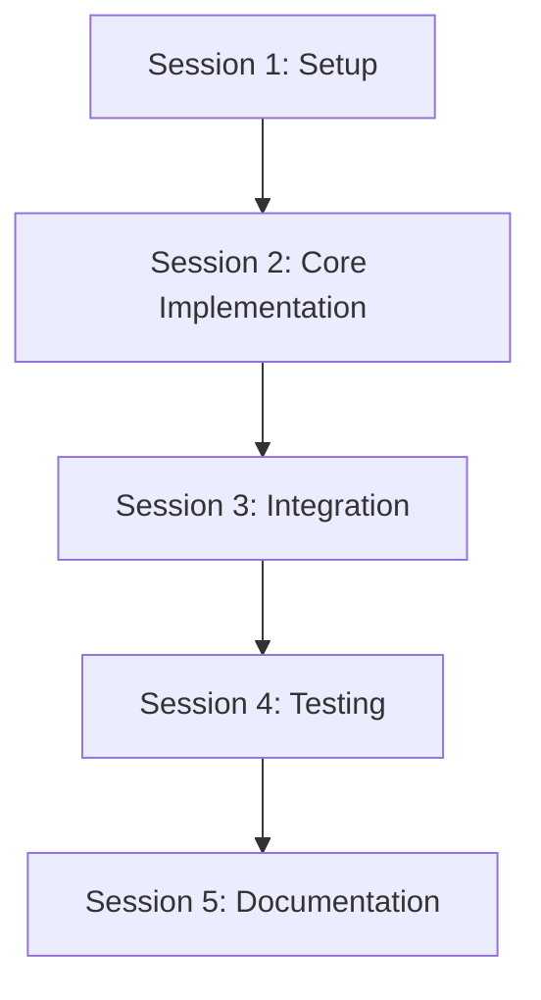
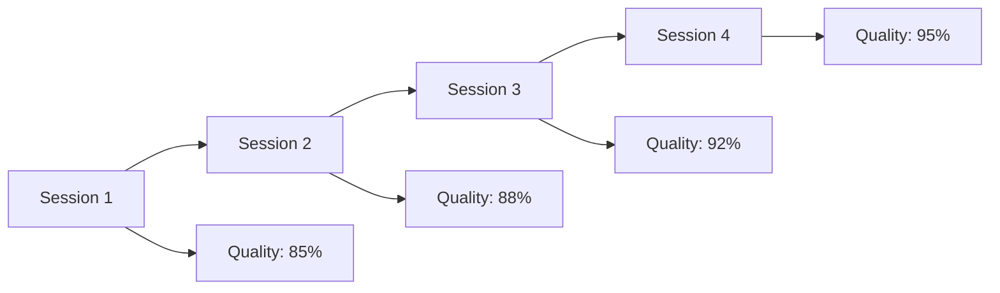

# Multi-Session Tasks Template

## Purpose
Structure tasks for completion across multiple sessions by different AI agents, ensuring seamless handoffs and continuous progress tracking.

## Instructions
Use this template to break down complex tasks into manageable sessions that can be completed by different AI agents over time. Each session should have clear entry and exit points with comprehensive state preservation.

1. **Plan Session Boundaries**: Identify natural breakpoints in complex tasks
2. **Define Session Objectives**: Set clear goals for each session
3. **Implement State Tracking**: Capture all relevant state between sessions
4. **Create Handoff Documentation**: Provide complete context for next agent
5. **Validate Continuity**: Ensure smooth transitions between sessions

## Examples

### Multi-Session Feature Development Example
```markdown
## Multi-Session Task: E-commerce Checkout System

### Session 1: Foundation Setup (2-3 hours)
**Objective**: Set up basic checkout infrastructure and data models

**Entry Requirements**:
- Product catalog API available
- User authentication system working
- Database schema permissions

**Tasks**:
1. Create checkout data models (Cart, Order, Payment)
2. Set up basic API endpoints structure
3. Implement cart management functionality
4. Create basic validation rules

**Exit Criteria**:
- [ ] Cart CRUD operations working
- [ ] Basic order model created
- [ ] API endpoints responding
- [ ] Unit tests passing

**Handoff Package**:
- Database schema changes applied
- API endpoint documentation
- Test coverage report
- Known issues and next steps

### Session 2: Payment Integration (3-4 hours)
**Objective**: Integrate payment processing and order completion

**Entry Requirements**:
- Session 1 completed successfully
- Payment provider credentials available
- SSL certificates configured

**Tasks**:
1. Integrate Stripe payment processing
2. Implement order state management
3. Add payment validation and error handling
4. Create order confirmation system

**Exit Criteria**:
- [ ] Payment processing working
- [ ] Order state transitions correct
- [ ] Error handling comprehensive
- [ ] Integration tests passing

**Handoff Package**:
- Payment integration documentation
- Error handling guide
- Security review checklist
- Performance test results

### Session 3: UI Integration (2-3 hours)
**Objective**: Connect frontend checkout flow with backend services

**Entry Requirements**:
- Sessions 1-2 completed
- Frontend framework set up
- Design system components available

**Tasks**:
1. Create checkout UI components
2. Implement form validation
3. Add loading states and error handling
4. Integrate with backend APIs

**Exit Criteria**:
- [ ] Complete checkout flow working
- [ ] Form validation comprehensive
- [ ] Error states handled gracefully
- [ ] E2E tests passing

**Final Deliverables**:
- Complete checkout system
- User documentation
- Admin documentation
- Deployment guide
```

### Session State Management Example
```markdown
## Session State: User Authentication System

### Current Session: Session 2 of 3
**Started**: 2024-01-15 14:30
**Agent**: AI-Agent-Beta
**Previous Agent**: AI-Agent-Alpha

### Progress Summary
**Completed in Previous Sessions**:
- ✅ Database schema created
- ✅ User model implemented
- ✅ Basic registration endpoint
- ✅ Password hashing with bcrypt

**Current Session Objectives**:
- [ ] Implement JWT token generation
- [ ] Add login endpoint
- [ ] Create token refresh mechanism
- [ ] Add logout functionality

### Technical State
**Environment**:
- Node.js 18.x running
- PostgreSQL database connected
- Redis cache available
- Test environment configured

**Code Changes This Session**:
- Modified: `src/auth/auth.service.ts` (JWT implementation)
- Added: `src/auth/token.service.ts` (token management)
- Updated: `src/auth/auth.controller.ts` (login endpoint)

**Dependencies Installed**:
- jsonwebtoken@9.0.0
- @types/jsonwebtoken@9.0.1

### Issues and Decisions
**Decisions Made This Session**:
- JWT expiry set to 15 minutes (security requirement)
- Refresh tokens stored in Redis (performance)
- Login rate limiting: 5 attempts per minute

**Issues Encountered**:
- Token signing key configuration needed
- Redis connection intermittent (resolved)

### Next Session Preparation
**Immediate Next Steps**:
1. Complete logout endpoint implementation
2. Add token blacklisting for logout
3. Implement password reset flow
4. Add comprehensive error handling

**Context for Next Agent**:
- JWT implementation follows RFC 7519 standard
- Rate limiting uses express-rate-limit middleware
- All passwords must meet complexity requirements
- Error responses follow API error format standard

**Files to Review**:
- `src/auth/auth.service.ts` - Core authentication logic
- `tests/auth/auth.test.ts` - Current test coverage
- `docs/api/auth-endpoints.md` - API documentation

### Quality Gates
**Before Session End**:
- [ ] All new code has unit tests
- [ ] API documentation updated
- [ ] No security vulnerabilities introduced
- [ ] Performance impact assessed

**Before Next Session**:
- [ ] Code reviewed and approved
- [ ] Integration tests updated
- [ ] Documentation complete
- [ ] Deployment checklist updated
```

## Core Principles
- **Session Boundary Management**: Clear start/stop points for development sessions
- **State Preservation**: Complete state capture between sessions
- **Agent Handoff**: Smooth transitions between different AI agents
- **Progress Continuity**: Uninterrupted development flow across sessions

## Session Structure Framework

### Session Planning Template
```markdown
## Session Plan: [Task/Feature Name]

### Session Overview
**Estimated Sessions**: [Number of sessions expected]
**Session Duration**: [Typical session length]
**Complexity Level**: [Simple/Medium/Complex]
**Handoff Points**: [Natural break points]

**Objective**: [Single sentence describing what this task accomplishes]

### Session Breakdown
#### Session 1: [Phase Name]
**Objective**: [What this session accomplishes]
**Duration**: [Estimated time]
**Deliverables**: [Concrete outputs]
**End State**: [How session concludes]

#### Session 2: [Phase Name]
**Objective**: [What this session accomplishes]
**Duration**: [Estimated time]
**Deliverables**: [Concrete outputs]
**End State**: [How session concludes]

#### Session N: [Phase Name]
**Objective**: [What this session accomplishes]
**Duration**: [Estimated time]
**Deliverables**: [Concrete outputs]
**End State**: [How session concludes]

### Session Dependencies

```

### Session State Management

#### Session Start Template
```markdown
## Session Start: [Session Name]

### Pre-Session Checklist
- [ ] Read previous session summary
- [ ] Verify environment state
- [ ] Check dependency status
- [ ] Review current objectives
- [ ] Validate prerequisite completion

### Current Context
**Project State**: [Overall project status]
**Feature Status**: [Current feature development status]
**Last Completed**: [Most recent completed work]
**Current Focus**: [What this session will work on]

### Environment Verification
```bash
# Commands to verify environment is ready
npm --version
node --version
git status
npm test -- --run
```

**Expected Results**:
- Node.js version: [expected version]
- Dependencies: All installed and up to date
- Git status: Clean working directory
- Tests: All passing

### Session Objectives
**Primary Goal**: [Main objective for this session]
**Secondary Goals**: [Additional objectives if time permits]
**Success Criteria**: [How to know session was successful]

### Resources Available
**Documentation**: [Links to relevant docs]
**Previous Work**: [Links to completed components]
**Assets**: [Available assets and resources]
**Tools**: [Development tools and configurations]
```

#### Session End Template
```markdown
## Session End: [Session Name]

### Session Summary
**Duration**: [Actual time spent]
**Objectives Met**: [Which objectives were completed]
**Deliverables**: [What was produced]
**Quality Status**: [Testing and validation results]

### Work Completed
#### Implemented Features
- [Feature/Component 1] - [Status and notes]
- [Feature/Component 2] - [Status and notes]
- [Feature/Component 3] - [Status and notes]

#### Files Modified
- [filename] - [description of changes]
- [filename] - [description of changes]
- [filename] - [description of changes]

#### Configuration Changes
- [setting/config] - [change made and reason]
- [setting/config] - [change made and reason]

### Work Remaining
#### Immediate Next Steps
1. [Next action with priority level]
2. [Next action with priority level]
3. [Next action with priority level]

#### Future Sessions
- **Session N+1**: [Planned focus and objectives]
- **Session N+2**: [Planned focus and objectives]

### Issues and Decisions
#### Decisions Made
- **Decision**: [What was decided]
  - **Rationale**: [Why this decision was made]
  - **Alternatives**: [Other options considered]
  - **Impact**: [How this affects future work]

#### Issues Encountered
- **Issue**: [Problem encountered]
  - **Resolution**: [How it was resolved or current status]
  - **Prevention**: [How to avoid in future]
  - **Impact**: [Effect on timeline or scope]

### Environment State
**Current Branch**: [Git branch name]
**Uncommitted Changes**: [List any uncommitted work]
**Dependencies**: [Any new dependencies added]
**Configuration**: [Current configuration state]

### Handoff Information
#### For Next Agent
**Context**: [Essential context for continuation]
**Priorities**: [What should be tackled first]
**Gotchas**: [Important things to watch out for]
**Resources**: [Helpful resources for continuation]

#### Quality Gates
- [ ] All tests passing
- [ ] Code follows project standards
- [ ] Documentation updated
- [ ] No breaking changes introduced

### Session Metrics
**Lines of Code**: [Added/Modified/Deleted]
**Tests Added**: [Number of new tests]
**Coverage**: [Test coverage percentage]
**Performance**: [Any performance impacts]
```

## Agent Handoff Protocol

### Handoff Preparation
```markdown
## Agent Handoff Preparation

### Context Package Creation
**Summary Document**: [Link to session summary]
**State Snapshot**: [Current project state]
**Decision Log**: [Recent decisions and rationale]
**Issue Tracker**: [Current issues and blockers]

### Knowledge Transfer
#### Technical Context
- **Architecture**: [Current architectural state]
- **Patterns**: [Coding patterns and conventions in use]
- **Dependencies**: [Key dependencies and their usage]
- **Configuration**: [Important configuration details]

#### Business Context
- **Feature Purpose**: [Why this feature is being built]
- **User Impact**: [How users will benefit]
- **Success Metrics**: [How success will be measured]
- **Constraints**: [Any limitations or requirements]

#### Development Context
- **Testing Strategy**: [How testing is approached]
- **Quality Standards**: [Code quality requirements]
- **Performance Requirements**: [Performance expectations]
- **Security Considerations**: [Security requirements]

### Handoff Verification
```bash
# Commands for incoming agent to verify readiness
git log --oneline -10
npm test -- --run
npm run lint
npm run build
```

**Expected Results**:
- Recent commits show clear progress
- All tests pass
- No linting errors
- Build completes successfully
```

### Handoff Reception
```markdown
## Agent Handoff Reception

### Onboarding Checklist
- [ ] Read handoff summary
- [ ] Verify environment setup
- [ ] Run verification commands
- [ ] Review recent decisions
- [ ] Understand current objectives

### Context Absorption
#### Quick Start Guide
1. **Understand the Goal**: [Read feature requirements]
2. **Check Current State**: [Review what's been completed]
3. **Identify Next Steps**: [Understand immediate priorities]
4. **Verify Environment**: [Ensure development environment is ready]

#### Deep Dive Resources
- **Architecture Documentation**: [Link to architecture docs]
- **API Documentation**: [Link to API specs]
- **Design System**: [Link to design guidelines]
- **Testing Guidelines**: [Link to testing standards]

### First Actions Protocol
1. **Environment Verification**: [Run standard verification commands]
2. **Code Review**: [Review recent changes]
3. **Test Execution**: [Run full test suite]
4. **Issue Assessment**: [Review any open issues]
5. **Priority Confirmation**: [Confirm understanding of priorities]
```

## Progress Tracking Framework

### Milestone Tracking
```markdown
## Progress Tracking: [Feature/Task Name]

### Overall Progress
**Completion**: [X]% complete
**Phase**: [Current development phase]
**Timeline**: [On track/Behind/Ahead]
**Quality**: [Green/Yellow/Red]

### Milestone Status
| Milestone | Target Date | Status | Completion | Notes |
|-----------|-------------|--------|------------|-------|
| [Milestone 1] | [Date] | [Status] | [%] | [Notes] |
| [Milestone 2] | [Date] | [Status] | [%] | [Notes] |
| [Milestone 3] | [Date] | [Status] | [%] | [Notes] |

### Session Progress
| Session | Date | Duration | Objectives | Completion | Quality |
|---------|------|----------|------------|------------|---------|
| 1 | [Date] | [Time] | [Objectives] | [%] | [Status] |
| 2 | [Date] | [Time] | [Objectives] | [%] | [Status] |
| 3 | [Date] | [Time] | [Objectives] | [%] | [Status] |

### Velocity Tracking
**Average Session Productivity**: [Metric]
**Estimated Remaining Sessions**: [Number]
**Projected Completion**: [Date]
**Risk Factors**: [List of potential delays]
```

### Quality Tracking
```markdown
## Quality Metrics: [Feature/Task Name]

### Code Quality
**Test Coverage**: [Percentage]
**Linting Score**: [Score/Status]
**Code Review Status**: [Status]
**Documentation Coverage**: [Percentage]

### Functional Quality
**Features Implemented**: [Count/Total]
**Features Tested**: [Count/Total]
**Bugs Found**: [Count]
**Bugs Fixed**: [Count]

### Performance Quality
**Load Time**: [Metric]
**Memory Usage**: [Metric]
**API Response Time**: [Metric]
**Bundle Size**: [Metric]

### Quality Trends

```

## Session Recovery Protocols

### Session Interruption Handling
```markdown
## Session Interruption Protocol

### Immediate Actions
1. **Save Current State**: [Commands to save work]
2. **Document Progress**: [Quick progress update]
3. **Note Issues**: [Record any current problems]
4. **Prepare Handoff**: [Essential information for continuation]

### State Preservation
```bash
# Commands to preserve session state
git add .
git commit -m "WIP: [description of current work]"
git push origin [branch-name]
echo "[current status]" > .session-state
```

### Recovery Preparation
**Recovery Document**: [Link to recovery instructions]
**State Snapshot**: [Current state description]
**Next Steps**: [Immediate actions for recovery]
**Contact Information**: [How to get help if needed]
```

### Session Recovery
```markdown
## Session Recovery Protocol

### Recovery Checklist
- [ ] Verify environment integrity
- [ ] Check for uncommitted changes
- [ ] Review interruption notes
- [ ] Validate current state
- [ ] Identify continuation point

### Recovery Commands
```bash
# Standard recovery sequence
git status
git log --oneline -5
npm install
npm test -- --run
```

### Recovery Validation
**State Verification**: [Commands to verify state]
**Functionality Check**: [Tests to run]
**Integration Validation**: [Integration points to verify]
**Performance Check**: [Performance validation]

### Continuation Strategy
1. **Assess Impact**: [Determine impact of interruption]
2. **Adjust Timeline**: [Update estimates if needed]
3. **Reprioritize**: [Adjust priorities based on lost time]
4. **Resume Work**: [Continue from appropriate point]
```

This template ensures that complex tasks can be seamlessly distributed across multiple development sessions with different AI agents, maintaining continuity, quality, and progress tracking throughout the entire development lifecycle.

## Multi-Session Task Features
This template provides comprehensive multi-session task capabilities including:
- **Context Independence**: Tasks executable without requiring previous conversation
- **self-contained**: Complete task information without external dependencies
- **Multi-Session**: Structure for completion across multiple sessions
- **Session Boundaries**: Clear start/stop points for development sessions
- **Checkpoints**: Built-in validation and progress tracking
- **Incremental Progress**: Tasks that build upon each other with clear dependencies
- **Specification References**: Complete reference management
- **Asset References**: Asset inventory and usage instructions
- **Dependency Management**: Prerequisites and dependency tracking
- **Dry-Run Capability**: Validation Mode for testing task structure