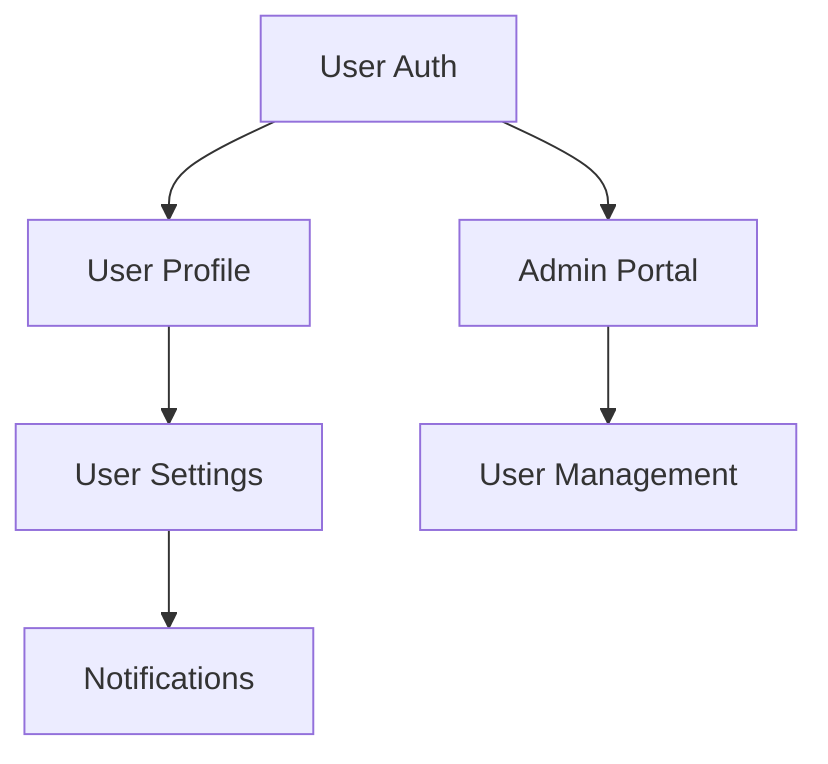

# Project State Tracking Template

## Purpose
Maintain comprehensive project state that tracks what is completed, what is in progress, and what remains to be done, enabling any AI agent to understand project status and continue development seamlessly. This template provides context-agnostic state tracking that is self-contained and executable with only the information provided.

## Instructions
Use this template to maintain real-time project state across all development activities. Update the PROJECT_STATUS.md file regularly with current metrics, feature progress, and health indicators. Maintain the DEVELOPMENT_LOG.md with chronological activity records, and keep NEXT_STEPS.md current with immediate priorities. Use the decision tracking framework to record all architectural and technical decisions with full rationale. Implement automated state updates through Git hooks and CI/CD integration where possible. Ensure all state documents are self-contained and provide complete context for new AI agents joining the project.

## Examples

### Project Status Dashboard
```markdown
# Project Status: Task Management App

## Executive Summary
**Project**: Modern task management application with offline support
**Status**: Active
**Phase**: Feature Development (Phase 2 of 4)
**Completion**: 65%
**Health**: Green - On track for Q2 delivery

## Key Metrics
| Metric | Current | Target | Status |
|--------|---------|--------|--------|
| Features Complete | 8/12 | 12 | On Track |
| Test Coverage | 87% | 90% | On Track |
| Performance Score | 92 | 90 | Ahead |
| Documentation | 75% | 80% | Behind |

## Current Focus
**Active Work**: Implementing offline synchronization
**Next Milestone**: Beta release - March 15, 2024
**Blockers**: None
**Decisions Needed**: Database migration strategy for v2.0
```

### Feature Status Tracking
```markdown
## Feature Status Matrix

### Completed Features ✅
| Feature | Completion Date | Version | Tests | Documentation | Notes |
|---------|----------------|---------|-------|---------------|-------|
| User Authentication | 2024-01-15 | v1.0 | ✅ | ✅ | OAuth integration complete |
| Task CRUD Operations | 2024-01-22 | v1.0 | ✅ | ✅ | Full REST API implemented |
| Real-time Updates | 2024-02-01 | v1.1 | ✅ | ✅ | WebSocket implementation |

### In Progress Features 🚧
| Feature | Progress | Assignee | Target Date | Blockers | Notes |
|---------|----------|----------|-------------|----------|-------|
| Offline Sync | 75% | Agent-Session-001 | 2024-02-15 | None | Testing phase |
| Mobile App | 40% | Agent-Session-002 | 2024-03-01 | API finalization | React Native |

### Planned Features 📋
| Feature | Priority | Effort | Dependencies | Target Date | Notes |
|---------|----------|--------|--------------|-------------|-------|
| Team Collaboration | High | L | Offline Sync | 2024-03-15 | Multi-user support |
| Advanced Analytics | Medium | M | Team Collaboration | 2024-04-01 | Usage insights |
```

### Development Activity Log
```markdown
## Development Log

### Recent Activity (Last 7 Days)
| Date | Activity | Component | Impact | Agent |
|------|----------|-----------|--------|-------|
| 2024-02-08 | Implemented conflict resolution | Sync Engine | High | Agent-001 |
| 2024-02-07 | Added offline queue | Data Layer | Medium | Agent-001 |
| 2024-02-06 | Fixed authentication bug | Auth Service | Low | Agent-002 |

### Weekly Progress Summary
#### Week of February 5, 2024
**Completed**:
- Offline data storage implementation
- Conflict resolution algorithm
- Unit tests for sync engine

**In Progress**:
- Integration testing for offline features - 80% complete
- Mobile app authentication flow - 60% complete

**Planned for Next Week**:
- Complete offline sync testing
- Begin team collaboration features
- Update API documentation

**Blockers Resolved**:
- Database schema conflicts - Resolved with migration script
- Performance issues in sync - Resolved with batching

**New Blockers**:
- None identified
```

### Architecture Decision Example
```markdown
## Architecture Decision Record: Offline Data Storage

**Date**: 2024-02-01
**Status**: Accepted
**Deciders**: Development Team
**Context**: Need to store user data locally for offline functionality

### Decision
Use IndexedDB with Dexie.js wrapper for client-side data storage

### Rationale
- Native browser support for large data storage
- Dexie.js provides better API and TypeScript support
- Supports complex queries needed for sync conflict resolution

### Consequences
**Positive**:
- Robust offline data storage
- Good performance for large datasets
- Strong TypeScript integration

**Negative**:
- Additional dependency (Dexie.js)
- Learning curve for team members
- Browser compatibility considerations

### Implementation Notes
- Use separate object stores for different data types
- Implement automatic cleanup for old data
- Add migration support for schema changes
```

## Core Principles
- **Complete Visibility**: Full transparency into project status at all levels
- **Real-Time Updates**: State reflects current reality, not outdated information
- **Agent Accessibility**: Any AI agent can quickly understand project status
- **Context Independence**: All state records are self-contained without requiring previous conversation
- **Decision Traceability**: All decisions and changes are tracked with rationale

## Project State Structure

### Master Project Status
```markdown
# Project Status: [Project Name]

## Executive Summary
**Project**: [Project name and brief description]
**Status**: [Active/On Hold/Completed/Cancelled]
**Phase**: [Current development phase]
**Completion**: [Overall completion percentage]
**Health**: [Green/Yellow/Red with brief explanation]

## Key Metrics
| Metric | Current | Target | Status |
|--------|---------|--------|--------|
| Features Complete | [X/Y] | [Y] | [On Track/Behind/Ahead] |
| Test Coverage | [X%] | [Y%] | [Status] |
| Performance Score | [X] | [Y] | [Status] |
| Documentation | [X%] | [Y%] | [Status] |

## Current Focus
**Active Work**: [What is currently being worked on]
**Next Milestone**: [Next major milestone and target date]
**Blockers**: [Any current blockers or impediments]
**Decisions Needed**: [Any pending decisions that need to be made]

## Quick Navigation
- [Development Log](#development-log)
- [Feature Status](#feature-status)
- [Architecture Decisions](#architecture-decisions)
- [Known Issues](#known-issues)
- [Next Steps](#next-steps)
```

### Feature Status Tracking
```markdown
## Feature Status Matrix

### Completed Features ✅
| Feature | Completion Date | Version | Tests | Documentation | Notes |
|---------|----------------|---------|-------|---------------|-------|
| [Feature Name] | [Date] | [Version] | ✅ | ✅ | [Notes] |
| [Feature Name] | [Date] | [Version] | ✅ | ✅ | [Notes] |

### In Progress Features 🚧
| Feature | Progress | Assignee | Target Date | Blockers | Notes |
|---------|----------|----------|-------------|----------|-------|
| [Feature Name] | [X%] | [Agent/Session] | [Date] | [Blockers] | [Notes] |
| [Feature Name] | [X%] | [Agent/Session] | [Date] | [Blockers] | [Notes] |

### Planned Features 📋
| Feature | Priority | Effort | Dependencies | Target Date | Notes |
|---------|----------|--------|--------------|-------------|-------|
| [Feature Name] | [High/Med/Low] | [S/M/L] | [Dependencies] | [Date] | [Notes] |
| [Feature Name] | [High/Med/Low] | [S/M/L] | [Dependencies] | [Date] | [Notes] |

### Feature Dependencies


### Feature Health Status
**Green Features** (Healthy): [List features that are on track]
**Yellow Features** (At Risk): [List features with minor issues]
**Red Features** (Blocked): [List features with major issues]
```

### Development Progress Tracking
```markdown
## Development Log

### Recent Activity (Last 7 Days)
| Date | Activity | Component | Impact | Agent |
|------|----------|-----------|--------|-------|
| [Date] | [Activity] | [Component] | [Impact] | [Agent ID] |
| [Date] | [Activity] | [Component] | [Impact] | [Agent ID] |

### Weekly Progress Summary
#### Week of [Date]
**Completed**:
- [Completed item 1]
- [Completed item 2]
- [Completed item 3]

**In Progress**:
- [In progress item 1] - [Status]
- [In progress item 2] - [Status]

**Planned for Next Week**:
- [Planned item 1]
- [Planned item 2]
- [Planned item 3]

**Blockers Resolved**:
- [Resolved blocker 1] - [Resolution]
- [Resolved blocker 2] - [Resolution]

**New Blockers**:
- [New blocker 1] - [Impact and plan]
- [New blocker 2] - [Impact and plan]

### Milestone Progress
| Milestone | Target Date | Status | Completion | Risk Level |
|-----------|-------------|--------|------------|------------|
| [Milestone 1] | [Date] | [Status] | [X%] | [Low/Med/High] |
| [Milestone 2] | [Date] | [Status] | [X%] | [Low/Med/High] |
| [Milestone 3] | [Date] | [Status] | [X%] | [Low/Med/High] |
```

### Technical State Tracking
```markdown
## Technical Status

### Architecture State
**Current Architecture**: [Brief description of current architecture]
**Recent Changes**: [Any recent architectural changes]
**Planned Changes**: [Any planned architectural changes]
**Technical Debt**: [Current technical debt level and plan]

### Code Quality Metrics
| Metric | Current | Target | Trend | Last Updated |
|--------|---------|--------|-------|--------------|
| Test Coverage | [X%] | [Y%] | [↑/↓/→] | [Date] |
| Code Quality Score | [X] | [Y] | [↑/↓/→] | [Date] |
| Performance Score | [X] | [Y] | [↑/↓/→] | [Date] |
| Security Score | [X] | [Y] | [↑/↓/→] | [Date] |

### Environment Status
**Development**: [Status and health]
**Staging**: [Status and health]
**Production**: [Status and health]
**CI/CD Pipeline**: [Status and health]

### Dependency Status
| Dependency | Version | Status | Security | Last Updated |
|------------|---------|--------|----------|--------------|
| [Package] | [Version] | [Status] | [Security Status] | [Date] |
| [Package] | [Version] | [Status] | [Security Status] | [Date] |
```

## Decision Tracking Framework

### Architecture Decision Records (ADRs)
```markdown
## Architecture Decision Record: [Decision Title]

**Date**: [Decision date]
**Status**: [Proposed/Accepted/Deprecated/Superseded]
**Deciders**: [Who made this decision]
**Context**: [What is the issue that we're seeing that is motivating this decision]

### Decision
[What is the change that we're proposing or have agreed to implement]

### Rationale
[Why did we choose this option over alternatives]

### Consequences
**Positive**:
- [Positive consequence 1]
- [Positive consequence 2]

**Negative**:
- [Negative consequence 1]
- [Negative consequence 2]

**Neutral**:
- [Neutral consequence 1]
- [Neutral consequence 2]

### Alternatives Considered
1. **[Alternative 1]**
   - Pros: [Advantages]
   - Cons: [Disadvantages]
   - Rejected because: [Reason]

2. **[Alternative 2]**
   - Pros: [Advantages]
   - Cons: [Disadvantages]
   - Rejected because: [Reason]

### Implementation Notes
[Any specific implementation details or considerations]

### Review Date
[When this decision should be reviewed again]
```

### Decision Log Summary
```markdown
## Decision Log Summary

### Recent Decisions (Last 30 Days)
| Date | Decision | Impact | Status | Review Date |
|------|----------|--------|--------|-------------|
| [Date] | [Decision Summary] | [High/Med/Low] | [Status] | [Date] |
| [Date] | [Decision Summary] | [High/Med/Low] | [Status] | [Date] |

### Pending Decisions
| Decision Needed | Priority | Deadline | Owner | Context |
|----------------|----------|----------|-------|---------|
| [Decision] | [High/Med/Low] | [Date] | [Owner] | [Context] |
| [Decision] | [High/Med/Low] | [Date] | [Owner] | [Context] |

### Decision Impact Tracking
**High Impact Decisions**: [Decisions that significantly affect the project]
**Medium Impact Decisions**: [Decisions with moderate project impact]
**Low Impact Decisions**: [Decisions with minimal project impact]
```

## Issue and Risk Management

### Known Issues Tracking
```markdown
## Known Issues

### Critical Issues 🔴
| Issue | Impact | Workaround | Owner | Target Resolution |
|-------|--------|------------|-------|-------------------|
| [Issue] | [Impact] | [Workaround] | [Owner] | [Date] |

### Major Issues 🟡
| Issue | Impact | Workaround | Owner | Target Resolution |
|-------|--------|------------|-------|-------------------|
| [Issue] | [Impact] | [Workaround] | [Owner] | [Date] |

### Minor Issues 🟢
| Issue | Impact | Workaround | Owner | Target Resolution |
|-------|--------|------------|-------|-------------------|
| [Issue] | [Impact] | [Workaround] | [Owner] | [Date] |

### Issue Resolution History
| Date | Issue | Resolution | Impact | Lessons Learned |
|------|-------|------------|--------|-----------------|
| [Date] | [Issue] | [Resolution] | [Impact] | [Lessons] |
| [Date] | [Issue] | [Resolution] | [Impact] | [Lessons] |
```

### Risk Assessment
```markdown
## Risk Assessment

### Current Risks
| Risk | Probability | Impact | Mitigation | Owner | Status |
|------|-------------|--------|------------|-------|--------|
| [Risk] | [High/Med/Low] | [High/Med/Low] | [Mitigation] | [Owner] | [Status] |
| [Risk] | [High/Med/Low] | [High/Med/Low] | [Mitigation] | [Owner] | [Status] |

### Risk Trends
**Increasing Risks**: [Risks that are becoming more likely or impactful]
**Decreasing Risks**: [Risks that are being mitigated successfully]
**New Risks**: [Recently identified risks]
**Resolved Risks**: [Risks that have been eliminated]
```

## State Update Protocols

### Automated State Updates
```markdown
## Automated State Tracking

### Git Hook Integration
```bash
#!/bin/bash
# Post-commit hook to update project state
echo "$(date): Commit $(git rev-parse --short HEAD) - $(git log -1 --pretty=%B)" >> .project-state/commit-log.txt
npm run update-project-state
```

### CI/CD Integration
```yaml
# GitHub Actions workflow to update state
name: Update Project State
on:
  push:
    branches: [main, develop]
  pull_request:
    branches: [main]

jobs:
  update-state:
    runs-on: ubuntu-latest
    steps:
      - uses: actions/checkout@v2
      - name: Update Project State
        run: |
          npm run test:coverage
          npm run update-metrics
          npm run generate-state-report
```

### Manual State Updates
```markdown
## Manual State Update Checklist

### Daily Updates
- [ ] Update feature progress percentages
- [ ] Log any new issues or blockers
- [ ] Update current focus and priorities
- [ ] Record any decisions made

### Weekly Updates
- [ ] Update milestone progress
- [ ] Review and update risk assessment
- [ ] Update dependency status
- [ ] Generate weekly progress summary

### Monthly Updates
- [ ] Review and update architecture decisions
- [ ] Assess overall project health
- [ ] Update long-term roadmap
- [ ] Review and archive resolved issues
```

## Agent Onboarding Integration

### Quick Start Guide for New Agents
```markdown
## Agent Quick Start: Project State

### Essential Reading (5 minutes)
1. **Project Status**: [Link to current status]
2. **Active Features**: [Link to in-progress features]
3. **Recent Decisions**: [Link to recent ADRs]
4. **Current Issues**: [Link to known issues]

### Understanding Current State (10 minutes)
1. **Read Development Log**: Last 7 days of activity
2. **Check Feature Status**: What's completed vs. in progress
3. **Review Blockers**: Any current impediments
4. **Understand Priorities**: What should be worked on next

### Verification Steps (5 minutes)
```bash
# Commands to verify understanding
git log --oneline -10
npm test -- --run
npm run lint
cat .project-state/current-focus.txt
```

### Ready to Contribute Checklist
- [ ] Understand project goals and current phase
- [ ] Know what features are complete vs. in progress
- [ ] Aware of any current blockers or issues
- [ ] Understand immediate priorities
- [ ] Verified development environment is working
```

This comprehensive project state tracking system ensures that any AI agent can quickly understand the current project status, recent progress, and immediate next steps, enabling seamless continuation of development work across multiple sessions and agents.

## State Management Features
This template provides comprehensive state management including:
- **PROJECT_STATUS.md**: High-level project overview and status tracking
- **DEVELOPMENT_LOG.md**: Chronological record of development activities
- **NEXT_STEPS.md**: Clear action items and priorities
- **ARCHITECTURE_DECISIONS.md**: technical choices with rationale
- **COMPLETED_FEATURES.md**: implemented and tested functionality
- **KNOWN_ISSUES.md**: bugs, limitations, and technical debt
- **Context Summary**: Quick Orientation for new agents
- **Decision Record**: ADR and Decision Logging capabilities
- **Handoff**: AI Agent handoff procedures for new agent onboarding
- **Recovery**: Recovery Procedures and Emergency Procedures for system recovery
- **Incremental Progress**: Features and tasks build upon each other systematically
- **Multi-Session**: Support for development across multiple sessions
- **Checkpoint**: Milestone tracking and validation points