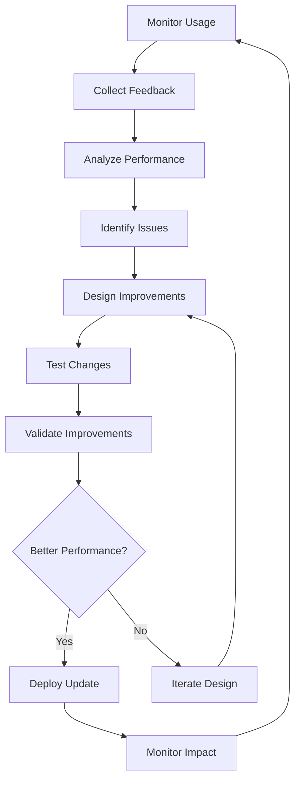

# Prompt Continuous Improvement Template

## Purpose
Establish a systematic approach for continuously improving prompt templates based on usage data, user feedback, and performance metrics to ensure optimal effectiveness over time.

## Instructions
Use this template to implement a continuous improvement system for your prompt library. Set up monitoring systems to collect usage data and user feedback, analyze performance trends to identify improvement opportunities, and implement automated improvements where possible. Follow the systematic approach to ensure prompts evolve and maintain high quality over time.

## Examples
```markdown
# Example: Improving a Feature Breakdown Prompt

## Performance Analysis Results
- **Current Success Rate**: 85% (down from 92% last month)
- **Average Quality Score**: 7.2/10 (down from 8.1/10)
- **Common Issues**: Users report unclear instructions, missing examples for complex features
- **User Feedback**: "Need more specific guidance for breaking down technical features"

## Improvement Plan
1. **Add Technical Feature Examples**: Include examples for API design, database schema, security features
2. **Enhance Instructions**: Add step-by-step process for complex feature analysis
3. **Improve Error Handling**: Add guidance for handling ambiguous requirements

## Implementation
- **Version**: 2.1.0 → 2.2.0
- **Changes**: Added 3 technical examples, restructured instructions section, added troubleshooting guide
- **Expected Impact**: Increase success rate to 90%+, improve quality score to 8.0+
```

## Continuous Improvement Framework

### Improvement Lifecycle
```markdown
## Improvement Process Overview

### Continuous Improvement Cycle


### Improvement Triggers
#### Performance-Based Triggers
- **Success Rate Drop**: Success rate falls below 90%
- **Quality Degradation**: Output quality scores decline by >10%
- **Performance Issues**: Execution time increases by >20%
- **Error Rate Increase**: Error rates exceed 5%
- **User Satisfaction Drop**: User ratings fall below 4.0/5.0

#### Usage-Based Triggers
- **High Usage Volume**: Prompt becomes heavily used (top 10%)
- **New Use Cases**: Users applying prompt to unintended scenarios
- **Integration Issues**: Problems with downstream systems or workflows
- **Scalability Concerns**: Performance issues under increased load
- **Compatibility Problems**: Issues with new platforms or environments

#### Feedback-Based Triggers
- **User Complaints**: Multiple user reports of issues or confusion
- **Feature Requests**: Consistent requests for additional functionality
- **Usability Issues**: Users struggling with prompt complexity or clarity
- **Documentation Gaps**: Frequent questions about usage or implementation
- **Training Needs**: Users requiring additional guidance or examples
```

### Data Collection and Analysis
```markdown
## Performance Monitoring System

### Metrics Collection Framework
```python
#!/usr/bin/env python3
"""
Prompt Performance Monitoring System
Collects and analyzes prompt usage data for continuous improvement
"""

import json
import sqlite3
import statistics
from datetime import datetime, timedelta
from typing import Dict, List, Tuple, Optional
from dataclasses import dataclass
import pandas as pd
import matplotlib.pyplot as plt

@dataclass
class UsageMetric:
    prompt_id: str
    timestamp: datetime
    execution_time: float
    success: bool
    quality_score: float
    user_id: str
    use_case: str
    error_type: Optional[str] = None
    feedback_score: Optional[float] = None

class PromptMonitoringSystem:
    def __init__(self, db_path: str = "prompt_monitoring.db"):
        self.db_path = db_path
        self.connection = sqlite3.connect(db_path)
        self.setup_database()
    
    def setup_database(self):
        """Initialize monitoring database schema"""
        cursor = self.connection.cursor()
        
        # Usage metrics table
        cursor.execute('''
            CREATE TABLE IF NOT EXISTS usage_metrics (
                id INTEGER PRIMARY KEY AUTOINCREMENT,
                prompt_id TEXT NOT NULL,
                timestamp DATETIME NOT NULL,
                execution_time REAL,
                success BOOLEAN,
                quality_score REAL,
                user_id TEXT,
                use_case TEXT,
                error_type TEXT,
                feedback_score REAL
            )
        ''')
        
        # Performance trends table
        cursor.execute('''
            CREATE TABLE IF NOT EXISTS performance_trends (
                id INTEGER PRIMARY KEY AUTOINCREMENT,
                prompt_id TEXT NOT NULL,
                date DATE NOT NULL,
                avg_execution_time REAL,
                success_rate REAL,
                avg_quality_score REAL,
                usage_count INTEGER,
                avg_feedback_score REAL
            )
        ''')
        
        # Improvement actions table
        cursor.execute('''
            CREATE TABLE IF NOT EXISTS improvement_actions (
                id INTEGER PRIMARY KEY AUTOINCREMENT,
                prompt_id TEXT NOT NULL,
                action_type TEXT NOT NULL,
                description TEXT,
                implemented_date DATETIME,
                impact_score REAL,
                status TEXT DEFAULT 'planned'
            )
        ''')
        
        self.connection.commit()
    
    def record_usage(self, metric: UsageMetric):
        """Record a single usage metric"""
        cursor = self.connection.cursor()
        cursor.execute('''
            INSERT INTO usage_metrics 
            (prompt_id, timestamp, execution_time, success, quality_score, 
             user_id, use_case, error_type, feedback_score)
            VALUES (?, ?, ?, ?, ?, ?, ?, ?, ?)
        ''', (
            metric.prompt_id, metric.timestamp, metric.execution_time,
            metric.success, metric.quality_score, metric.user_id,
            metric.use_case, metric.error_type, metric.feedback_score
        ))
        self.connection.commit()
    
    def analyze_performance_trends(self, prompt_id: str, days: int = 30) -> Dict:
        """Analyze performance trends over specified period"""
        cursor = self.connection.cursor()
        
        # Get recent usage data
        cursor.execute('''
            SELECT * FROM usage_metrics 
            WHERE prompt_id = ? AND timestamp >= datetime('now', '-{} days')
            ORDER BY timestamp
        '''.format(days), (prompt_id,))
        
        rows = cursor.fetchall()
        if not rows:
            return {"error": "No usage data found"}
        
        # Convert to metrics objects
        metrics = []
        for row in rows:
            metrics.append(UsageMetric(
                prompt_id=row[1], timestamp=datetime.fromisoformat(row[2]),
                execution_time=row[3], success=bool(row[4]),
                quality_score=row[5], user_id=row[6], use_case=row[7],
                error_type=row[8], feedback_score=row[9]
            ))
        
        # Calculate trend analysis
        return self.calculate_trends(metrics)
    
    def calculate_trends(self, metrics: List[UsageMetric]) -> Dict:
        """Calculate performance trends from usage metrics"""
        if not metrics:
            return {}
        
        # Group by day for trend analysis
        daily_data = {}
        for metric in metrics:
            date_key = metric.timestamp.date()
            if date_key not in daily_data:
                daily_data[date_key] = []
            daily_data[date_key].append(metric)
        
        # Calculate daily aggregates
        daily_trends = []
        for date, day_metrics in daily_data.items():
            success_rate = sum(1 for m in day_metrics if m.success) / len(day_metrics)
            avg_execution_time = statistics.mean([m.execution_time for m in day_metrics])
            avg_quality = statistics.mean([m.quality_score for m in day_metrics if m.quality_score])
            feedback_scores = [m.feedback_score for m in day_metrics if m.feedback_score]
            avg_feedback = statistics.mean(feedback_scores) if feedback_scores else None
            
            daily_trends.append({
                'date': date,
                'success_rate': success_rate,
                'avg_execution_time': avg_execution_time,
                'avg_quality_score': avg_quality,
                'usage_count': len(day_metrics),
                'avg_feedback_score': avg_feedback
            })
        
        # Calculate overall trends
        recent_data = daily_trends[-7:]  # Last 7 days
        older_data = daily_trends[:-7] if len(daily_trends) > 7 else daily_trends[:1]
        
        trends = {}
        if older_data and recent_data:
            # Success rate trend
            old_success = statistics.mean([d['success_rate'] for d in older_data])
            new_success = statistics.mean([d['success_rate'] for d in recent_data])
            trends['success_rate_change'] = new_success - old_success
            
            # Quality trend
            old_quality = statistics.mean([d['avg_quality_score'] for d in older_data])
            new_quality = statistics.mean([d['avg_quality_score'] for d in recent_data])
            trends['quality_change'] = new_quality - old_quality
            
            # Performance trend
            old_time = statistics.mean([d['avg_execution_time'] for d in older_data])
            new_time = statistics.mean([d['avg_execution_time'] for d in recent_data])
            trends['performance_change'] = (old_time - new_time) / old_time  # Positive = improvement
        
        return {
            'daily_trends': daily_trends,
            'trend_analysis': trends,
            'summary': self.generate_trend_summary(daily_trends, trends)
        }
    
    def identify_improvement_opportunities(self, prompt_id: str) -> List[Dict]:
        """Identify specific improvement opportunities"""
        trends = self.analyze_performance_trends(prompt_id)
        opportunities = []
        
        # Check for performance degradation
        if trends.get('trend_analysis', {}).get('success_rate_change', 0) < -0.05:
            opportunities.append({
                'type': 'success_rate_decline',
                'priority': 'high',
                'description': 'Success rate has declined by >5%',
                'suggested_actions': [
                    'Review recent prompt changes',
                    'Analyze failure patterns',
                    'Update examples and instructions',
                    'Conduct user feedback sessions'
                ]
            })
        
        # Check for quality issues
        if trends.get('trend_analysis', {}).get('quality_change', 0) < -0.1:
            opportunities.append({
                'type': 'quality_decline',
                'priority': 'high',
                'description': 'Output quality has declined by >10%',
                'suggested_actions': [
                    'Review quality criteria',
                    'Update prompt instructions',
                    'Add more specific examples',
                    'Improve error handling guidance'
                ]
            })
        
        # Check for performance issues
        if trends.get('trend_analysis', {}).get('performance_change', 0) < -0.2:
            opportunities.append({
                'type': 'performance_decline',
                'priority': 'medium',
                'description': 'Execution time has increased by >20%',
                'suggested_actions': [
                    'Optimize prompt structure',
                    'Reduce unnecessary complexity',
                    'Improve input validation',
                    'Consider prompt chunking'
                ]
            })
        
        return opportunities
    
    def generate_improvement_plan(self, prompt_id: str) -> Dict:
        """Generate comprehensive improvement plan"""
        opportunities = self.identify_improvement_opportunities(prompt_id)
        trends = self.analyze_performance_trends(prompt_id)
        
        # Prioritize improvements
        high_priority = [opp for opp in opportunities if opp['priority'] == 'high']
        medium_priority = [opp for opp in opportunities if opp['priority'] == 'medium']
        low_priority = [opp for opp in opportunities if opp['priority'] == 'low']
        
        # Create action plan
        action_plan = {
            'prompt_id': prompt_id,
            'analysis_date': datetime.now().isoformat(),
            'current_performance': self.get_current_performance_summary(prompt_id),
            'improvement_opportunities': {
                'high_priority': high_priority,
                'medium_priority': medium_priority,
                'low_priority': low_priority
            },
            'recommended_actions': self.generate_action_recommendations(opportunities),
            'success_metrics': self.define_success_metrics(opportunities),
            'timeline': self.create_improvement_timeline(opportunities)
        }
        
        return action_plan
```

### User Feedback Integration
```python
class FeedbackCollectionSystem:
    def __init__(self, db_path: str = "feedback.db"):
        self.db_path = db_path
        self.connection = sqlite3.connect(db_path)
        self.setup_feedback_database()
    
    def setup_feedback_database(self):
        """Initialize feedback collection database"""
        cursor = self.connection.cursor()
        
        cursor.execute('''
            CREATE TABLE IF NOT EXISTS user_feedback (
                id INTEGER PRIMARY KEY AUTOINCREMENT,
                prompt_id TEXT NOT NULL,
                user_id TEXT,
                feedback_type TEXT NOT NULL,
                rating INTEGER,
                comment TEXT,
                suggestion TEXT,
                timestamp DATETIME DEFAULT CURRENT_TIMESTAMP,
                status TEXT DEFAULT 'new'
            )
        ''')
        
        cursor.execute('''
            CREATE TABLE IF NOT EXISTS feedback_analysis (
                id INTEGER PRIMARY KEY AUTOINCREMENT,
                prompt_id TEXT NOT NULL,
                analysis_date DATE NOT NULL,
                avg_rating REAL,
                common_issues TEXT,
                improvement_suggestions TEXT,
                sentiment_score REAL
            )
        ''')
        
        self.connection.commit()
    
    def collect_feedback(self, prompt_id: str, user_id: str, 
                        feedback_type: str, rating: int, 
                        comment: str = "", suggestion: str = ""):
        """Collect user feedback"""
        cursor = self.connection.cursor()
        cursor.execute('''
            INSERT INTO user_feedback 
            (prompt_id, user_id, feedback_type, rating, comment, suggestion)
            VALUES (?, ?, ?, ?, ?, ?)
        ''', (prompt_id, user_id, feedback_type, rating, comment, suggestion))
        self.connection.commit()
    
    def analyze_feedback_patterns(self, prompt_id: str, days: int = 30) -> Dict:
        """Analyze feedback patterns and extract insights"""
        cursor = self.connection.cursor()
        
        cursor.execute('''
            SELECT * FROM user_feedback 
            WHERE prompt_id = ? AND timestamp >= datetime('now', '-{} days')
        '''.format(days), (prompt_id,))
        
        feedback_data = cursor.fetchall()
        
        if not feedback_data:
            return {"message": "No feedback data available"}
        
        # Analyze ratings
        ratings = [row[4] for row in feedback_data if row[4]]
        avg_rating = statistics.mean(ratings) if ratings else 0
        
        # Analyze comments for common themes
        comments = [row[5] for row in feedback_data if row[5]]
        common_issues = self.extract_common_issues(comments)
        
        # Analyze suggestions
        suggestions = [row[6] for row in feedback_data if row[6]]
        improvement_suggestions = self.categorize_suggestions(suggestions)
        
        return {
            'avg_rating': avg_rating,
            'total_feedback': len(feedback_data),
            'rating_distribution': self.calculate_rating_distribution(ratings),
            'common_issues': common_issues,
            'improvement_suggestions': improvement_suggestions,
            'sentiment_analysis': self.analyze_sentiment(comments)
        }
    
    def extract_common_issues(self, comments: List[str]) -> List[Dict]:
        """Extract common issues from user comments"""
        # Simple keyword-based analysis (could be enhanced with NLP)
        issue_keywords = {
            'clarity': ['unclear', 'confusing', 'hard to understand', 'vague'],
            'completeness': ['missing', 'incomplete', 'not enough', 'lacking'],
            'accuracy': ['wrong', 'incorrect', 'error', 'mistake'],
            'performance': ['slow', 'timeout', 'takes too long', 'performance'],
            'usability': ['difficult', 'complex', 'hard to use', 'complicated']
        }
        
        issue_counts = {category: 0 for category in issue_keywords}
        
        for comment in comments:
            comment_lower = comment.lower()
            for category, keywords in issue_keywords.items():
                if any(keyword in comment_lower for keyword in keywords):
                    issue_counts[category] += 1
        
        # Return sorted issues by frequency
        sorted_issues = sorted(issue_counts.items(), key=lambda x: x[1], reverse=True)
        return [{'category': cat, 'count': count} for cat, count in sorted_issues if count > 0]
```
```

### Automated Improvement Implementation
```markdown
## Automated Improvement System

### Improvement Action Framework
```python
class AutomatedImprovementSystem:
    def __init__(self, config: Dict):
        self.config = config
        self.improvement_strategies = {
            'clarity_improvement': self.improve_clarity,
            'performance_optimization': self.optimize_performance,
            'completeness_enhancement': self.enhance_completeness,
            'error_handling_improvement': self.improve_error_handling,
            'example_enhancement': self.enhance_examples
        }
    
    def apply_improvement(self, prompt_path: str, improvement_type: str, 
                         analysis_data: Dict) -> Dict:
        """Apply specific improvement to prompt"""
        if improvement_type not in self.improvement_strategies:
            return {"error": f"Unknown improvement type: {improvement_type}"}
        
        # Load current prompt
        with open(prompt_path, 'r') as f:
            current_prompt = f.read()
        
        # Apply improvement strategy
        improved_prompt = self.improvement_strategies[improvement_type](
            current_prompt, analysis_data
        )
        
        # Validate improvement
        validation_result = self.validate_improvement(
            current_prompt, improved_prompt, improvement_type
        )
        
        if validation_result['valid']:
            # Create backup
            backup_path = f"{prompt_path}.backup.{datetime.now().strftime('%Y%m%d_%H%M%S')}"
            with open(backup_path, 'w') as f:
                f.write(current_prompt)
            
            # Apply improvement
            with open(prompt_path, 'w') as f:
                f.write(improved_prompt)
            
            return {
                'success': True,
                'improvement_type': improvement_type,
                'backup_path': backup_path,
                'changes_summary': validation_result['changes_summary']
            }
        else:
            return {
                'success': False,
                'error': validation_result['error'],
                'suggested_manual_review': True
            }
    
    def improve_clarity(self, prompt: str, analysis_data: Dict) -> str:
        """Improve prompt clarity based on analysis"""
        improvements = []
        
        # Add clearer purpose statement if missing
        if not re.search(r'## Purpose', prompt):
            purpose_section = """## Purpose
This prompt helps you [specific objective] by [method] to achieve [outcome].

"""
            improvements.append(('add_purpose', purpose_section))
        
        # Enhance instructions section
        if 'unclear_instructions' in analysis_data.get('issues', []):
            instructions_enhancement = """
### Step-by-Step Instructions
1. **Preparation**: [Clear preparation steps]
2. **Execution**: [Detailed execution steps]
3. **Validation**: [How to verify success]
4. **Troubleshooting**: [Common issues and solutions]
"""
            improvements.append(('enhance_instructions', instructions_enhancement))
        
        # Apply improvements
        improved_prompt = prompt
        for improvement_type, content in improvements:
            improved_prompt = self.apply_content_improvement(
                improved_prompt, improvement_type, content
            )
        
        return improved_prompt
    
    def optimize_performance(self, prompt: str, analysis_data: Dict) -> str:
        """Optimize prompt for better performance"""
        # Identify performance bottlenecks
        bottlenecks = analysis_data.get('performance_issues', [])
        
        optimizations = []
        
        # Reduce complexity if execution time is high
        if 'high_execution_time' in bottlenecks:
            optimizations.append(self.reduce_prompt_complexity)
        
        # Improve input validation if errors are common
        if 'validation_errors' in bottlenecks:
            optimizations.append(self.enhance_input_validation)
        
        # Optimize for token usage if token consumption is high
        if 'high_token_usage' in bottlenecks:
            optimizations.append(self.optimize_token_usage)
        
        # Apply optimizations
        optimized_prompt = prompt
        for optimization_func in optimizations:
            optimized_prompt = optimization_func(optimized_prompt, analysis_data)
        
        return optimized_prompt
    
    def enhance_completeness(self, prompt: str, analysis_data: Dict) -> str:
        """Enhance prompt completeness based on missing elements"""
        missing_elements = analysis_data.get('missing_elements', [])
        
        enhancements = []
        
        # Add missing examples
        if 'examples' in missing_elements:
            examples_section = self.generate_examples_section(analysis_data)
            enhancements.append(('add_examples', examples_section))
        
        # Add missing error handling
        if 'error_handling' in missing_elements:
            error_handling_section = self.generate_error_handling_section(analysis_data)
            enhancements.append(('add_error_handling', error_handling_section))
        
        # Add missing success criteria
        if 'success_criteria' in missing_elements:
            success_criteria_section = self.generate_success_criteria_section(analysis_data)
            enhancements.append(('add_success_criteria', success_criteria_section))
        
        # Apply enhancements
        enhanced_prompt = prompt
        for enhancement_type, content in enhancements:
            enhanced_prompt = self.apply_content_improvement(
                enhanced_prompt, enhancement_type, content
            )
        
        return enhanced_prompt
    
    def validate_improvement(self, original: str, improved: str, 
                           improvement_type: str) -> Dict:
        """Validate that improvement is beneficial"""
        # Basic validation checks
        if len(improved) < len(original) * 0.8:
            return {
                'valid': False,
                'error': 'Improved prompt is significantly shorter, may have lost content'
            }
        
        # Check for structural integrity
        original_sections = re.findall(r'^#+\s+(.+)$', original, re.MULTILINE)
        improved_sections = re.findall(r'^#+\s+(.+)$', improved, re.MULTILINE)
        
        if len(improved_sections) < len(original_sections) * 0.8:
            return {
                'valid': False,
                'error': 'Improved prompt lost significant structural elements'
            }
        
        # Calculate improvement score
        improvement_score = self.calculate_improvement_score(
            original, improved, improvement_type
        )
        
        if improvement_score < 0.1:  # Less than 10% improvement
            return {
                'valid': False,
                'error': 'Improvement score too low, manual review recommended'
            }
        
        return {
            'valid': True,
            'improvement_score': improvement_score,
            'changes_summary': self.summarize_changes(original, improved)
        }
    
    def calculate_improvement_score(self, original: str, improved: str, 
                                  improvement_type: str) -> float:
        """Calculate quantitative improvement score"""
        scores = []
        
        # Readability improvement
        original_readability = self.calculate_readability_score(original)
        improved_readability = self.calculate_readability_score(improved)
        readability_improvement = (improved_readability - original_readability) / original_readability
        scores.append(readability_improvement)
        
        # Completeness improvement
        original_completeness = self.calculate_completeness_score(original)
        improved_completeness = self.calculate_completeness_score(improved)
        completeness_improvement = (improved_completeness - original_completeness) / original_completeness
        scores.append(completeness_improvement)
        
        # Structure improvement
        original_structure = self.calculate_structure_score(original)
        improved_structure = self.calculate_structure_score(improved)
        structure_improvement = (improved_structure - original_structure) / original_structure
        scores.append(structure_improvement)
        
        return statistics.mean(scores)
```
```

### Version Control and Rollback
```markdown
## Version Management System

### Prompt Version Control
```python
class PromptVersionControl:
    def __init__(self, repository_path: str):
        self.repository_path = repository_path
        self.version_db = sqlite3.connect(f"{repository_path}/versions.db")
        self.setup_version_database()
    
    def setup_version_database(self):
        """Initialize version control database"""
        cursor = self.version_db.cursor()
        
        cursor.execute('''
            CREATE TABLE IF NOT EXISTS prompt_versions (
                id INTEGER PRIMARY KEY AUTOINCREMENT,
                prompt_id TEXT NOT NULL,
                version TEXT NOT NULL,
                content TEXT NOT NULL,
                change_summary TEXT,
                author TEXT,
                timestamp DATETIME DEFAULT CURRENT_TIMESTAMP,
                performance_score REAL,
                is_active BOOLEAN DEFAULT FALSE
            )
        ''')
        
        cursor.execute('''
            CREATE TABLE IF NOT EXISTS version_performance (
                id INTEGER PRIMARY KEY AUTOINCREMENT,
                version_id INTEGER,
                metric_name TEXT,
                metric_value REAL,
                measurement_date DATETIME DEFAULT CURRENT_TIMESTAMP,
                FOREIGN KEY (version_id) REFERENCES prompt_versions (id)
            )
        ''')
        
        self.version_db.commit()
    
    def create_version(self, prompt_id: str, content: str, 
                      change_summary: str, author: str) -> str:
        """Create new version of prompt"""
        # Generate version number
        version = self.generate_version_number(prompt_id)
        
        cursor = self.version_db.cursor()
        cursor.execute('''
            INSERT INTO prompt_versions 
            (prompt_id, version, content, change_summary, author)
            VALUES (?, ?, ?, ?, ?)
        ''', (prompt_id, version, content, change_summary, author))
        
        version_id = cursor.lastrowid
        self.version_db.commit()
        
        return version
    
    def activate_version(self, prompt_id: str, version: str) -> bool:
        """Activate specific version of prompt"""
        cursor = self.version_db.cursor()
        
        # Deactivate current version
        cursor.execute('''
            UPDATE prompt_versions 
            SET is_active = FALSE 
            WHERE prompt_id = ?
        ''', (prompt_id,))
        
        # Activate specified version
        cursor.execute('''
            UPDATE prompt_versions 
            SET is_active = TRUE 
            WHERE prompt_id = ? AND version = ?
        ''', (prompt_id, version))
        
        affected_rows = cursor.rowcount
        self.version_db.commit()
        
        if affected_rows > 0:
            # Update prompt file
            self.deploy_version(prompt_id, version)
            return True
        
        return False
    
    def rollback_to_version(self, prompt_id: str, version: str, 
                           reason: str) -> Dict:
        """Rollback to previous version"""
        # Get version content
        cursor = self.version_db.cursor()
        cursor.execute('''
            SELECT content FROM prompt_versions 
            WHERE prompt_id = ? AND version = ?
        ''', (prompt_id, version))
        
        result = cursor.fetchone()
        if not result:
            return {"success": False, "error": "Version not found"}
        
        # Create rollback version
        rollback_version = self.create_version(
            prompt_id, result[0], f"Rollback to {version}: {reason}", "system"
        )
        
        # Activate rollback version
        success = self.activate_version(prompt_id, rollback_version)
        
        return {
            "success": success,
            "rollback_version": rollback_version,
            "original_version": version,
            "reason": reason
        }
    
    def compare_versions(self, prompt_id: str, version1: str, version2: str) -> Dict:
        """Compare two versions of a prompt"""
        cursor = self.version_db.cursor()
        
        # Get both versions
        cursor.execute('''
            SELECT version, content, performance_score, timestamp 
            FROM prompt_versions 
            WHERE prompt_id = ? AND version IN (?, ?)
        ''', (prompt_id, version1, version2))
        
        versions = cursor.fetchall()
        if len(versions) != 2:
            return {"error": "One or both versions not found"}
        
        v1_data, v2_data = versions[0], versions[1]
        
        # Calculate differences
        content_diff = self.calculate_content_diff(v1_data[1], v2_data[1])
        performance_diff = v2_data[2] - v1_data[2] if v1_data[2] and v2_data[2] else None
        
        return {
            "version1": {
                "version": v1_data[0],
                "performance_score": v1_data[2],
                "timestamp": v1_data[3]
            },
            "version2": {
                "version": v2_data[0],
                "performance_score": v2_data[2],
                "timestamp": v2_data[3]
            },
            "differences": {
                "content_changes": content_diff,
                "performance_change": performance_diff,
                "recommendation": self.generate_version_recommendation(
                    v1_data, v2_data, performance_diff
                )
            }
        }
```
```

This comprehensive continuous improvement system ensures prompts evolve and optimize over time based on real usage data and user feedback, maintaining high quality and effectiveness.

## Implementation Guidelines

### Setting Up Continuous Improvement
```bash
# Initialize improvement system
python setup_improvement_system.py --prompt-library-path ./prompts

# Start monitoring
python start_monitoring.py --config monitoring_config.json

# Run daily improvement analysis
python daily_improvement_analysis.py --output improvement_report.json

# Apply automated improvements
python apply_improvements.py --plan improvement_plan.json --auto-approve low-risk
```

### Integration with Development Workflow
```yaml
# Continuous improvement in CI/CD
name: Prompt Continuous Improvement

schedule:
  - cron: '0 2 * * *'  # Daily at 2 AM

jobs:
  analyze-performance:
    runs-on: ubuntu-latest
    steps:
      - name: Analyze Prompt Performance
        run: python analyze_performance.py --days 7
      
      - name: Generate Improvement Plan
        run: python generate_improvement_plan.py
      
      - name: Apply Low-Risk Improvements
        run: python apply_improvements.py --risk-level low
      
      - name: Create Improvement PR
        if: improvements_available
        run: |
          git checkout -b improvements/$(date +%Y%m%d)
          git commit -am "Automated prompt improvements"
          gh pr create --title "Automated Prompt Improvements" --body "$(cat improvement_summary.md)"
```