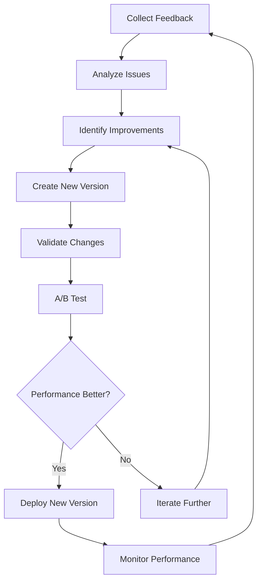

# Prompt Quality Validation Template

## Purpose
Validate the quality, effectiveness, and completeness of generated prompts to ensure they meet production standards and deliver consistent results.

## Instructions
Use this template to systematically validate prompt quality across structural, content, and performance dimensions. Apply the comprehensive checklist to evaluate prompts before deployment, implement automated quality checks where possible, and maintain quality standards through regular reviews and updates.

## Examples
```markdown
# Example: Quality Validation Report

## Prompt: "API Documentation Generator"
**Validation Date**: 2024-01-15
**Validator**: QA Team
**Overall Score**: 87/100

## Quality Assessment Results

### Structural Quality: 92/100
✅ Clear objective and scope
✅ Unambiguous instructions
✅ Complete input/output specifications
⚠️ Minor: Could improve error handling examples

### Content Quality: 85/100
✅ Technically accurate
✅ Follows best practices
✅ Appropriate for target audience
❌ Missing: Security considerations for API keys
❌ Missing: Rate limiting examples

### Performance Quality: 84/100
✅ Executes within time limits
✅ Consistent output format
⚠️ Minor: Token usage could be optimized

## Recommendations
1. Add security section with API key handling
2. Include rate limiting examples
3. Optimize token usage by 15%
4. Add more error handling scenarios

## Approval Status: ✅ APPROVED (with minor improvements)
```

## Prompt Quality Assessment Framework

### Quality Validation Checklist
```markdown
## Prompt Quality Evaluation

### Structural Quality Assessment
#### Clarity and Specificity
- [ ] **Clear Objective**: Prompt has a well-defined, specific goal
- [ ] **Unambiguous Language**: No vague or confusing terminology
- [ ] **Actionable Instructions**: Clear, executable steps and requirements
- [ ] **Context Sufficiency**: Adequate context for task completion
- [ ] **Scope Definition**: Clear boundaries of what is included/excluded

#### Completeness Assessment
- [ ] **All Required Elements**: Includes all necessary components for task completion
- [ ] **Input Specifications**: Clear definition of required inputs and formats
- [ ] **Output Specifications**: Detailed description of expected outputs
- [ ] **Success Criteria**: Measurable criteria for successful completion
- [ ] **Error Handling**: Guidance for handling edge cases and errors

#### Technical Accuracy
- [ ] **Technical Correctness**: All technical information is accurate and current
- [ ] **Best Practices**: Incorporates industry best practices and standards
- [ ] **Tool References**: Correct tool names, versions, and usage patterns
- [ ] **Code Examples**: Syntactically correct and functional code samples
- [ ] **Configuration Accuracy**: Proper configuration examples and settings

### Content Quality Assessment
#### Relevance and Appropriateness
- [ ] **Target Audience**: Appropriate for intended skill level and role
- [ ] **Use Case Alignment**: Matches intended use cases and scenarios
- [ ] **Technology Relevance**: Uses current, relevant technologies and approaches
- [ ] **Business Context**: Aligns with business objectives and constraints
- [ ] **Platform Suitability**: Appropriate for target platforms and environments

#### Comprehensiveness
- [ ] **Feature Coverage**: Covers all required features and functionality
- [ ] **Edge Case Handling**: Addresses common edge cases and exceptions
- [ ] **Integration Points**: Includes necessary integration considerations
- [ ] **Security Considerations**: Addresses relevant security requirements
- [ ] **Performance Implications**: Considers performance and scalability

#### Consistency and Standards
- [ ] **Style Consistency**: Follows established writing and formatting standards
- [ ] **Terminology Consistency**: Uses consistent terminology throughout
- [ ] **Template Adherence**: Follows established template structures
- [ ] **Cross-Reference Accuracy**: Correct references to other documents and resources
- [ ] **Version Consistency**: Aligns with current versions and standards
```

### Effectiveness Validation Framework
```markdown
## Prompt Effectiveness Testing

### Execution Testing
#### Functional Testing
**Test Objective**: Verify prompt produces expected functional outcomes
**Test Method**: Execute prompt with representative inputs and validate outputs
**Success Criteria**: 
- Outputs match specified requirements
- All functional requirements are met
- No critical errors or failures occur

```bash
# Example effectiveness test script
#!/bin/bash

# Test prompt execution with sample inputs
echo "Testing prompt effectiveness..."

# Execute prompt with test data
result=$(execute_prompt --input="test_data.json" --template="prompt_template.md")

# Validate output structure
if validate_output_structure "$result"; then
    echo "✓ Output structure validation passed"
else
    echo "✗ Output structure validation failed"
    exit 1
fi

# Validate content quality
if validate_content_quality "$result"; then
    echo "✓ Content quality validation passed"
else
    echo "✗ Content quality validation failed"
    exit 1
fi

# Validate completeness
if validate_completeness "$result"; then
    echo "✓ Completeness validation passed"
else
    echo "✗ Completeness validation failed"
    exit 1
fi

echo "Prompt effectiveness test completed successfully"
```

#### Performance Testing
**Test Objective**: Verify prompt executes within acceptable time and resource limits
**Test Method**: Measure execution time, token usage, and resource consumption
**Success Criteria**:
- Execution time within acceptable limits
- Token usage within budget constraints
- Memory and CPU usage within reasonable bounds

#### Consistency Testing
**Test Objective**: Verify prompt produces consistent results across multiple executions
**Test Method**: Execute prompt multiple times with same inputs, compare outputs
**Success Criteria**:
- Consistent output structure across executions
- Stable quality metrics across runs
- Minimal variation in execution time and resource usage

### User Experience Testing
#### Usability Assessment
- [ ] **Ease of Understanding**: Users can easily understand prompt requirements
- [ ] **Clear Instructions**: Step-by-step instructions are clear and followable
- [ ] **Helpful Examples**: Examples effectively illustrate expected usage
- [ ] **Error Recovery**: Clear guidance when things go wrong
- [ ] **Documentation Quality**: Supporting documentation is helpful and complete

#### Accessibility Assessment
- [ ] **Language Clarity**: Uses clear, accessible language appropriate for audience
- [ ] **Technical Jargon**: Minimizes unnecessary technical jargon
- [ ] **Cultural Sensitivity**: Avoids culturally specific references or assumptions
- [ ] **Inclusive Examples**: Uses diverse and inclusive examples
- [ ] **Multiple Learning Styles**: Accommodates different learning preferences

### Quality Metrics Framework
```json
{
  "qualityMetrics": {
    "structural": {
      "clarity": {
        "score": "1-10",
        "criteria": "Language clarity and specificity",
        "target": "8+"
      },
      "completeness": {
        "score": "1-10", 
        "criteria": "All required elements present",
        "target": "9+"
      },
      "accuracy": {
        "score": "1-10",
        "criteria": "Technical accuracy and correctness",
        "target": "9+"
      }
    },
    "effectiveness": {
      "functionalSuccess": {
        "score": "percentage",
        "criteria": "Successful task completion rate",
        "target": "95%+"
      },
      "consistency": {
        "score": "percentage",
        "criteria": "Consistent results across executions",
        "target": "90%+"
      },
      "performance": {
        "score": "milliseconds",
        "criteria": "Average execution time",
        "target": "< 5000ms"
      }
    },
    "usability": {
      "understandability": {
        "score": "1-10",
        "criteria": "User comprehension rating",
        "target": "8+"
      },
      "followability": {
        "score": "1-10",
        "criteria": "Ease of following instructions",
        "target": "8+"
      },
      "errorRecovery": {
        "score": "1-10",
        "criteria": "Quality of error handling guidance",
        "target": "7+"
      }
    }
  }
}
```
```

## Automated Validation Tools

### Validation Script Framework
```markdown
## Automated Quality Validation

### Prompt Structure Validator
```python
#!/usr/bin/env python3
"""
Prompt Quality Validation Script
Validates prompt templates against quality standards
"""

import re
import json
import yaml
from typing import Dict, List, Tuple
from dataclasses import dataclass

@dataclass
class ValidationResult:
    passed: bool
    score: float
    issues: List[str]
    suggestions: List[str]

class PromptValidator:
    def __init__(self, config_path: str = "validation_config.yaml"):
        with open(config_path, 'r') as f:
            self.config = yaml.safe_load(f)
    
    def validate_structure(self, prompt_content: str) -> ValidationResult:
        """Validate prompt structural elements"""
        issues = []
        suggestions = []
        score = 10.0
        
        # Check for required sections
        required_sections = self.config['required_sections']
        for section in required_sections:
            if not re.search(f"#{1,3}\\s+{section}", prompt_content, re.IGNORECASE):
                issues.append(f"Missing required section: {section}")
                score -= 1.0
        
        # Check for clear objectives
        if not re.search(r"(purpose|objective|goal):", prompt_content, re.IGNORECASE):
            issues.append("No clear objective or purpose statement found")
            score -= 1.0
        
        # Check for examples
        if not re.search(r"(example|sample):", prompt_content, re.IGNORECASE):
            suggestions.append("Consider adding examples to improve clarity")
            score -= 0.5
        
        # Check for success criteria
        if not re.search(r"(success|criteria|expected):", prompt_content, re.IGNORECASE):
            issues.append("No success criteria defined")
            score -= 1.0
        
        return ValidationResult(
            passed=len(issues) == 0,
            score=max(0, score),
            issues=issues,
            suggestions=suggestions
        )
    
    def validate_content_quality(self, prompt_content: str) -> ValidationResult:
        """Validate content quality and clarity"""
        issues = []
        suggestions = []
        score = 10.0
        
        # Check for vague language
        vague_terms = self.config['vague_terms']
        for term in vague_terms:
            if re.search(f"\\b{term}\\b", prompt_content, re.IGNORECASE):
                issues.append(f"Vague term found: '{term}' - be more specific")
                score -= 0.5
        
        # Check sentence length (readability)
        sentences = re.split(r'[.!?]+', prompt_content)
        long_sentences = [s for s in sentences if len(s.split()) > 25]
        if long_sentences:
            suggestions.append(f"Consider breaking down {len(long_sentences)} long sentences")
            score -= 0.3 * len(long_sentences)
        
        # Check for technical accuracy indicators
        if not re.search(r"(version|current|latest|as of)", prompt_content, re.IGNORECASE):
            suggestions.append("Consider adding version or currency information for technical content")
        
        return ValidationResult(
            passed=len(issues) == 0,
            score=max(0, score),
            issues=issues,
            suggestions=suggestions
        )
    
    def validate_completeness(self, prompt_content: str) -> ValidationResult:
        """Validate prompt completeness"""
        issues = []
        suggestions = []
        score = 10.0
        
        # Check for input specifications
        if not re.search(r"(input|parameter|argument)s?:", prompt_content, re.IGNORECASE):
            issues.append("No input specifications found")
            score -= 2.0
        
        # Check for output specifications
        if not re.search(r"(output|result|return)s?:", prompt_content, re.IGNORECASE):
            issues.append("No output specifications found")
            score -= 2.0
        
        # Check for error handling
        if not re.search(r"(error|exception|failure|troubleshoot)", prompt_content, re.IGNORECASE):
            suggestions.append("Consider adding error handling guidance")
            score -= 1.0
        
        # Check for prerequisites
        if not re.search(r"(prerequisite|requirement|dependency)", prompt_content, re.IGNORECASE):
            suggestions.append("Consider adding prerequisites or requirements section")
            score -= 0.5
        
        return ValidationResult(
            passed=len(issues) == 0,
            score=max(0, score),
            issues=issues,
            suggestions=suggestions
        )
    
    def generate_report(self, prompt_path: str) -> Dict:
        """Generate comprehensive validation report"""
        with open(prompt_path, 'r') as f:
            content = f.read()
        
        structure_result = self.validate_structure(content)
        quality_result = self.validate_content_quality(content)
        completeness_result = self.validate_completeness(content)
        
        overall_score = (
            structure_result.score * 0.4 +
            quality_result.score * 0.3 +
            completeness_result.score * 0.3
        )
        
        return {
            "prompt_path": prompt_path,
            "overall_score": round(overall_score, 2),
            "passed": all([
                structure_result.passed,
                quality_result.passed,
                completeness_result.passed
            ]),
            "results": {
                "structure": structure_result.__dict__,
                "quality": quality_result.__dict__,
                "completeness": completeness_result.__dict__
            },
            "recommendations": self._generate_recommendations(overall_score)
        }
    
    def _generate_recommendations(self, score: float) -> List[str]:
        """Generate improvement recommendations based on score"""
        if score >= 9.0:
            return ["Excellent prompt quality - ready for production use"]
        elif score >= 7.0:
            return [
                "Good prompt quality with minor improvements needed",
                "Address any identified issues before production use"
            ]
        elif score >= 5.0:
            return [
                "Moderate prompt quality - significant improvements needed",
                "Review and address all identified issues",
                "Consider peer review before production use"
            ]
        else:
            return [
                "Poor prompt quality - major revision required",
                "Comprehensive rewrite recommended",
                "Mandatory peer review and testing required"
            ]

# Usage example
if __name__ == "__main__":
    import sys
    
    if len(sys.argv) != 2:
        print("Usage: python prompt_validator.py <prompt_file>")
        sys.exit(1)
    
    validator = PromptValidator()
    report = validator.generate_report(sys.argv[1])
    
    print(json.dumps(report, indent=2))
```

### Validation Configuration
```yaml
# validation_config.yaml
required_sections:
  - "Purpose"
  - "Instructions"
  - "Examples"
  - "Success Criteria"

vague_terms:
  - "appropriate"
  - "reasonable"
  - "suitable"
  - "adequate"
  - "proper"
  - "good"
  - "bad"
  - "nice"
  - "clean"
  - "simple"

quality_thresholds:
  excellent: 9.0
  good: 7.0
  acceptable: 5.0
  poor: 3.0

metrics:
  max_sentence_length: 25
  min_examples: 1
  required_code_blocks: 1
```
```

## Continuous Improvement Framework

### Feedback Collection System
```markdown
## Prompt Improvement Process

### User Feedback Collection
#### Feedback Mechanisms
- **Usage Analytics**: Track prompt execution success rates and patterns
- **User Surveys**: Regular surveys on prompt effectiveness and usability
- **Issue Tracking**: Bug reports and improvement suggestions
- **Performance Metrics**: Execution time, resource usage, and success rates
- **A/B Testing**: Compare different prompt versions for effectiveness

#### Feedback Analysis Framework
```python
class FeedbackAnalyzer:
    def analyze_usage_patterns(self, usage_data: List[Dict]) -> Dict:
        """Analyze prompt usage patterns and success rates"""
        success_rate = sum(1 for u in usage_data if u['success']) / len(usage_data)
        avg_execution_time = sum(u['execution_time'] for u in usage_data) / len(usage_data)
        common_failures = self._identify_common_failures(usage_data)
        
        return {
            'success_rate': success_rate,
            'avg_execution_time': avg_execution_time,
            'common_failures': common_failures,
            'improvement_opportunities': self._suggest_improvements(usage_data)
        }
    
    def _identify_common_failures(self, usage_data: List[Dict]) -> List[str]:
        """Identify most common failure patterns"""
        failures = [u['error'] for u in usage_data if not u['success'] and u.get('error')]
        failure_counts = {}
        for failure in failures:
            failure_counts[failure] = failure_counts.get(failure, 0) + 1
        
        return sorted(failure_counts.items(), key=lambda x: x[1], reverse=True)[:5]
    
    def _suggest_improvements(self, usage_data: List[Dict]) -> List[str]:
        """Generate improvement suggestions based on usage patterns"""
        suggestions = []
        
        # Analyze success rates
        success_rate = sum(1 for u in usage_data if u['success']) / len(usage_data)
        if success_rate < 0.9:
            suggestions.append("Consider improving prompt clarity and instructions")
        
        # Analyze execution times
        avg_time = sum(u['execution_time'] for u in usage_data) / len(usage_data)
        if avg_time > 5000:  # 5 seconds
            suggestions.append("Consider optimizing prompt for better performance")
        
        # Analyze error patterns
        errors = [u.get('error', '') for u in usage_data if not u['success']]
        if any('unclear' in error.lower() for error in errors):
            suggestions.append("Add more examples and clarify instructions")
        
        return suggestions
```

### Version Control and Iteration
#### Prompt Versioning Strategy
- **Semantic Versioning**: Major.Minor.Patch version numbering
- **Change Documentation**: Detailed changelog for each version
- **Backward Compatibility**: Maintain compatibility when possible
- **Migration Guides**: Clear guidance for version upgrades
- **Rollback Procedures**: Safe rollback to previous versions

#### Improvement Workflow


### Quality Assurance Integration
#### CI/CD Integration
```yaml
# .github/workflows/prompt-validation.yml
name: Prompt Quality Validation

on:
  push:
    paths:
      - 'prompts/**/*.md'
  pull_request:
    paths:
      - 'prompts/**/*.md'

jobs:
  validate-prompts:
    runs-on: ubuntu-latest
    steps:
      - uses: actions/checkout@v3
      
      - name: Setup Python
        uses: actions/setup-python@v3
        with:
          python-version: '3.9'
      
      - name: Install dependencies
        run: |
          pip install pyyaml
      
      - name: Validate changed prompts
        run: |
          for file in $(git diff --name-only HEAD~1 HEAD | grep "prompts/.*\.md$"); do
            echo "Validating $file"
            python scripts/prompt_validator.py "$file"
          done
      
      - name: Generate quality report
        run: |
          python scripts/generate_quality_report.py
      
      - name: Upload quality report
        uses: actions/upload-artifact@v3
        with:
          name: prompt-quality-report
          path: quality-report.json
```

#### Quality Gates
- **Minimum Score Threshold**: Prompts must score 7.0+ to pass validation
- **Peer Review Required**: All prompt changes require peer review
- **Automated Testing**: Automated validation runs on all changes
- **Performance Benchmarks**: Execution time and resource usage limits
- **User Acceptance**: User feedback scores must meet minimum thresholds
```

This prompt quality validation system ensures consistent, high-quality prompts that effectively guide AI agents and deliver reliable results across all use cases.

## Usage Instructions

### Running Validation
```bash
# Validate a single prompt
python scripts/prompt_validator.py prompts/templates/example.md

# Validate all prompts in a directory
find prompts/ -name "*.md" -exec python scripts/prompt_validator.py {} \;

# Generate comprehensive quality report
python scripts/generate_quality_report.py --output quality-report.json
```

### Integration with Development Workflow
1. **Pre-commit Validation**: Run validation before committing changes
2. **Pull Request Checks**: Automated validation on pull requests
3. **Regular Audits**: Scheduled quality audits of all prompts
4. **Performance Monitoring**: Continuous monitoring of prompt effectiveness
5. **User Feedback Integration**: Regular incorporation of user feedback into improvements