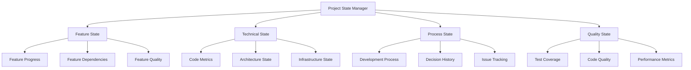

# State Management Orchestration Template

## Purpose
Orchestrate comprehensive state management across all project components, ensuring consistent state tracking, synchronization, and accessibility for all AI agents and development sessions.

## Instructions
Use this template to implement centralized state management for your project. Set up state tracking systems that maintain consistency across all components, enable real-time synchronization, and provide accessible state information for all AI agents and development sessions. Follow the atomic operations principle to ensure state consistency.

## Examples
```markdown
# Example: Project State Update

## Current State Snapshot
**Timestamp**: 2024-01-15T14:30:00Z
**Session**: dev-session-001
**Agent**: implementation-agent

### Feature State
- **User Authentication**: ✅ Complete (v1.2.0)
- **Product Catalog**: 🚧 In Progress (75% - API done, UI pending)
- **Shopping Cart**: 📋 Planned (dependencies: Product Catalog)

### Technical State
- **Database**: ✅ Schema v2.1 deployed
- **API**: ⚠️ 3 endpoints pending review
- **Frontend**: 🚧 Component library 80% complete

### Process State
- **Current Sprint**: Sprint 3 (Day 8/10)
- **Blockers**: 1 critical (payment gateway integration)
- **Next Milestone**: Beta Release (Jan 30)

## State Change Event
**Action**: Feature completion
**Component**: Product Catalog API
**Previous State**: In Progress (60%)
**New State**: In Progress (75%)
**Impact**: Unblocks UI development team
```

## Core Principles
- **Centralized State**: Single source of truth for all project state information
- **Real-Time Synchronization**: State updates are immediately reflected across all components
- **Agent Accessibility**: Any AI agent can read and update state information
- **Atomic Operations**: State changes are consistent and transactional

## State Architecture Framework

### State Management Architecture


### State Schema Definition
```markdown
## Project State Schema

### Core State Structure
```json
{
  "project": {
    "id": "string",
    "name": "string",
    "description": "string",
    "version": "string",
    "status": "active|paused|completed|cancelled",
    "health": "green|yellow|red",
    "lastUpdated": "timestamp",
    "currentPhase": "string"
  },
  "features": {
    "[featureId]": {
      "name": "string",
      "status": "not_started|in_progress|completed|blocked",
      "progress": "number (0-100)",
      "priority": "high|medium|low",
      "assignee": "string",
      "dependencies": ["featureId"],
      "blockers": ["string"],
      "estimatedEffort": "string",
      "actualEffort": "string",
      "quality": {
        "testCoverage": "number",
        "codeQuality": "number",
        "documentation": "boolean"
      },
      "milestones": [
        {
          "name": "string",
          "targetDate": "date",
          "status": "pending|completed|overdue",
          "completion": "number"
        }
      ]
    }
  },
  "technical": {
    "architecture": {
      "decisions": ["decisionId"],
      "patterns": ["string"],
      "technologies": ["string"],
      "lastReview": "timestamp"
    },
    "codebase": {
      "linesOfCode": "number",
      "testCoverage": "number",
      "codeQuality": "number",
      "technicalDebt": "number",
      "lastAnalysis": "timestamp"
    },
    "infrastructure": {
      "environments": {
        "development": "status",
        "staging": "status",
        "production": "status"
      },
      "deployments": [
        {
          "environment": "string",
          "version": "string",
          "timestamp": "timestamp",
          "status": "success|failed|in_progress"
        }
      ]
    }
  },
  "process": {
    "currentSprint": {
      "id": "string",
      "startDate": "date",
      "endDate": "date",
      "goals": ["string"],
      "progress": "number"
    },
    "decisions": [
      {
        "id": "string",
        "title": "string",
        "status": "proposed|accepted|implemented|deprecated",
        "impact": "high|medium|low",
        "date": "timestamp"
      }
    ],
    "issues": [
      {
        "id": "string",
        "title": "string",
        "severity": "critical|major|minor",
        "status": "open|in_progress|resolved",
        "assignee": "string",
        "createdDate": "timestamp"
      }
    ]
  },
  "quality": {
    "metrics": {
      "overallHealth": "number",
      "featureCompleteness": "number",
      "codeQuality": "number",
      "testCoverage": "number",
      "performance": "number",
      "security": "number"
    },
    "trends": {
      "daily": ["dataPoint"],
      "weekly": ["dataPoint"],
      "monthly": ["dataPoint"]
    }
  },
  "sessions": [
    {
      "id": "string",
      "agentId": "string",
      "startTime": "timestamp",
      "endTime": "timestamp",
      "objectives": ["string"],
      "completed": ["string"],
      "issues": ["string"],
      "handoffNotes": "string"
    }
  ]
}
```
```

## State Operations Framework

### State Update Operations
```markdown
## State Update Protocols

### Atomic State Updates
```javascript
// Example state update operation
function updateFeatureProgress(featureId, progress, metadata) {
  return atomicUpdate({
    operation: 'UPDATE_FEATURE_PROGRESS',
    featureId: featureId,
    changes: {
      progress: progress,
      lastUpdated: new Date().toISOString(),
      updatedBy: metadata.agentId,
      notes: metadata.notes
    },
    validation: {
      progressRange: [0, 100],
      requiredFields: ['featureId', 'progress'],
      dependencies: checkFeatureDependencies(featureId)
    }
  });
}
```

### State Validation Rules
```markdown
## State Validation Framework

### Validation Rules
1. **Progress Consistency**: Feature progress must align with milestone completion
2. **Dependency Integrity**: Dependent features cannot be completed before dependencies
3. **Status Coherence**: Feature status must match progress percentage
4. **Quality Gates**: Features cannot be marked complete without meeting quality criteria
5. **Timeline Consistency**: Dates must be logically consistent (start < end)

### Validation Implementation
```javascript
function validateStateUpdate(currentState, proposedChanges) {
  const validationResults = {
    valid: true,
    errors: [],
    warnings: []
  };
  
  // Progress validation
  if (proposedChanges.progress < 0 || proposedChanges.progress > 100) {
    validationResults.valid = false;
    validationResults.errors.push('Progress must be between 0 and 100');
  }
  
  // Dependency validation
  if (proposedChanges.status === 'completed') {
    const incompleteDependencies = checkIncompleteDependencies(
      proposedChanges.featureId, 
      currentState
    );
    if (incompleteDependencies.length > 0) {
      validationResults.valid = false;
      validationResults.errors.push(
        `Cannot complete feature with incomplete dependencies: ${incompleteDependencies.join(', ')}`
      );
    }
  }
  
  return validationResults;
}
```
```

### State Synchronization
```markdown
## State Synchronization Protocols

### Real-Time Synchronization
```javascript
// State synchronization manager
class StateSynchronizationManager {
  constructor() {
    this.subscribers = new Map();
    this.syncQueue = [];
    this.isProcessing = false;
  }
  
  subscribe(component, callback) {
    if (!this.subscribers.has(component)) {
      this.subscribers.set(component, []);
    }
    this.subscribers.get(component).push(callback);
  }
  
  async broadcastUpdate(stateChange) {
    // Add to sync queue
    this.syncQueue.push(stateChange);
    
    // Process queue if not already processing
    if (!this.isProcessing) {
      await this.processSyncQueue();
    }
  }
  
  async processSyncQueue() {
    this.isProcessing = true;
    
    while (this.syncQueue.length > 0) {
      const change = this.syncQueue.shift();
      
      // Validate change
      const validation = validateStateUpdate(this.currentState, change);
      if (!validation.valid) {
        console.error('State validation failed:', validation.errors);
        continue;
      }
      
      // Apply change
      this.currentState = applyStateChange(this.currentState, change);
      
      // Notify subscribers
      for (const [component, callbacks] of this.subscribers) {
        for (const callback of callbacks) {
          try {
            await callback(change, this.currentState);
          } catch (error) {
            console.error(`Error notifying ${component}:`, error);
          }
        }
      }
      
      // Persist state
      await this.persistState(this.currentState);
    }
    
    this.isProcessing = false;
  }
}
```

### Conflict Resolution
```markdown
## State Conflict Resolution

### Conflict Detection
```javascript
function detectConflicts(currentState, incomingChanges) {
  const conflicts = [];
  
  // Check for concurrent modifications
  if (currentState.lastUpdated > incomingChanges.baseTimestamp) {
    conflicts.push({
      type: 'CONCURRENT_MODIFICATION',
      field: 'lastUpdated',
      current: currentState.lastUpdated,
      incoming: incomingChanges.baseTimestamp
    });
  }
  
  // Check for logical conflicts
  if (incomingChanges.status === 'completed' && 
      currentState.progress < 100) {
    conflicts.push({
      type: 'LOGICAL_CONFLICT',
      message: 'Cannot mark feature complete with progress < 100%'
    });
  }
  
  return conflicts;
}
```

### Conflict Resolution Strategies
1. **Last Writer Wins**: Most recent update takes precedence
2. **Merge Strategy**: Combine non-conflicting changes
3. **User Resolution**: Prompt for manual conflict resolution
4. **Rollback Strategy**: Revert to last known good state

### Conflict Resolution Implementation
```javascript
async function resolveConflicts(conflicts, currentState, incomingChanges) {
  for (const conflict of conflicts) {
    switch (conflict.type) {
      case 'CONCURRENT_MODIFICATION':
        // Use merge strategy for concurrent modifications
        const mergedState = mergeStates(currentState, incomingChanges);
        return mergedState;
        
      case 'LOGICAL_CONFLICT':
        // Reject logically inconsistent changes
        throw new Error(`Logical conflict: ${conflict.message}`);
        
      default:
        // Default to last writer wins
        return applyStateChange(currentState, incomingChanges);
    }
  }
}
```
```

## State Persistence Framework

### Persistence Strategy
```markdown
## State Persistence Architecture

### Multi-Layer Persistence
1. **Memory Layer**: In-memory state for fast access
2. **File System Layer**: JSON files for durability
3. **Version Control Layer**: Git commits for history
4. **Backup Layer**: Periodic backups for recovery

### Persistence Implementation
```javascript
class StatePersistenceManager {
  constructor(config) {
    this.memoryState = new Map();
    this.fileSystemPath = config.stateDirectory;
    this.backupInterval = config.backupInterval || 3600000; // 1 hour
    this.versionControl = config.enableVersionControl || true;
  }
  
  async saveState(stateId, state) {
    // Update memory layer
    this.memoryState.set(stateId, {
      data: state,
      timestamp: new Date().toISOString(),
      version: this.generateVersion()
    });
    
    // Persist to file system
    const filePath = path.join(this.fileSystemPath, `${stateId}.json`);
    await fs.writeFile(filePath, JSON.stringify(state, null, 2));
    
    // Commit to version control
    if (this.versionControl) {
      await this.commitToVersionControl(stateId, state);
    }
    
    // Schedule backup
    this.scheduleBackup(stateId);
  }
  
  async loadState(stateId) {
    // Try memory layer first
    if (this.memoryState.has(stateId)) {
      return this.memoryState.get(stateId).data;
    }
    
    // Fall back to file system
    const filePath = path.join(this.fileSystemPath, `${stateId}.json`);
    if (await fs.exists(filePath)) {
      const data = await fs.readFile(filePath, 'utf8');
      const state = JSON.parse(data);
      
      // Update memory layer
      this.memoryState.set(stateId, {
        data: state,
        timestamp: new Date().toISOString(),
        version: this.generateVersion()
      });
      
      return state;
    }
    
    // Return default state if not found
    return this.getDefaultState();
  }
}
```

### State History Management
```markdown
## State History and Versioning

### Version Control Integration
```bash
#!/bin/bash
# State commit script
STATE_FILE="$1"
COMMIT_MESSAGE="$2"

# Add state file to git
git add "$STATE_FILE"

# Commit with structured message
git commit -m "State Update: $COMMIT_MESSAGE

- File: $STATE_FILE
- Timestamp: $(date -u +%Y-%m-%dT%H:%M:%SZ)
- Agent: ${AGENT_ID:-unknown}
- Session: ${SESSION_ID:-unknown}"

# Tag significant state changes
if [[ "$COMMIT_MESSAGE" == *"milestone"* ]]; then
  git tag -a "state-$(date +%Y%m%d-%H%M%S)" -m "Milestone state snapshot"
fi
```

### State Recovery Procedures
```javascript
class StateRecoveryManager {
  async recoverFromBackup(stateId, targetTimestamp) {
    // Find closest backup to target timestamp
    const backups = await this.listBackups(stateId);
    const closestBackup = this.findClosestBackup(backups, targetTimestamp);
    
    if (!closestBackup) {
      throw new Error('No suitable backup found for recovery');
    }
    
    // Load backup state
    const backupState = await this.loadBackup(closestBackup);
    
    // Validate backup integrity
    const validation = await this.validateStateIntegrity(backupState);
    if (!validation.valid) {
      throw new Error(`Backup validation failed: ${validation.errors.join(', ')}`);
    }
    
    // Restore state
    await this.persistenceManager.saveState(stateId, backupState);
    
    // Log recovery action
    await this.logRecoveryAction(stateId, closestBackup, targetTimestamp);
    
    return backupState;
  }
  
  async validateStateIntegrity(state) {
    const validation = {
      valid: true,
      errors: [],
      warnings: []
    };
    
    // Check required fields
    const requiredFields = ['project', 'features', 'technical', 'process', 'quality'];
    for (const field of requiredFields) {
      if (!state[field]) {
        validation.valid = false;
        validation.errors.push(`Missing required field: ${field}`);
      }
    }
    
    // Check data consistency
    if (state.features) {
      for (const [featureId, feature] of Object.entries(state.features)) {
        if (feature.progress < 0 || feature.progress > 100) {
          validation.valid = false;
          validation.errors.push(`Invalid progress for feature ${featureId}: ${feature.progress}`);
        }
      }
    }
    
    return validation;
  }
}
```
```

## Agent Integration Framework

### Agent State Access
```markdown
## Agent State Interface

### State Access API
```javascript
class AgentStateInterface {
  constructor(agentId, sessionId) {
    this.agentId = agentId;
    this.sessionId = sessionId;
    this.stateManager = new StateManager();
  }
  
  // Read operations
  async getProjectOverview() {
    const state = await this.stateManager.getCurrentState();
    return {
      name: state.project.name,
      status: state.project.status,
      health: state.project.health,
      currentPhase: state.project.currentPhase,
      completion: this.calculateOverallCompletion(state)
    };
  }
  
  async getFeatureStatus(featureId) {
    const state = await this.stateManager.getCurrentState();
    return state.features[featureId] || null;
  }
  
  async getCurrentPriorities() {
    const state = await this.stateManager.getCurrentState();
    return Object.entries(state.features)
      .filter(([_, feature]) => feature.status === 'in_progress')
      .sort((a, b) => this.priorityWeight(b[1].priority) - this.priorityWeight(a[1].priority))
      .map(([id, feature]) => ({ id, ...feature }));
  }
  
  // Write operations
  async updateFeatureProgress(featureId, progress, notes) {
    const update = {
      operation: 'UPDATE_FEATURE_PROGRESS',
      featureId,
      progress,
      notes,
      agentId: this.agentId,
      sessionId: this.sessionId,
      timestamp: new Date().toISOString()
    };
    
    return await this.stateManager.applyUpdate(update);
  }
  
  async logDecision(decision) {
    const update = {
      operation: 'ADD_DECISION',
      decision: {
        ...decision,
        id: this.generateDecisionId(),
        agentId: this.agentId,
        sessionId: this.sessionId,
        timestamp: new Date().toISOString()
      }
    };
    
    return await this.stateManager.applyUpdate(update);
  }
  
  async reportIssue(issue) {
    const update = {
      operation: 'ADD_ISSUE',
      issue: {
        ...issue,
        id: this.generateIssueId(),
        reportedBy: this.agentId,
        sessionId: this.sessionId,
        createdDate: new Date().toISOString(),
        status: 'open'
      }
    };
    
    return await this.stateManager.applyUpdate(update);
  }
}
```

### Agent Onboarding Integration
```markdown
## Agent State Onboarding

### Quick State Summary
```javascript
async function generateAgentOnboardingSummary(agentId) {
  const state = await stateManager.getCurrentState();
  
  return {
    projectOverview: {
      name: state.project.name,
      description: state.project.description,
      currentPhase: state.project.currentPhase,
      health: state.project.health
    },
    
    currentFocus: {
      activeFeatures: Object.entries(state.features)
        .filter(([_, f]) => f.status === 'in_progress')
        .map(([id, f]) => ({ id, name: f.name, progress: f.progress })),
      
      blockers: Object.entries(state.features)
        .filter(([_, f]) => f.status === 'blocked')
        .map(([id, f]) => ({ id, name: f.name, blockers: f.blockers })),
      
      nextPriorities: this.getNextPriorities(state, 3)
    },
    
    recentActivity: {
      lastSession: state.sessions[state.sessions.length - 1],
      recentDecisions: state.process.decisions
        .filter(d => this.isRecent(d.date, 7))
        .slice(0, 5),
      recentIssues: state.process.issues
        .filter(i => this.isRecent(i.createdDate, 7))
        .slice(0, 5)
    },
    
    qualityStatus: {
      overallHealth: state.quality.metrics.overallHealth,
      testCoverage: state.quality.metrics.testCoverage,
      codeQuality: state.quality.metrics.codeQuality,
      criticalIssues: state.process.issues
        .filter(i => i.severity === 'critical' && i.status === 'open').length
    },
    
    recommendations: this.generateRecommendations(state, agentId)
  };
}
```
```

## Monitoring and Analytics

### State Health Monitoring
```markdown
## State Health Dashboard

### Health Metrics
```javascript
class StateHealthMonitor {
  calculateHealthScore(state) {
    const metrics = {
      featureProgress: this.calculateFeatureProgressHealth(state),
      codeQuality: this.calculateCodeQualityHealth(state),
      issueManagement: this.calculateIssueManagementHealth(state),
      processHealth: this.calculateProcessHealth(state)
    };
    
    // Weighted average
    const weights = {
      featureProgress: 0.3,
      codeQuality: 0.25,
      issueManagement: 0.25,
      processHealth: 0.2
    };
    
    return Object.entries(metrics).reduce((total, [metric, score]) => {
      return total + (score * weights[metric]);
    }, 0);
  }
  
  generateHealthReport(state) {
    const healthScore = this.calculateHealthScore(state);
    const trends = this.calculateHealthTrends(state);
    const alerts = this.generateHealthAlerts(state);
    
    return {
      overallHealth: healthScore,
      status: this.getHealthStatus(healthScore),
      trends: trends,
      alerts: alerts,
      recommendations: this.generateHealthRecommendations(state, healthScore)
    };
  }
}
```

### State Analytics
```javascript
class StateAnalytics {
  generateProductivityMetrics(state) {
    const sessions = state.sessions;
    const features = state.features;
    
    return {
      averageSessionDuration: this.calculateAverageSessionDuration(sessions),
      featuresCompletedPerWeek: this.calculateFeatureVelocity(features),
      averageFeatureCompletionTime: this.calculateAverageCompletionTime(features),
      blockerResolutionTime: this.calculateBlockerResolutionTime(state),
      codeQualityTrend: this.calculateQualityTrend(state.quality.trends)
    };
  }
  
  generatePredictiveAnalytics(state) {
    return {
      estimatedCompletionDate: this.predictCompletionDate(state),
      riskFactors: this.identifyRiskFactors(state),
      resourceRequirements: this.predictResourceNeeds(state),
      qualityProjections: this.projectQualityTrends(state)
    };
  }
}
```
```

This comprehensive state management orchestration framework ensures that all project state is consistently tracked, synchronized, and accessible across all AI agents and development sessions, providing a robust foundation for collaborative development work.

## State Management Orchestration Features
This template provides comprehensive state orchestration including:
- **Context Summary**: Centralized state information and Quick Orientation
- **Decision Logging**: Integration with decision tracking systems
- **Handoff**: AI Agent handoff protocols and procedures for new agent onboarding
- **Recovery**: State recovery and backup procedures
- **PROJECT_STATUS.md**: High-level project overview and status tracking
- **DEVELOPMENT_LOG.md**: Chronological record of development activities
- **NEXT_STEPS.md**: Clear action items and priorities
- **ARCHITECTURE_DECISIONS.md**: technical choices with rationale
- **COMPLETED_FEATURES.md**: implemented and tested functionality
- **KNOWN_ISSUES.md**: bugs, limitations, and technical debt